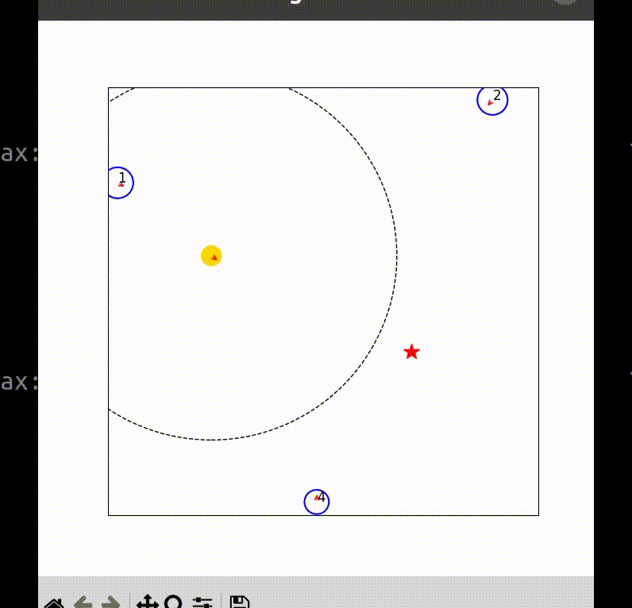

## Our Approach

### All Attention

#### Network


#### Result



```
attention weights before softmax: tensor([ 3.9687,  4.6783,  5.9645,  4.1785,  3.7010, 81.8610], device='cuda:0')
human_1: 0.00
human_2: 0.00
human_3: 0.00
human_4: 0.00
human_5: 0.00
goal: 1.00
```

#### To Do List

- Add Tensorboard to visualize loss function
- Check the method of calculating weights

