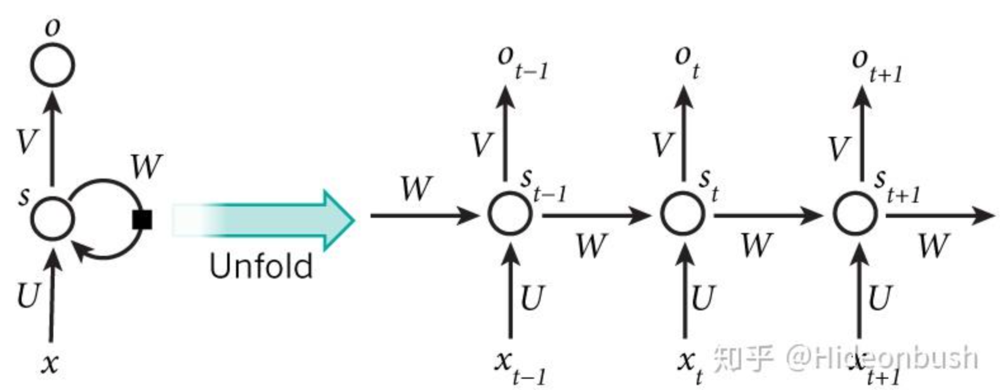
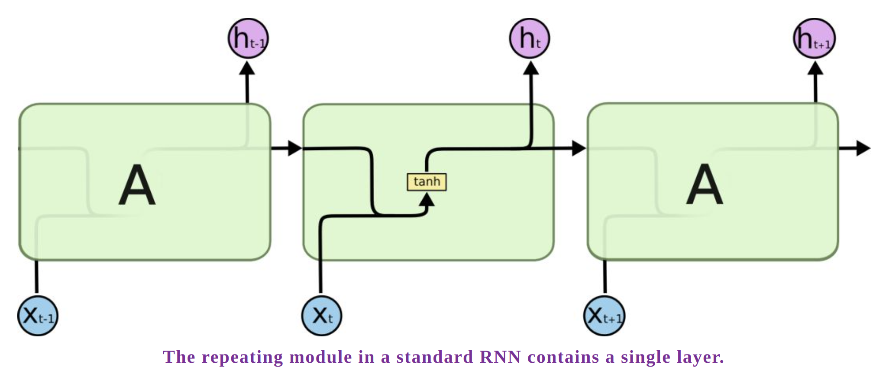
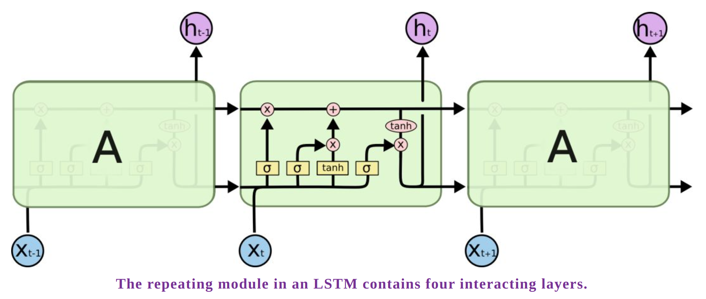
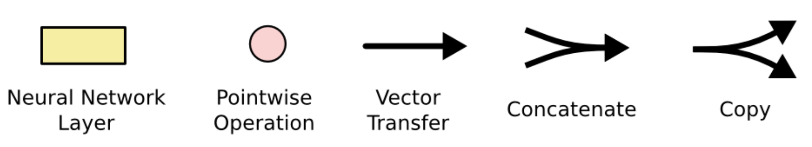
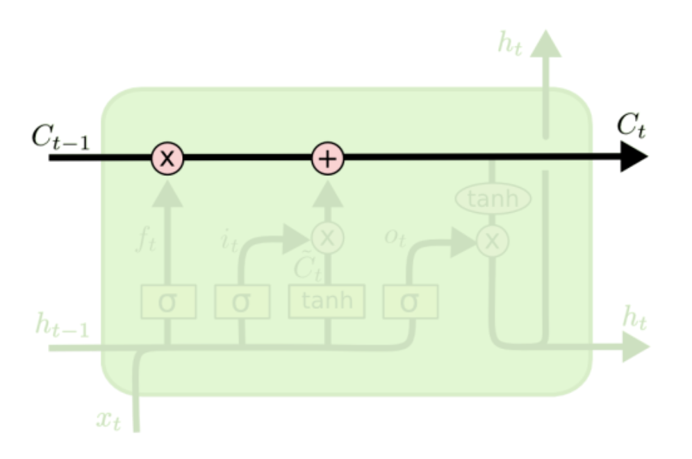
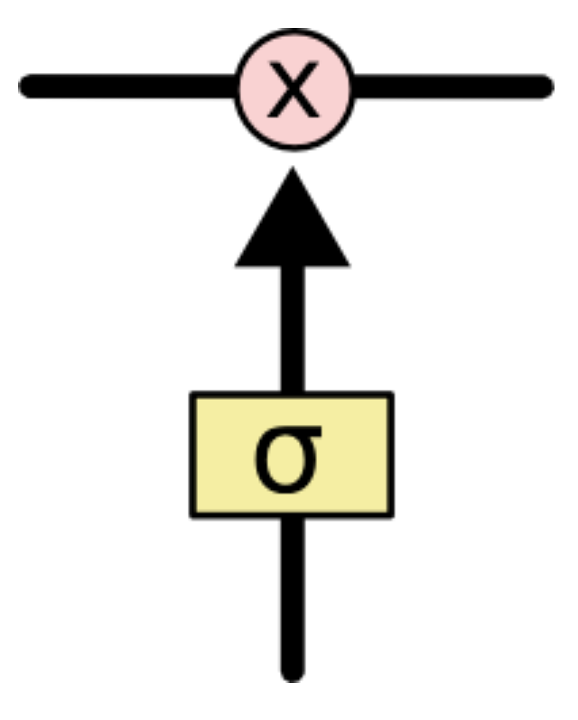
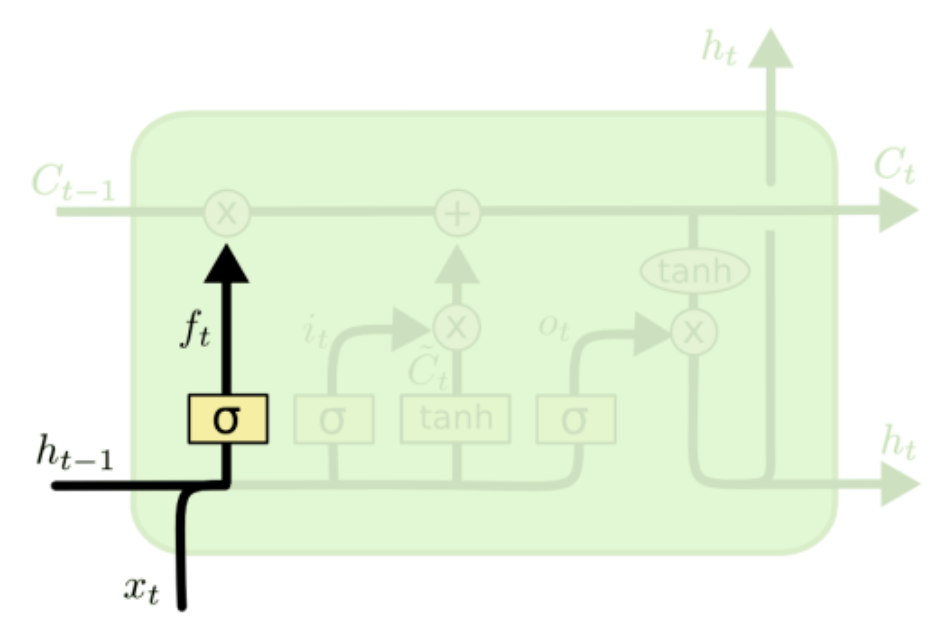
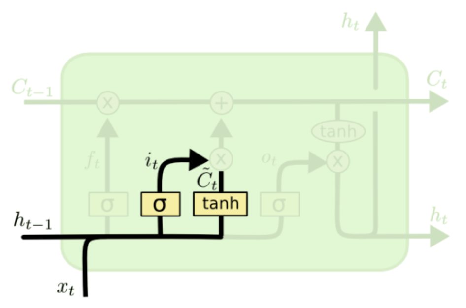
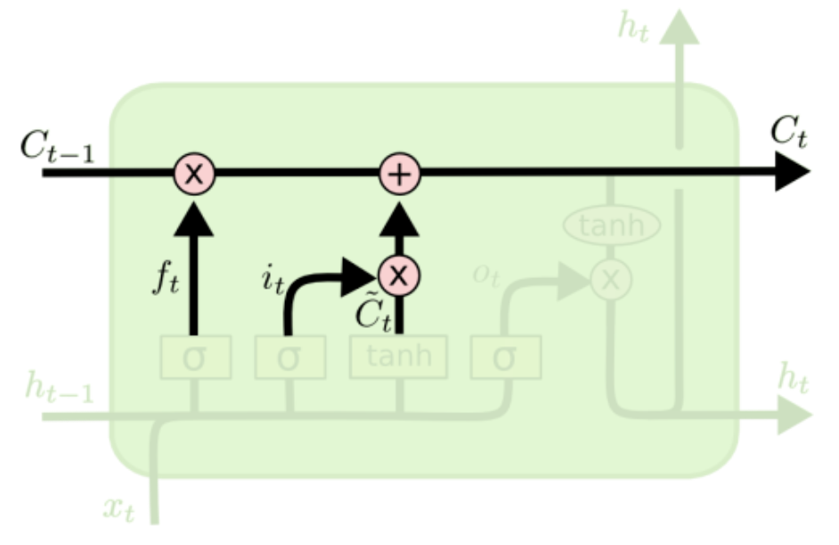
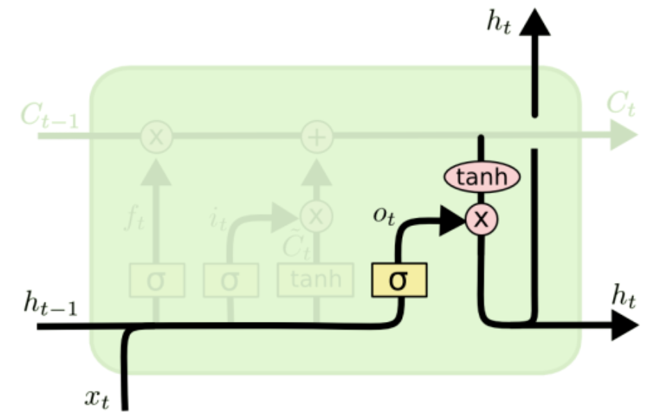

## Network

---

### RNN

#### Principle

**Forward**

$s_t = \phi(Ux_t + Ws_{t-1})$

$o_t = f(Vs_t)$

$s_t$: the state value of hidden layer at time t

$o_t$: output value of time t

$U$: weights of input x

$W$: weights of input state $s_{t-1}$ at time t

$\phi$: activation function

$V$: weights of output layer

$f$: activation function

**loss function**

cross entropy: $\sum_{i=1}^{T}{-\overline{o}_t\log{o_t}}$

**Backward**

BPTT(back-propagation through time)

---

### LSTM

#### Principle

**RNN**

**LSTM**

- Pointwise Operation: dot product

**Cell State**

**Gate**

- Contains a sigmod layer and a dot product

- It determines how much message can go through

**Forget Gate**

- Reduce value towards 0

$f_t=\sigma(W_f\cdot[h_{t-1}, x_t]+b_f)$

**Input Gate**

- Determine whether to ignore input or not

$i_t=\sigma(W_i\cdot[h_{t-1},x_t]+b_i$

$$\widetilde{C}_t = \tanh{(W_C\cdot[h_{t-1},x_t]+b_C)}$$

**Cell State**

$C_t=f_t\cdot{C_{t-1}}+i_t\cdot{\widetilde{C}_t}$

**Output Gate**

- Determine whether to use hidden state

$o_t = \sigma(W_o\cdot[h_{t-1},x_t])+b_o$

$h_t = o_t\cdot\tanh{(C_t)}$

#### Implementation using Pytorch

