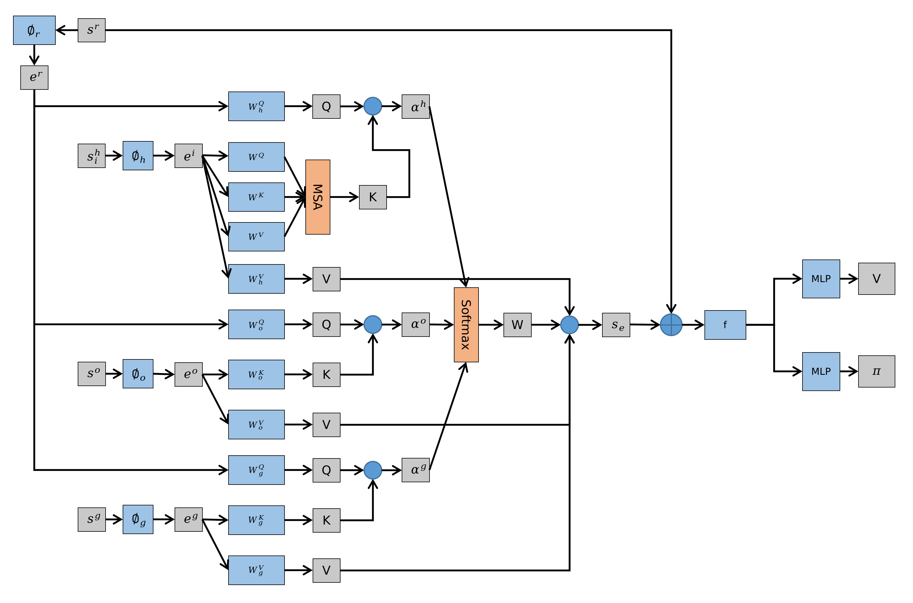
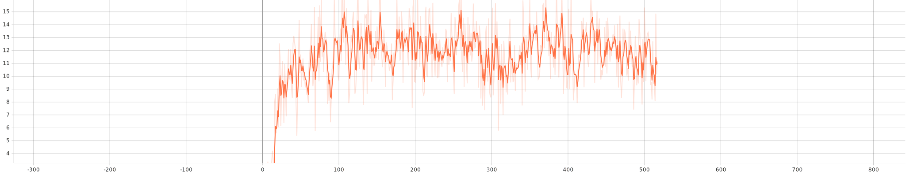
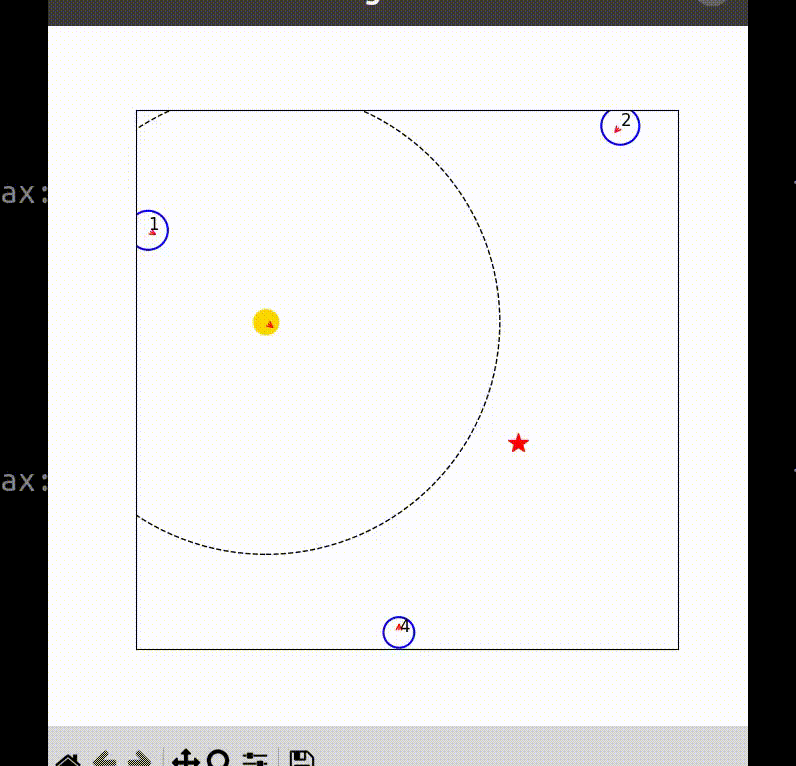

## README

### All Attention

#### Setup

1. Create workspace

```bash
mkdir Crowd_Navigation_ws
```

2. Clone crowd_nav package

```bash
cd Crowd_Navigation_ws
git clone https://github.com/up-tech/CrowdNav_Prediction_AttnGraph.git -b allattn
```

3. Install required python packages

```bash
cd CrowdNav_Prediction_AttnGraph
pip install -r requirements.txt
```

4. Install OpenAI Baselines

```bash
cd Crowd_Navigation_ws
git clone https://github.com/openai/baselines.git
cd baselines
pip install -e .
```

5. Install Python-RVO2 library

```bash
cd Crowd_Navigation_ws
git clone https://github.com/sybrenstuvel/Python-RVO2.git
cd Python-RVO2
python setup.py build
sudo python setup.py install
```

#### Train

- Model will be saved as pt file in CrowdNav_Prediction_AttnGraph/trained_models/my_model/checkpoints

```bash
cd CrowdNav_Prediction_AttnGraph
python train.py
```

#### Test

- Firstly modify --test_model in test.py according to saved pt file

```bash
cd CrowdNav_Prediction_AttnGraph
python test.py
```

#### Plot

```bash
cd CrowdNav_Prediction_AttnGraph
python plot.py
```

#### Network



#### Result





```
attention weights before softmax: tensor([ 3.9687,  4.6783,  5.9645,  4.1785,  3.7010, 81.8610], device='cuda:0')
human_1: 0.00
human_2: 0.00
human_3: 0.00
human_4: 0.00
human_5: 0.00
goal: 1.00
```

#### To Do List

- Check the method of calculating weights

