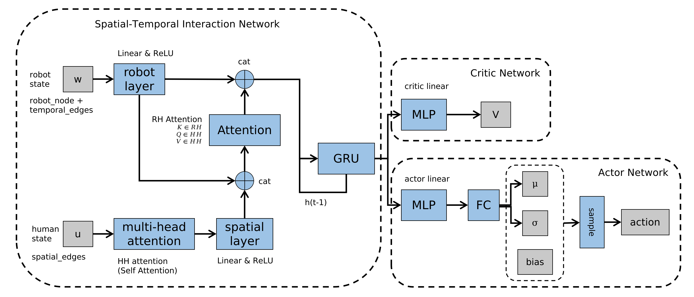

## CrowdNav++

### Overview


### Environment Setup

#### Observation

robot_state:        $s = [p_x, p_y, v_x, v_y, g_x, g_y, v_{max}, \theta]$

human_state:   $w_i = [p_x^i, p_y^i]$

- $\theta$ : heading angle

```python
#human_num 20
dict = {'robot_node':  #shape(1, 7)
        #[self.px, self.py, self.radius, self.gx, self.gy, self.v_pref, self.theta]
        'temporal_edges': #shape(1, 2)
        #[self.vx, self.vy]
        'spatial_edges': #shape(20, 12)  (px, py)*[1(current) + 5(pridict)]
        #[px1, py1, ..., px6, py6]
        'visible_masks': #shape(20, changeable)
        #did not use
        'detected_human_num':} #shape(1, changable)
        #[changable]
```

#### Reward

$$r_{pot} = 2(-d_{goal}^t+d_{gial}^{t-1})$$

$$r_{pred}^i(s_t)=\min_{k=1,...,K}(\text{collision}_i^{t+k} \frac{r_c}{2^k})$$

$$r_{pred}(s_t)=\min_{i=1,...,n}r_{pred}^i(s_t)$$

```math
R_t(s_t^{jn}, a_t) = \begin{cases} 10 & \text{if\ $s_t$ $\in$ $S_{goal}$}  \\ r_c & \text{if\ $s_t$ = $S_{fail}$} \\ r_{pot}(s_t)+r_{pred}(s_t) & \text{otherwise} \end{cases}
```

<!--

$$R_t(s_t^{jn}, a_t) = \begin{cases} 10 & \text{if\ $s_t$ $\in$ $S_{goal}$}  \\ r_c & \text{if\ $s_t$ = $S_{fail}$} \\ r_{pot}(s_t)+r_{pred}(s_t) & \text{otherwise} \end{cases}$$

-->

#### Action

- $v_x: (-\infty,+\infty) \ v_y: (-\infty,+\infty)$

```python
high = np.inf * np.ones([2, ])
self.action_space = gym.spaces.Box(-high, high, dtype=np.float32)
```

#### Terminal condition

- Timeout
- Reaching goal
- Collision

### Network Architecture



- robot state:
  - robot_node: [self.px, self.py, self.radius, self.gx, self.gy, self.v_pref, self.theta]
  - temporal_edges: [self.vx, self.vy]
- human state:
  - spatial_edges: [px1, py1, ..., px6, py6], 1 pair of current and 5 pairs of prediction 


```math
Q = \begin{bmatrix}
 q_1 & q_2 & q_3\\
 q_1 & q_2 & q_3\\
 q_1 & q_2 & q_3
\end{bmatrix}, K = \begin{bmatrix}
 k_1 & k_2 & k_3\\
 k_1 & k_2 & k_3\\
 k_1 & k_2 & k_3
\end{bmatrix}, V = \begin{bmatrix}
 v_1 & v_2 & v_3\\
 v_1 & v_2 & v_3\\
 v_1 & v_2 & v_3
\end{bmatrix}
```

```math
(Q_{mean})^\top\cdot K_{mean} \cdot V = \begin{bmatrix}
 v_1\cdot q_1(k_1 + k_2 + k3) & v_2\cdot q_1(k_1 + k_2 + k3) & v_3\cdot q_1(k_1 + k_2 + k3)\\
 v_1\cdot q_2(k_1 + k_2 + k3) & v_2\cdot q_2(k_1 + k_2 + k3) & v_3\cdot q_2(k_1 + k_2 + k3)\\
 v_1\cdot q_3(k_1 + k_2 + k3) & v_2\cdot q_3(k_1 + k_2 + k3) & v_3\cdot q_3(k_1 + k_2 + k3)
\end{bmatrix}
```

<!--

$$Q = \begin{bmatrix}
 q_1 & q_2 & q_3\\
 q_1 & q_2 & q_3\\
 q_1 & q_2 & q_3
\end{bmatrix}, K = \begin{bmatrix}
 k_1 & k_2 & k_3\\
 k_1 & k_2 & k_3\\
 k_1 & k_2 & k_3
\end{bmatrix}, V = \begin{bmatrix}
 v_1 & v_2 & v_3\\
 v_1 & v_2 & v_3\\
 v_1 & v_2 & v_3
\end{bmatrix}$$

$$(Q_{mean})^\top\cdot K_{mean} \cdot V = \begin{bmatrix}
 v_1\cdot q_1(k_1 + k_2 + k_3) & v_2\cdot q_1(k_1 + k_2 + k_3) & v_3\cdot q_1(k_1 + k_2 + k_3)\\
 v_1\cdot q_2(k_1 + k_2 + k_3) & v_2\cdot q_2(k_1 + k_2 + k_3) & v_3\cdot q_2(k_1 + k_2 + k_3)\\
 v_1\cdot q_3(k_1 + k_2 + k_3) & v_2\cdot q_3(k_1 + k_2 + k_3) & v_3\cdot q_3(k_1 + k_2 + k_3)
\end{bmatrix}$$

-->

- Tips for nn.multihead attn: (*L*,*N*,*E*) when `batch_first=False` where *L* is the target sequence length

- How to handle changeable human number:

  - Set a max human number (20 for the paper)

  - Sort Input by dist
  - Add mask

  ```python
  #e.g. mask
  tensor([[False, False, False, False, False, False, False, False, False,  True,
            True,  True,  True,  True,  True,  True,  True,  True,  True,  True]]
  ```

- GRU

- Self attention parameters

```
Conv2d()参数个数计算
Param = in_c * out_c * k * k + out_c  
in_c 表示输入通道维度       
out_c 表示输出通道维度       
k 表示卷积核大小

Linear()参数个数计算
Param = in_f * out_f + out_f
in_f 表示输入特征维度
out_f 表示输出特征维度

1536  linear 12*128         
128
65536  linear 128*512         
512

262144  linear 512*512         
512
262144  linear 512*512         
512
262144  linear 512*512         
512

786432  
1536
262144
512
```

**Layers Structure**

```python
Policy(
  (base): selfAttn_merge_SRNN(
    (humanNodeRNN): EndRNN(
      (gru): GRU(128, 128)
      (encoder_linear): Linear(in_features=256, out_features=64, bias=True)
      (relu): ReLU()
      (edge_attention_embed): Linear(in_features=256, out_features=64, bias=True)
      (output_linear): Linear(in_features=128, out_features=256, bias=True)
    )
      
    (attn): EdgeAttention_M(
      (temporal_edge_layer): ModuleList(
        (0): Linear(in_features=256, out_features=64, bias=True)
      )
      (spatial_edge_layer): ModuleList(
        (0): Linear(in_features=256, out_features=64, bias=True)
      )
    )
      
    (actor): Sequential(
      (0): Linear(in_features=256, out_features=256, bias=True)
      (1): Tanh()
      (2): Linear(in_features=256, out_features=256, bias=True)
      (3): Tanh()
    )
      
    (critic): Sequential(
      (0): Linear(in_features=256, out_features=256, bias=True)
      (1): Tanh()
      (2): Linear(in_features=256, out_features=256, bias=True)
      (3): Tanh()
    )
    
    (critic_linear): Linear(in_features=256, out_features=1, bias=True)
    
    (robot_linear): Sequential(
      (0): Linear(in_features=9, out_features=256, bias=True)
      (1): ReLU()
    )
    
    (human_node_final_linear): Linear(in_features=256, out_features=2, bias=True)
    
    (spatial_attn): SpatialEdgeSelfAttn(
      (embedding_layer): Sequential(
        (0): Linear(in_features=12, out_features=128, bias=True)
        (1): ReLU()
        (2): Linear(in_features=128, out_features=512, bias=True)
        (3): ReLU()
      )
      (q_linear): Linear(in_features=512, out_features=512, bias=True)
      (v_linear): Linear(in_features=512, out_features=512, bias=True)
      (k_linear): Linear(in_features=512, out_features=512, bias=True)
      (multihead_attn): MultiheadAttention(
        (out_proj): NonDynamicallyQuantizableLinear(in_features=512, out_features=512, bias=True)
      )
    )
      
    (spatial_linear): Sequential(
      (0): Linear(in_features=512, out_features=256, bias=True)
      (1): ReLU()
    )
  )
  
  (dist): DiagGaussian(
    (fc_mean): Linear(in_features=256, out_features=2, bias=True)
    (logstd): AddBias()
  )
)
```

<details>
  <summary>Code</summary>

```python
pending
```

</details>

### Training Process

1. using network generate value and action
2. execute step() update env and update obs, reward, done
3. using network generate new_value
4. after 30 episode compute advantage and gradient using gae
5.  after 30 episode using ppo compute value loss, action loss and entropy
6.  after 30 episode using adam update network paramters

### Testing Process

1. load network weights
2. generate deterministic action through network
3. update env

<!--

**utils for html showing**

```markdown
<details>
  <summary>Code</summary>

</details>
```

-->
