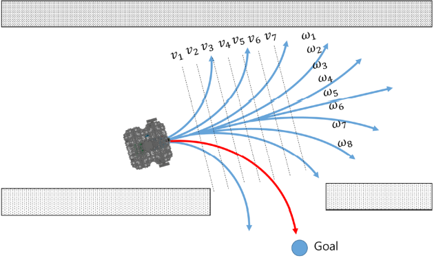

### Implementation of DWA

---

#### Basic idea of DWA (ROS Implemention)



The basic idea of the Dynamic Window Approach (DWA) algorithm is as follows:

1. Discretely sample in the robot's control space (dx,dy,dtheta)
2. For each sampled velocity, perform forward simulation from the robot's current state to predict what would happen if the sampled velocity were applied for some (short) period of time.
3. Evaluate (score) each trajectory resulting from the forward simulation, using a metric that incorporates characteristics such as: proximity to obstacles, proximity to the goal, proximity to the global path, and speed. Discard illegal trajectories (those that collide with obstacles).
4. Pick the highest-scoring trajectory and send the associated velocity to the mobile base.
5. Rinse and repeat.

#### key parameters

根据DWA的原理可以总结出两类关键参数：

- 影响采样空间的参数
  1. 机器人线速度及角速度取值范围
  2. 线加速度及角加速度取值范围
  3. 局部路径的仿真时间
- 影响采样空间内速度选择的参数
  - 计算速度对应score时各个value的权重

#### Calculate score of sample

| 对象名称           | 数据类型                | 说明                                  |
| ------------------ | ----------------------- | ------------------------------------- |
| oscillation_costs_ | OscillationCostFunction | 尽量降低机器人在原地晃动的情况。      |
| obstacle_costs_    | ObstacleCostFunction    | 防止机器人撞到障碍物上。              |
| path_costs_        | MapGridCostFunction     | 使机器人尽可能的贴近全局轨迹。        |
| goal_costs_        | MapGridCostFunction     | 更倾向于选择接近目标点的轨迹。        |
| goal_front_costs_  | MapGridCostFunction     | 尽可能的让机器人朝向局部的nose goal。 |
| alignment_costs_   | MapGridCostFunction     | 尽可能的让机器人保持在nose path上。   |
| twirling_costs_    | TwirlingCostFunction    | 尽量不让机器人原地打转。              |

- 每一个速度采样都需要计算以上几类score，然后比较所有项score的和，选择score结果最大的速度给机器人执行

---

#### Code analysis of dynamic window approach


#### Code Structure

```
├── main(gx=10.0, gy=10.0, robot_type=RobotType.circle)
    ├── start control loop
    ├── u, predicted_trajectory = dwa_control(x, config, goal, ob)
        ├── 
        ├── 
        ├── 
    ├── update state x
    ├── stacking trajectory points
 ├── arrival goal
 ├── plotting trajectory
```

#### Analysis

1. initial state tupe x np.array([0.0, 0.0, math.pi / 8.0, 0.0, 0.0])  [x(m), y(m), yaw(rad), v(m/s), omega(rad/s)]
2. set goal position goal = np.array([gx, gy]) (10, 10)
3. 

#### Code


```python
def main(gx=10.0, gy=10.0, robot_type=RobotType.circle):
    print(__file__ + " start!!")
    # initial state [x(m), y(m), yaw(rad), v(m/s), omega(rad/s)]
    x = np.array([0.0, 0.0, math.pi / 8.0, 0.0, 0.0])
    # goal position [x(m), y(m)]
    goal = np.array([gx, gy])

    # input [forward speed, yaw_rate]

    config.robot_type = robot_type
    trajectory = np.array(x)
    ob = config.ob
    while True:
        u, predicted_trajectory = dwa_control(x, config, goal, ob)
        x = motion(x, u, config.dt)  # simulate robot
        trajectory = np.vstack((trajectory, x))  # store state history
        
        # check reaching goal
        dist_to_goal = math.hypot(x[0] - goal[0], x[1] - goal[1])
        if dist_to_goal <= config.robot_radius:
            print("Goal!!")
            break
```

