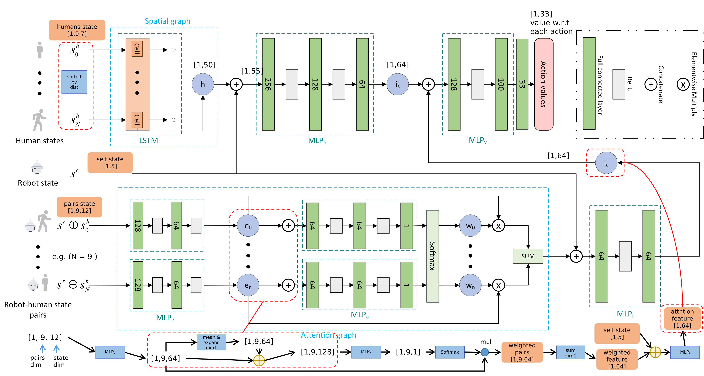

## Code structure of ESA

### Overview


### Code Structure

<details>
  <summary>Code Structure</summary>

```
├── configs
│   ├── agent.cfg
│   ├── env.config
│   ├── explorer.cfg
│   ├── optimizer.cfg
│   ├── policy.config
│   ├── replay_buffer.cfg
│   └── train.config
├── crowd_env
│   ├── envs
│   │   ├── crowd_env.py
│   │   ├── crowd_sim.py
│   │   ├── env_util.py
│   │   ├── policy
│   │   │   ├── linear.py
│   │   │   ├── orca.py
│   │   │   ├── policy_factory.py
│   │   │   ├── policy.py
│   │   └── utils
│   │       ├── action.py
│   │       ├── agent.py
│   │       ├── human.py
│   │       ├── info.py
│   │       ├── robot.py
│   │       ├── state.py
│   │       └── utils.py
├── crowd_nav
│   ├── first_step.py
│   ├── global_util.py
│   ├── policy
│   │   ├── cadrl.py
│   │   ├── esa.py
│   │   ├── lstm_rl.py
│   │   ├── multi_human_rl.py
│   │   ├── policy_factory.py
│   │   └── sarl.py
│   ├── test.py
│   ├── test_runner.py
│   ├── train.py
│   ├── train_runner.py
│   └── utils
│       ├── explorer.py
│       ├── __init__.py
│       ├── memory2.py
│       ├── plot.py
│       ├── trainer.py
│       └── util.py
├── models
│   ├── esa_model.py
│   ├── lstm_rl_model.py
│   └── sarl_model.py
├── pf_helper
│   ├── agent_builder.py
│   ├── explorer_builder.py
│   ├── network_builder.py
│   ├── optimizer_builder.py
│   ├── pf_runner.py
│   └── replay_buffer_builder.py
├── pfrl
│   ├── action_value.py
│   ├── agent.py
│   ├── agents
│   │   ├── a2c.py
│   │   ├── a3c.py
│   │   ├── acer.py
│   │   ├── al.py
│   │   ├── categorical_double_dqn.py
│   │   ├── categorical_dqn.py
│   │   ├── ddpg.py
│   │   ├── double_dqn.py
│   │   ├── double_pal.py
│   │   ├── dpp.py
│   │   ├── dqn.py
│   │   ├── iqn.py
│   │   ├── pal.py
│   │   ├── ppo.py
│   │   ├── reinforce.py
│   │   ├── soft_actor_critic.py
│   │   ├── state_q_function_actor.py
│   │   ├── td3.py
│   │   └── trpo.py
│   ├── collections
│   │   ├── persistent_collections.py
│   │   ├── prioritized.py
│   │   └── random_access_queue.py
│   ├── distributions
│   │   ├── delta.py
│   ├── env.py
│   ├── envs
│   │   ├── abc.py
│   │   ├── multiprocess_vector_env.py
│   │   └── serial_vector_env.py
│   ├── experiments
│   │   ├── evaluation_hooks.py
│   │   ├── evaluator.py
│   │   ├── hooks.py
│   │   ├── __init__.py
│   │   ├── prepare_output_dir.py
│   │   ├── train_agent_async.py
│   │   ├── train_agent_batch.py
│   │   └── train_agent.py
│   ├── explorer.py
│   ├── explorers
│   │   ├── additive_gaussian.py
│   │   ├── additive_ou.py
│   │   ├── boltzmann.py
│   │   ├── epsilon_greedy.py
│   │   ├── greedy.py
│   ├── functions
│   │   ├── bound_by_tanh.py
│   │   ├── __init__.py
│   │   ├── lower_triangular_matrix.py
│   ├── initializers
│   │   ├── chainer_default.py
│   │   ├── lecun_normal.py
│   ├── nn
│   │   ├── atari_cnn.py
│   │   ├── bound_by_tanh.py
│   │   ├── branched.py
│   │   ├── concat_obs_and_action.py
│   │   ├── empirical_normalization.py
│   │   ├── __init__.py
│   │   ├── lmbda.py
│   │   ├── mlp_bn.py
│   │   ├── mlp.py
│   │   ├── noisy_chain.py
│   │   ├── noisy_linear.py
│   │   ├── recurrent_branched.py
│   │   ├── recurrent.py
│   │   └── recurrent_sequential.py
│   ├── optimizers
│   │   └── rmsprop_eps_inside_sqrt.py
│   ├── policies
│   │   ├── deterministic_policy.py
│   │   ├── gaussian_policy.py
│   │   └── softmax_policy.py
│   ├── policy.py
│   ├── q_function.py
│   ├── q_functions
│   │   ├── dueling_dqn.py
│   │   ├── state_action_q_functions.py
│   │   └── state_q_functions.py
│   ├── replay_buffer.py
│   ├── replay_buffers
│   │   ├── episodic.py
│   │   ├── persistent.py
│   │   ├── prioritized_episodic.py
│   │   ├── prioritized.py
│   │   └── replay_buffer.py
│   ├── testing.py
│   ├── utils
│   │   ├── ask_yes_no.py
│   │   ├── async_.py
│   │   ├── batch_states.py
│   │   ├── clip_l2_grad_norm.py
│   │   ├── conjugate_gradient.py
│   │   ├── contexts.py
│   │   ├── copy_param.py
│   │   ├── env_modifiers.py
│   │   ├── __init__.py
│   │   ├── is_return_code_zero.py
│   │   ├── mode_of_distribution.py
│   │   ├── random.py
│   │   ├── random_seed.py
│   │   ├── recurrent.py
│   │   ├── reward_filter.py
│   │   └── stoppable_thread.py
│   └── wrappers
│       ├── atari_wrappers.py
│       ├── cast_observation.py
│       ├── continuing_time_limit.py
│       ├── __init__.py
│       ├── normalize_action_space.py
│       ├── randomize_action.py
│       ├── render.py
│       ├── scale_reward.py
│       └── vector_frame_stack.py
├── plot_success_rate.py
├── requirements.txt
├── run_dqn.py
├── test_pool.py
└── visualize_test.py
```

</details>

### Environment Setup

#### Observation

self_state:        $s = [d_g, v_{pref}, v_x, v_y, r]$

human_state:   $w_i = [p_x, p_y, v_x, v_y, d^i, r^i, r+r^i]$

**Code**

```python
#file location: crowd_env/envs/utils/robot.py
state = JointState(self.get_full_state(), ob)
```

#### Reward

```math
R_t(s_t^{jn}, a_t) = \begin{cases} -0.25 & \text{if\ $d_t$ < 0} \\ -0.1+d_t/2 & \text{else\ if\ $d_t$ < 0.2} \\ 1 & \text{else\ if\ $p_t$ = $p_g$} \\ 0 & \text{otherwise} \end{cases}
```

<!--

$$R_t(s_t^{jn}, a_t) = \begin{cases} -0.25 & \text{if\ $d_t$ < 0} \\ -0.1+d_t/2 & \text{else\ if\ $d_t$ < 0.2} \\ 1 & \text{else\ if\ $p_t$ = $p_g$} \\ 0 & \text{otherwise} \end{cases}$$

-->

<details>
  <summary>Code</summary>

```python
#file location: Crowd_env/envs/crowd_sim.py
if self.global_time >= self.time_limit - 1:
    reward = 0
    done = True
    info = Timeout()
elif collision:
    reward = self.collision_penalty
    done = True
    info = Collision()
elif reaching_goal:
    reward = self.success_reward
    done = True
    info = ReachGoal()
elif dmin < self.discomfort_dist:
    reward = (dmin - self.discomfort_dist) * self.discomfort_penalty_factor * self.time_step
    done = False
    info = Danger(dmin)
else:
    reward = 0
    done = False
    info = Nothing()
```

</details>

#### Action

- The action space consists of **33** discrete actions: 
  1. 4 speeds exponentially spaced between $(0, v_{pref}]$
  2. 8 headings evenly spaced between $(0, 2\pi)$
  3. (0, 0)

#### Terminal condition

- Timeout
- Reaching goal
- Collision

#### Dynamics

**env.step()**

```pseudocode
Input: global arguments, action: a
1 if robot is visible then
2   Get all humans’ state si and robot’ state
3 else
4   Get all humans’ state si
5 end
6 Calculate all humans’ action a_i using orca
7 Detection collision between robot and humans
8 Detection collision between humans (just for warning)
9 Check if reaching the goal
10 Calculate reward
11 Check if terminal conditions were satisfied
12 Update robot’s state and humans’s state
13 Get observation ob
Output: ob reward done info
```

### Value Network

#### Structure



- Dist is used to sort humans state: $$dist = w_c{({p_x'}^2+{p_y'}^2)}^\frac{1}{2}+(1-w_c){({(p_x'+v_x'\Delta t)}^2+{(p_y'+v_y'\Delta t)}^2)}^\frac{1}{2}$$
- $$w_c = 0.8$$

**Layers Structure**

```python
EsaModel(
  (mlp21): Sequential(
    (0): Linear(in_features=12, out_features=128, bias=True)
    (1): ReLU()
    (2): Linear(in_features=128, out_features=64, bias=True)
    (3): ReLU()
  )
  (mlp23): Sequential(
    (0): Linear(in_features=69, out_features=64, bias=True)
    (1): ReLU()
    (2): Linear(in_features=64, out_features=64, bias=True)
  )
  (attention): Sequential(
    (0): Linear(in_features=64, out_features=64, bias=True)
    (1): ReLU()
    (2): Linear(in_features=64, out_features=64, bias=True)
    (3): ReLU()
    (4): Linear(in_features=64, out_features=1, bias=True)
  )
  (lstm): LSTM(7, 50, batch_first=True)
  (mlp11): Sequential(
    (0): Linear(in_features=55, out_features=256, bias=True)
    (1): ReLU()
    (2): Linear(in_features=256, out_features=128, bias=True)
    (3): ReLU()
    (4): Linear(in_features=128, out_features=64, bias=True)
  )
  (mlp_final2): Sequential(
    (0): Linear(in_features=128, out_features=128, bias=True)
    (1): ReLU()
    (2): Linear(in_features=128, out_features=100, bias=True)
    (3): ReLU()
    (4): Linear(in_features=100, out_features=33, bias=True)
  )
)
```

### Training Process

- **main**

```pseudocode
1 Load configuration
2 Implement memory model trainer explorer
3 Set policy as ESA
/* start reinforcement learning */
4 Dynamically set epsilon while training
5 for episodes = 1, K RL do
6   while not done do
7     Generate action through randomly sampling or choosing from action space
8     Collect data into memory
9   end
10   Using SGD execute gradient descent
11 end
12 Saving model’s parameters
```

**Details of action generated while RL**

- Randomly sample action from action space when probability less than epsilon
- Or choosing by: $a_t = argmax_{a_t\in A}R(s_t,a_t)+{\gamma} \max_{a'} Q^{\star}(s_{t+\Delta t},a')$

### Testing Process

```pseudocode
1 Load configuration
2 Set policy as ESA
3 while not done do
4    for action in action_space do
5       Calculate self_state at next time step according to single integrator model
6       Calculate humans_state and next_state_reward at next time step using onestep_lookahead(policy is orca)
7       Concatenate self_state and humans_state as next_state
8       Input next_state into network and get next_state_value
9       Calculate value using next_state_value and next_state_reward
10      Get value and action pair
11    Choose action with highest value from pairs as execute action
11 Update env
12 end
```

- Method to calculate value: $a_t = argmax_{a_t\in A}R(s_t,a_t)+{\gamma} \max_{a'} Q^{\star}(s_{t+\Delta t},a')$

<!--

**utils for html showing**

```markdown
<details>
  <summary>Code</summary>

</details>
```

-->
