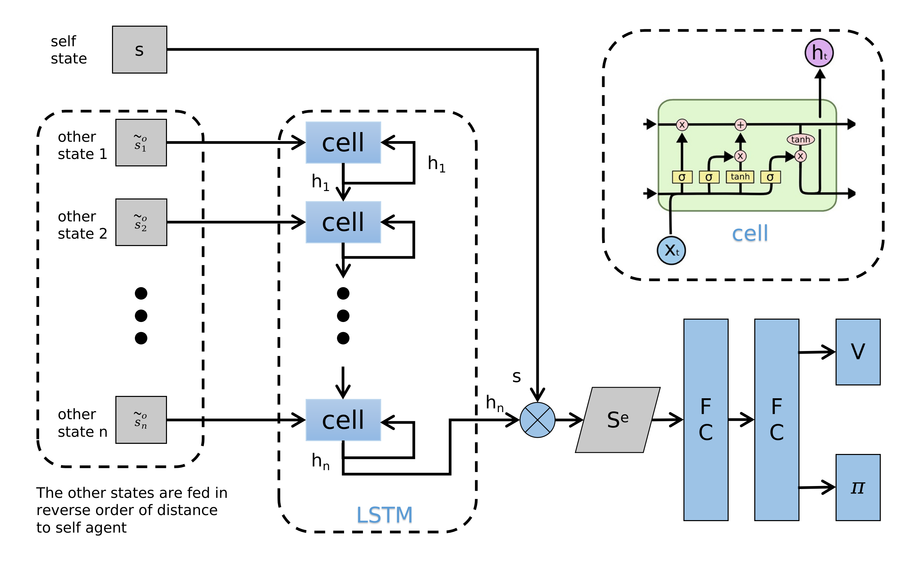

## Network structure of GA3C-CADRL

### Overview

### Environment Setup

#### Observation

self_state:        $s = [d_g, v_{pref}, v_x, v_y, r]$

human_state:   $w_i = [p_x, p_y, v_x, v_y, r_i, d_i, r_i + r]$

- $d_g$ : robot's distance to the goal
- $d_i$ : robot's distance to the human i 
- Source of observation data: Ground truth in gym environment

#### Reward

```math
R_t(s_t^{jn}, a_t) = \begin{cases} -0.25 & \text{if\ $d_t$ < 0} \\ -0.1+0.05 \cdot d_t & \text{else\ if\ $d_t$ < 0.2} \\ 1 & \text{else\ if\ $p_t$ = $p_g$} \\ 0 & \text{otherwise} \end{cases}
```

<!--

$$R_t(s_t^{jn}, a_t) = \begin{cases} -0.25 & \text{if\ $d_t$ < 0} \\ -0.1+0.05 \cdot d_t & \text{else\ if\ $d_t$ < 0.2} \\ 1 & \text{else\ if\ $p_t$ = $p_g$} \\ 0 & \text{otherwise} \end{cases}$$

-->

#### Action

- The action space consists of 80 discrete actions: 
  1. 5 speeds exponentially spaced between $(0, v_{pref}]$
  2. 16 headings evenly spaced between $[0, 2\pi)$

#### Terminal condition

- Timeout
- Reaching goal
- Collision

### Value Network

#### Structure



```python
ValueNetwork1(
  (mlp): Sequential(
    (0): Linear(in_features=56, out_features=150, bias=True)
    (1): ReLU()
    (2): Linear(in_features=150, out_features=100, bias=True)
    (3): ReLU()
    (4): Linear(in_features=100, out_features=100, bias=True)
    (5): ReLU()
    (6): Linear(in_features=100, out_features=1, bias=True)
  )
  (lstm): LSTM(13, 50, batch_first=True)
)
```

- Assume there are 5 humans and with_global_state is set to true, we can get state:

```math
\begin{cases}state &= [state1, state2, ..., state5] \\ state1 &= [self\_data, human1\_data, local\_map1] \\ self\_data &= [dg, v\_pref, theta, radius, vx, vy] \\ human1\_data &= [px1, py1, vx1, vy1, radius1, da, radius\_sum]\end{cases}
```

<!--

$$\begin{cases}state &= [state1, state2, ..., state5] \\ state1 &= [self\_data, human1\_data, local\_map1] \\ self\_data &= [dg, v\_pref, theta, radius, vx, vy] \\ human1\_data &= [px1, py1, vx1, vy1, radius1, da, radius\_sum] \end{cases}$$

-->

### Training Process

- **main**

```pseudocode
1 Load configuration
2 Implement memory model trainer explorer
3 Set policy as sarl
/* start imitation learning */
4 for episodes = 1, K IL do
5   while not done do
6     Generate action through orca
7     Push state, action, reward in memory
8   end
9 end
10 for epoch = 1, M IL do
11   Get one batch data from memory
12   Calculate loss between reward and value(return through model)
13   Using SGD execute gradient descent and update model’s parameters
14 end
/* start reinforcement learning */
15 Dynamically set epsilon while training
16 for episodes = 1, K RL do
17   while not done do
18     Generate action through sampling and scoring from action space
19     Collect data into memory
20   end
21   Using SGD execute gradient descent
22 end
23 Saving model’s parameters
```

**Details of action generated while RL**

- Random sample action from action space when probability less than epsilon
- Or $a_t = argmax_{a_t\in A}R(s_{t+\Delta t}^{jn},a_t)+{\gamma}^{{\Delta t}\cdot v_{pref}}V(s_{t+\Delta t}^{jn},a_t)$

### Testing Process

```pseudocode
1 Load configuration
2 Set policy as sarl
3 while not done do
4   Generate action through orca.predict(similar as rl training)
5   Update env
6 end
```

<details>
  <summary>Training's code</summary>

```python
#file location: CrowdNav/crowd_nav/train.py

# imitation learning
if args.resume:
    if not os.path.exists(rl_weight_file):
        logging.error('RL weights does not exist')
    model.load_state_dict(torch.load(rl_weight_file))
    rl_weight_file = os.path.join(args.output_dir, 'resumed_rl_model.pth')
    logging.info('Load reinforcement learning trained weights. Resume training')
elif os.path.exists(il_weight_file):
    model.load_state_dict(torch.load(il_weight_file))
    logging.info('Load imitation learning trained weights.')
else:
    il_episodes = train_config.getint('imitation_learning', 'il_episodes')
    il_policy = train_config.get('imitation_learning', 'il_policy')
    il_epochs = train_config.getint('imitation_learning', 'il_epochs')
    il_learning_rate = train_config.getfloat('imitation_learning', 'il_learning_rate')
    trainer.set_learning_rate(il_learning_rate)
    if robot.visible:
        safety_space = 0
    else:
        safety_space = train_config.getfloat('imitation_learning', 'safety_space')
    il_policy = policy_factory[il_policy]()
    il_policy.multiagent_training = policy.multiagent_training
    il_policy.safety_space = safety_space
    robot.set_policy(il_policy)
    explorer.run_k_episodes(il_episodes, 'train', update_memory=True, imitation_learning=True)
    trainer.optimize_epoch(il_epochs)
    torch.save(model.state_dict(), il_weight_file)
    logging.info('Finish imitation learning. Weights saved.')
    logging.info('Experience set size: %d/%d', len(memory), memory.capacity)
explorer.update_target_model(model)

# reinforcement learning
policy.set_env(env)
robot.set_policy(policy)
robot.print_info()
trainer.set_learning_rate(rl_learning_rate)
# fill the memory pool with some RL experience
if args.resume:
    robot.policy.set_epsilon(epsilon_end)
    explorer.run_k_episodes(100, 'train', update_memory=True, episode=0)
    logging.info('Experience set size: %d/%d', len(memory), memory.capacity)
episode = 0
while episode < train_episodes:
    if args.resume:
        epsilon = epsilon_end
    else:
        if episode < epsilon_decay:
            epsilon = epsilon_start + (epsilon_end - epsilon_start) / epsilon_decay * episode
        else:
            epsilon = epsilon_end
    robot.policy.set_epsilon(epsilon)

    # evaluate the model
    if episode % evaluation_interval == 0:
        explorer.run_k_episodes(env.case_size['val'], 'val', episode=episode)

    # sample k episodes into memory and optimize over the generated memory
    explorer.run_k_episodes(sample_episodes, 'train', update_memory=True, episode=episode)
    trainer.optimize_batch(train_batches)
    episode += 1

    if episode % target_update_interval == 0:
        explorer.update_target_model(model)

    if episode != 0 and episode % checkpoint_interval == 0:
        torch.save(model.state_dict(), rl_weight_file)
```

```python

```

```python
#file location: CrowdNav/crowd_nav/utils/trainer.py

def optimize_epoch(self, num_epochs):
    if self.optimizer is None:
        raise ValueError('Learning rate is not set!')
    if self.data_loader is None:
        self.data_loader = DataLoader(self.memory, self.batch_size, shuffle=True)
    average_epoch_loss = 0
    for epoch in range(num_epochs):
        epoch_loss = 0
        for data in self.data_loader:
            inputs, values = data
            inputs = Variable(inputs)
            values = Variable(values)

            self.optimizer.zero_grad()
            outputs = self.model(inputs)
            #torch.onnx.export(self.model, inputs, 'model.onnx', export_params=True)
            #self.writer.add_graph(self.model, inputs)
            loss = self.criterion(outputs, values)
            loss.backward()
            self.optimizer.step()
            epoch_loss += loss.data.item()

        average_epoch_loss = epoch_loss / len(self.memory)
        logging.debug('Average loss in epoch %d: %.2E', epoch, average_epoch_loss)

    return average_epoch_loss
```

<!--

**utils for html showing**

```markdown
<details>
  <summary>Code</summary>

</details>
```

-->
