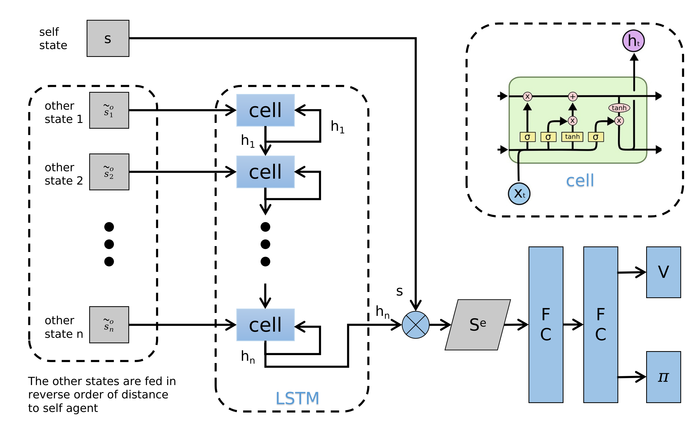

## Network structure of GA3C-CADRL

### Overview

### Environment Setup

#### Observation

self_state:        $s = [d_g, v_{pref}, v_x, v_y, r]$

human_state:   $w_i = [p_x, p_y, v_x, v_y, r_i, d_i, r_i + r]$

- $d_g$ : robot's distance to the goal
- $d_i$ : robot's distance to the human i 
- Source of observation data: Ground truth in gym environment

#### Reward

```math
R_t(s_t^{jn}, a_t) = \begin{cases} -0.25 & \text{if\ $d_t$ < 0} \\ -0.1+0.05 \cdot d_t & \text{else\ if\ $d_t$ < 0.2} \\ 1 & \text{else\ if\ $p_t$ = $p_g$} \\ 0 & \text{otherwise} \end{cases}
```

<!--

$$R_t(s_t^{jn}, a_t) = \begin{cases} -0.25 & \text{if\ $d_t$ < 0} \\ -0.1+0.05 \cdot d_t & \text{else\ if\ $d_t$ < 0.2} \\ 1 & \text{else\ if\ $p_t$ = $p_g$} \\ 0 & \text{otherwise} \end{cases}$$

-->

#### Action

- The action space consists of 80 discrete actions: 
  1. 5 speeds exponentially spaced between $(0, v_{pref}]$
  2. 16 headings evenly spaced between $[0, 2\pi)$

#### Terminal condition

- Timeout
- Reaching goal
- Collision

### Value Network

#### Structure



```python
# network structure of implemention in SARL
ValueNetwork1(
  (mlp): Sequential(
    (0): Linear(in_features=56, out_features=150, bias=True)
    (1): ReLU()
    (2): Linear(in_features=150, out_features=100, bias=True)
    (3): ReLU()
    (4): Linear(in_features=100, out_features=100, bias=True)
    (5): ReLU()
    (6): Linear(in_features=100, out_features=1, bias=True)
  )
  (lstm): LSTM(13, 50, batch_first=True)
)
```

- Assume there are 5 humans and with_global_state is set to true, we can get state:

```math
\begin{cases}state &= [state1, state2, ..., state5] \\ state1 &= [self\_data, human1\_data, local\_map1] \\ self\_data &= [dg, v\_pref, theta, radius, vx, vy] \\ human1\_data &= [px1, py1, vx1, vy1, radius1, da, radius\_sum]\end{cases}
```

<!--

$$\begin{cases}state &= [state1, state2, ..., state5] \\ state1 &= [self\_data, human1\_data, local\_map1] \\ self\_data &= [dg, v\_pref, theta, radius, vx, vy] \\ human1\_data &= [px1, py1, vx1, vy1, radius1, da, radius\_sum] \end{cases}$$

-->

### Training Process

**Details of action generated while RL**

- Random sample action from action space when probability less than epsilon
- Or $a_t = argmax_{a_t\in A}R(s_{t+\Delta t}^{jn},a_t)+{\gamma}^{{\Delta t}\cdot v_{pref}}V(s_{t+\Delta t}^{jn},a_t)$

### Testing Process

<!--

**utils for html showing**

```markdown
<details>
  <summary>Code</summary>

</details>
```

-->
