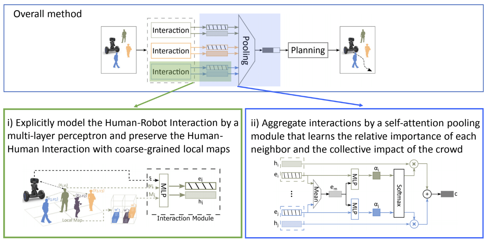
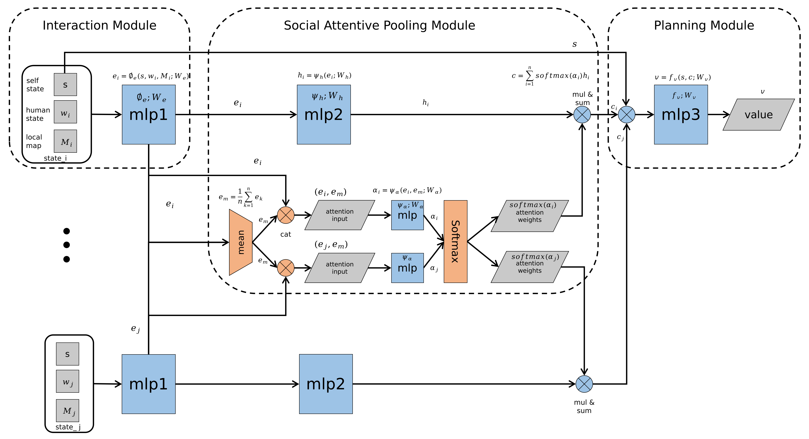
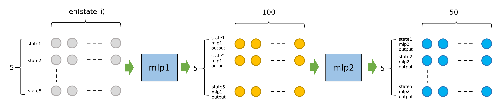
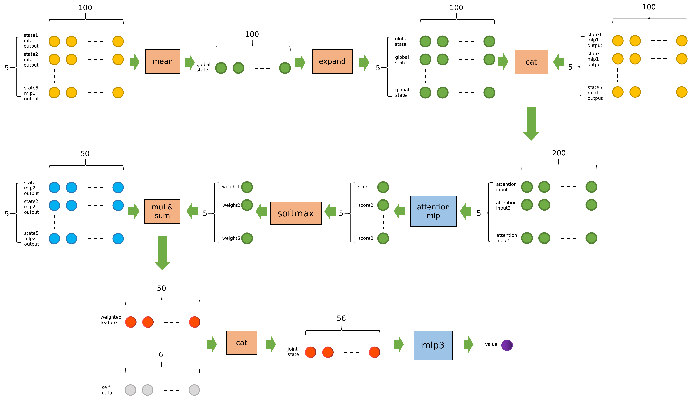

## Code structure of CrowdNav

### Overview



### Code Structure

```
├── crowd_nav
│   ├── configs
│   │   ├── env.config
│   │   ├── policy.config
│   │   └── train.config
│   ├── data
│   │   └── output
│   │       ├── env.config
│   │       ├── il_model.pth
│   │       ├── output.log
│   │       ├── policy.config
│   │       ├── rl_model.pth
│   │       └── train.config
│   ├── __init__.py
│   ├── policy
│   │   ├── cadrl.py
│   │   ├── lstm_rl.py
│   │   ├── multi_human_rl.py
│   │   ├── policy_factory.py
│   │   └── sarl.py
│   ├── test.py
│   ├── train.py
│   └── utils
│       ├── explorer.py
│       ├── memory.py
│       ├── plot.py
│       └── trainer.py
├── crowd_sim
│   ├── envs
│   │   ├── crowd_sim.py
│   │   ├── policy
│   │   │   ├── linear.py
│   │   │   ├── orca.py
│   │   │   ├── policy_factory.py
│   │   │   ├── policy.py
│   │   └── utils
│   │       ├── action.py
│   │       ├── agent.py
│   │       ├── human.py
│   │       ├── info.py
│   │       ├── robot.py
│   │       ├── state.py
│   │       └── utils.py
│   └── README.md
├── LICENSE
├── README.md
└── setup.py
```

### Environment Setup

#### Observation

self_state:        $s = [d_g, v_{pref}, v_x, v_y, r]$

human_state:   $w_i = [p_x, p_y, v_x, v_y, r_i, d_i, r_i + r]$

- $d_g$ : robot's distance to the goal
- $d_i$ : robot's distance to the human i 
- Source of observation data: Ground truth in gym environment

**Code**

```python
#file location: CrowdNav/crowd_sim/envs/utils/robot.py
state = JointState(self.get_full_state(), ob)
```

#### Reward

```math
R_t(s_t^{jn}, a_t) = \begin{cases} -0.25 & \text{if\ $d_t$ < 0} \\ -0.1+d_t/2 & \text{else\ if\ $d_t$ < 0.2} \\ 1 & \text{else\ if\ $p_t$ = $p_g$} \\ 0 & \text{otherwise} \end{cases}
```

<!--

$$R_t(s_t^{jn}, a_t) = \begin{cases} -0.25 & \text{if\ $d_t$ < 0} \\ -0.1+d_t/2 & \text{else\ if\ $d_t$ < 0.2} \\ 1 & \text{else\ if\ $p_t$ = $p_g$} \\ 0 & \text{otherwise} \end{cases}$$

-->

<details>
  <summary>Code</summary>

```python
#file location: CrowdNav/crowd_sim/envs/utils/crowd_sim.py
if self.global_time >= self.time_limit - 1:
    reward = 0
    done = True
    info = Timeout()
elif collision:
    reward = self.collision_penalty
    done = True
    info = Collision()
elif reaching_goal:
    reward = self.success_reward
    done = True
    info = ReachGoal()
elif dmin < self.discomfort_dist:
    reward = (dmin - self.discomfort_dist) * self.discomfort_penalty_factor * self.time_step
    done = False
    info = Danger(dmin)
else:
    reward = 0
    done = False
    info = Nothing()
```

</details>

#### Action

- The action space consists of 80 discrete actions: 
  1. 5 speeds exponentially spaced between $(0, v_{pref}]$
  2. 16 headings evenly spaced between $[0, 2\pi)$

<details>
  <summary>Code</summary>

```python
#file location: CrowdNav/crowd_nav/policy/cadrl.py

speeds = [(np.exp((i + 1) / self.speed_samples) - 1) / (np.e - 1) * v_pref for i in range(self.speed_samples)]
if holonomic:
    rotations = np.linspace(0, 2 * np.pi, self.rotation_samples, endpoint=False)
else:
    rotations = np.linspace(-np.pi / 4, np.pi / 4, self.rotation_samples)

action_space = [ActionXY(0, 0) if holonomic else ActionRot(0, 0)]
```

</details>

#### Terminal condition

- Timeout
- Reaching goal
- Collision

**Code**

- The code's location is the same as reward

#### Dynamics

**env.step()**

```pseudocode
Input: global arguments, action: arobot
1 if robot is visible then
2   Get all humans’ state si i ∈ 1, 2...5 and robot’ state srobot
3 else
4   Get all humans’ state si i ∈ 1, 2...5
5 end
6 Calculate all humans’ action ahuman i using orca
7 Detection collision between robot and humans
8 Detection collision between humans (just for warning)
9 Check if reaching the goal
10 Calculate reward
11 Check if terminal conditions were satisfied
12 Update robot’s state and humans’s state
13 Get observation ob
Output: ob reward done info
```

<details>
  <summary>Code</summary>

```python
#file location: CrowdNav/crowd_sim/envs/utils/crowd_sim.py

def step(self, action, update=True):
    """
    Compute actions for all agents, detect collision, update environment and return (ob, reward, done, info)

    """
    human_actions = []
    for human in self.humans:
        # observation for humans is always coordinates
        ob = [other_human.get_observable_state() for other_human in self.humans if other_human != human]
        if self.robot.visible:
            ob += [self.robot.get_observable_state()]
        human_actions.append(human.act(ob))

    # collision detection
    dmin = float('inf')
    collision = False
    for i, human in enumerate(self.humans):
        px = human.px - self.robot.px
        py = human.py - self.robot.py
        if self.robot.kinematics == 'holonomic':
            vx = human.vx - action.vx
            vy = human.vy - action.vy
        else:
            vx = human.vx - action.v * np.cos(action.r + self.robot.theta)
            vy = human.vy - action.v * np.sin(action.r + self.robot.theta)
        ex = px + vx * self.time_step
        ey = py + vy * self.time_step
        # closest distance between boundaries of two agents
        closest_dist = point_to_segment_dist(px, py, ex, ey, 0, 0) - human.radius - self.robot.radius
        if closest_dist < 0:
            collision = True
            # logging.debug("Collision: distance between robot and p{} is {:.2E}".format(i, closest_dist))
            break
        elif closest_dist < dmin:
            dmin = closest_dist

    # collision detection between humans
    human_num = len(self.humans)
    for i in range(human_num):
        for j in range(i + 1, human_num):
            dx = self.humans[i].px - self.humans[j].px
            dy = self.humans[i].py - self.humans[j].py
            dist = (dx ** 2 + dy ** 2) ** (1 / 2) - self.humans[i].radius - self.humans[j].radius
            if dist < 0:
                # detect collision but don't take humans' collision into account
                logging.debug('Collision happens between humans in step()')

    # check if reaching the goal
    end_position = np.array(self.robot.compute_position(action, self.time_step))
    reaching_goal = norm(end_position - np.array(self.robot.get_goal_position())) < self.robot.radius

    if self.global_time >= self.time_limit - 1:
        reward = 0
        done = True
        info = Timeout()
    elif collision:
        reward = self.collision_penalty
        done = True
        info = Collision()
    elif reaching_goal:
        reward = self.success_reward
        done = True
        info = ReachGoal()
    elif dmin < self.discomfort_dist:
        # only penalize agent for getting too close if it's visible
        # adjust the reward based on FPS
        reward = (dmin - self.discomfort_dist) * self.discomfort_penalty_factor * self.time_step
        done = False
        info = Danger(dmin)
    else:
        reward = 0
        done = False
        info = Nothing()

    if update:
        # store state, action value and attention weights
        self.states.append([self.robot.get_full_state(), [human.get_full_state() for human in self.humans]])
        if hasattr(self.robot.policy, 'action_values'):
            self.action_values.append(self.robot.policy.action_values)
        if hasattr(self.robot.policy, 'get_attention_weights'):
            self.attention_weights.append(self.robot.policy.get_attention_weights())

        # update all agents
        self.robot.step(action)
        for i, human_action in enumerate(human_actions):
            self.humans[i].step(human_action)
        self.global_time += self.time_step
        for i, human in enumerate(self.humans):
            # only record the first time the human reaches the goal
            if self.human_times[i] == 0 and human.reached_destination():
                self.human_times[i] = self.global_time

        # compute the observation
        if self.robot.sensor == 'coordinates':
            ob = [human.get_observable_state() for human in self.humans]
        elif self.robot.sensor == 'RGB':
            raise NotImplementedError
    else:
        if self.robot.sensor == 'coordinates':
            ob = [human.get_next_observable_state(action) for human, action in zip(self.humans, human_actions)]
        elif self.robot.sensor == 'RGB':
            raise NotImplementedError

    return ob, reward, done, info
```

```python
#file location: CrowdNav/crowd_sim/envs/utils/crowd_sim.py

def reset(self, phase='test', test_case=None):
    """
    Set px, py, gx, gy, vx, vy, theta for robot and humans
    :return:
    """
    if self.robot is None:
        raise AttributeError('robot has to be set!')
    assert phase in ['train', 'val', 'test']
    if test_case is not None:
        self.case_counter[phase] = test_case
    self.global_time = 0
    if phase == 'test':
        self.human_times = [0] * self.human_num
    else:
        self.human_times = [0] * (self.human_num if self.robot.policy.multiagent_training else 1)
    if not self.robot.policy.multiagent_training:
        self.train_val_sim = 'circle_crossing'

    if self.config.get('humans', 'policy') == 'trajnet':
        raise NotImplementedError
    else:
        counter_offset = {'train': self.case_capacity['val'] + self.case_capacity['test'],
                          'val': 0, 'test': self.case_capacity['val']}
        self.robot.set(0, -self.circle_radius, 0, self.circle_radius, 0, 0, np.pi / 2)
        if self.case_counter[phase] >= 0:
            np.random.seed(counter_offset[phase] + self.case_counter[phase])
            if phase in ['train', 'val']:
                human_num = self.human_num if self.robot.policy.multiagent_training else 1
                self.generate_random_human_position(human_num=human_num, rule=self.train_val_sim)
            else:
                self.generate_random_human_position(human_num=self.human_num, rule=self.test_sim)
            # case_counter is always between 0 and case_size[phase]
            self.case_counter[phase] = (self.case_counter[phase] + 1) % self.case_size[phase]
        else:
            assert phase == 'test'
            if self.case_counter[phase] == -1:
                # for debugging purposes
                self.human_num = 3
                self.humans = [Human(self.config, 'humans') for _ in range(self.human_num)]
                self.humans[0].set(0, -6, 0, 5, 0, 0, np.pi / 2)
                self.humans[1].set(-5, -5, -5, 5, 0, 0, np.pi / 2)
                self.humans[2].set(5, -5, 5, 5, 0, 0, np.pi / 2)
            else:
                raise NotImplementedError

    for agent in [self.robot] + self.humans:
        agent.time_step = self.time_step
        agent.policy.time_step = self.time_step

    self.states = list()
    if hasattr(self.robot.policy, 'action_values'):
        self.action_values = list()
    if hasattr(self.robot.policy, 'get_attention_weights'):
        self.attention_weights = list()

    # get current observation
    if self.robot.sensor == 'coordinates':
        ob = [human.get_observable_state() for human in self.humans]
    elif self.robot.sensor == 'RGB':
        raise NotImplementedError

    return ob
```

</details>

### Value Network

#### Structure



**Layers Structure**

```python
ValueNetwork(
  (mlp1): Sequential(
    (0): Linear(in_features=13, out_features=150, bias=True)
    (1): ReLU()
    (2): Linear(in_features=150, out_features=100, bias=True)
    (3): ReLU()
  )
  (mlp2): Sequential(
    (0): Linear(in_features=100, out_features=100, bias=True)
    (1): ReLU()
    (2): Linear(in_features=100, out_features=50, bias=True)
  )
  (attention): Sequential(
    (0): Linear(in_features=200, out_features=100, bias=True)
    (1): ReLU()
    (2): Linear(in_features=100, out_features=100, bias=True)
    (3): ReLU()
    (4): Linear(in_features=100, out_features=1, bias=True)
  )
  (mlp3): Sequential(
    (0): Linear(in_features=56, out_features=150, bias=True)
    (1): ReLU()
    (2): Linear(in_features=150, out_features=100, bias=True)
    (3): ReLU()
    (4): Linear(in_features=100, out_features=100, bias=True)
    (5): ReLU()
    (6): Linear(in_features=100, out_features=1, bias=True)
  )
)
```

- Assume there are 5 humans and with_global_state is set to true, we can get state:

```math
\begin{cases}state &= [state1, state2, ..., state5] \\ state1 &= [self\_data, human1\_data, local\_map1] \\ self\_data &= [dg, v\_pref, theta, radius, vx, vy] \\ human1\_data &= [px1, py1, vx1, vy1, radius1, da, radius\_sum] \\ local\_map1 &= [4 * 4 * 3]\end{cases}
```

<!--

$$\begin{cases}state &= [state1, state2, ..., state5] \\ state1 &= [self\_data, human1\_data, local\_map1] \\ self\_data &= [dg, v\_pref, theta, radius, vx, vy] \\ human1\_data &= [px1, py1, vx1, vy1, radius1, da, radius\_sum] \\ local\_map1 &= [4 * 4 * 3]\end{cases}$$

-->

**Details of data process** 



---



```pseudocode
Input: state
1 Pass data through mlp1 layer with
Input: data size: [5, 13]
Output: data size: [5, 100]
2 Pass data through mlp2 layer with
Input: data size: [5, 100]
Output: data size: [5, 50]
3 if with global state then
4   Add Mean of mlp1’s output with mlp1’s output and form attention input
5 else
6   Let mlp1’s output as attention input
7 end
8 Calculate attention scores data size: [1, 5]
9 Calculate attention weights using softmax
10 Multiple weights with mlp2’s output then form weighted feature
11 add weighted feature with self state as joint state
12 pass joint state to mlp3 then output value
Output: value
```

### Training Process

- **main**

```pseudocode
1 Load configuration
2 Implement memory model trainer explorer
3 Set policy as sarl
/* start imitation learning */
4 for episodes = 1, K IL do
5   while not done do
6     Generate action through orca
7     Push state, action, reward in memory
8   end
9 end
10 for epoch = 1, M IL do
11   Get one batch data from memory
12   Calculate loss between reward and value(return through model)
13   Using SGD execute gradient descent and update model’s parameters
14 end
/* start reinforcement learning */
15 Dynamically set epsilon while training
16 for episodes = 1, K RL do
17   while not done do
18     Generate action through sampling and scoring from action space
19     Collect data into memory
20   end
21   Using SGD execute gradient descent
22 end
23 Saving model’s parameters
```

**Details of action generated while RL**

- Random sample action from action space when probability less than epsilon
- Or $a_t = argmax_{a_t\in A}R(s_{t+\Delta t}^{jn},a_t)+{\gamma}^{{\Delta t}\cdot v_{pref}}V(s_{t+\Delta t}^{jn},a_t)$

### Testing Process

```pseudocode
1 Load configuration
2 Set policy as sarl
3 while not done do
4    for action in action_space do
5       Calculate self_state at next time step according to single integrator model
6       Calculate humans_state and next_state_reward at next time step using onestep_lookahead(policy is orca)
7       Concatenate self_state and humans_state as next_state
8       Input next_state into network and get next_state_value
9       Calculate value using next_state_value and next_state_reward
10      Get value and action pair
11    Choose action with highest value from pairs as execute action
11 Update env
12 end
```

- Method to calculate value: $R(s_{t+\Delta t}^{jn},a_t)+{\gamma}^{{\Delta t}\cdot v_{pref}}V(s_{t+\Delta t}^{jn},a_t)$
- Method to pursuance onestep_lookahead: Using action as input to execute step() function in sim env but don't update env state

<details>
  <summary>Training's code</summary>

```python
#file location: CrowdNav/crowd_nav/train.py

# imitation learning
if args.resume:
    if not os.path.exists(rl_weight_file):
        logging.error('RL weights does not exist')
    model.load_state_dict(torch.load(rl_weight_file))
    rl_weight_file = os.path.join(args.output_dir, 'resumed_rl_model.pth')
    logging.info('Load reinforcement learning trained weights. Resume training')
elif os.path.exists(il_weight_file):
    model.load_state_dict(torch.load(il_weight_file))
    logging.info('Load imitation learning trained weights.')
else:
    il_episodes = train_config.getint('imitation_learning', 'il_episodes')
    il_policy = train_config.get('imitation_learning', 'il_policy')
    il_epochs = train_config.getint('imitation_learning', 'il_epochs')
    il_learning_rate = train_config.getfloat('imitation_learning', 'il_learning_rate')
    trainer.set_learning_rate(il_learning_rate)
    if robot.visible:
        safety_space = 0
    else:
        safety_space = train_config.getfloat('imitation_learning', 'safety_space')
    il_policy = policy_factory[il_policy]()
    il_policy.multiagent_training = policy.multiagent_training
    il_policy.safety_space = safety_space
    robot.set_policy(il_policy)
    explorer.run_k_episodes(il_episodes, 'train', update_memory=True, imitation_learning=True)
    trainer.optimize_epoch(il_epochs)
    torch.save(model.state_dict(), il_weight_file)
    logging.info('Finish imitation learning. Weights saved.')
    logging.info('Experience set size: %d/%d', len(memory), memory.capacity)
explorer.update_target_model(model)

# reinforcement learning
policy.set_env(env)
robot.set_policy(policy)
robot.print_info()
trainer.set_learning_rate(rl_learning_rate)
# fill the memory pool with some RL experience
if args.resume:
    robot.policy.set_epsilon(epsilon_end)
    explorer.run_k_episodes(100, 'train', update_memory=True, episode=0)
    logging.info('Experience set size: %d/%d', len(memory), memory.capacity)
episode = 0
while episode < train_episodes:
    if args.resume:
        epsilon = epsilon_end
    else:
        if episode < epsilon_decay:
            epsilon = epsilon_start + (epsilon_end - epsilon_start) / epsilon_decay * episode
        else:
            epsilon = epsilon_end
    robot.policy.set_epsilon(epsilon)

    # evaluate the model
    if episode % evaluation_interval == 0:
        explorer.run_k_episodes(env.case_size['val'], 'val', episode=episode)

    # sample k episodes into memory and optimize over the generated memory
    explorer.run_k_episodes(sample_episodes, 'train', update_memory=True, episode=episode)
    trainer.optimize_batch(train_batches)
    episode += 1

    if episode % target_update_interval == 0:
        explorer.update_target_model(model)

    if episode != 0 and episode % checkpoint_interval == 0:
        torch.save(model.state_dict(), rl_weight_file)
```

```python
#file location: CrowdNav/crowd_nav/utils/explorer.py

def run_k_episodes(self, k, phase, update_memory=False, imitation_learning=False, episode=None,
                   print_failure=False):
    self.robot.policy.set_phase(phase)
    success_times = []
    collision_times = []
    timeout_times = []
    success = 0
    collision = 0
    timeout = 0
    too_close = 0
    min_dist = []
    cumulative_rewards = []
    collision_cases = []
    timeout_cases = []
    for i in range(k):
        ob = self.env.reset(phase)
        done = False
        states = []
        actions = []
        rewards = []
        while not done:
            action = self.robot.act(ob)
            ob, reward, done, info = self.env.step(action)
            states.append(self.robot.policy.last_state)
            actions.append(action)
            rewards.append(reward)

            if isinstance(info, Danger):
                too_close += 1
                min_dist.append(info.min_dist)

        if isinstance(info, ReachGoal):
            success += 1
            success_times.append(self.env.global_time)
        elif isinstance(info, Collision):
            collision += 1
            collision_cases.append(i)
            collision_times.append(self.env.global_time)
        elif isinstance(info, Timeout):
            timeout += 1
            timeout_cases.append(i)
            timeout_times.append(self.env.time_limit)
        else:
            raise ValueError('Invalid end signal from environment')

        if update_memory:
            if isinstance(info, ReachGoal) or isinstance(info, Collision):
                # only add positive(success) or negative(collision) experience in experience set
                self.update_memory(states, actions, rewards, imitation_learning)

        cumulative_rewards.append(sum([pow(self.gamma, t * self.robot.time_step * self.robot.v_pref)
                                       * reward for t, reward in enumerate(rewards)]))

    success_rate = success / k
    collision_rate = collision / k
    assert success + collision + timeout == k
    avg_nav_time = sum(success_times) / len(success_times) if success_times else self.env.time_limit

    extra_info = '' if episode is None else 'in episode {} '.format(episode)
    logging.info('{:<5} {}has success rate: {:.2f}, collision rate: {:.2f}, nav time: {:.2f}, total reward: {:.4f}'.
                 format(phase.upper(), extra_info, success_rate, collision_rate, avg_nav_time,
                        average(cumulative_rewards)))
    if phase in ['val', 'test']:
        num_step = sum(success_times + collision_times + timeout_times) / self.robot.time_step
        logging.info('Frequency of being in danger: %.2f and average min separate distance in danger: %.2f',
                     too_close / num_step, average(min_dist))

    if print_failure:
        logging.info('Collision cases: ' + ' '.join([str(x) for x in collision_cases]))
        logging.info('Timeout cases: ' + ' '.join([str(x) for x in timeout_cases]))
        
#update memory
def update_memory(self, states, actions, rewards, imitation_learning=False):
    if self.memory is None or self.gamma is None:
        raise ValueError('Memory or gamma value is not set!')

    for i, state in enumerate(states):
        reward = rewards[i]

        # VALUE UPDATE
        if imitation_learning:
            # define the value of states in IL as cumulative discounted rewards, which is the same in RL
            state = self.target_policy.transform(state)
            # value = pow(self.gamma, (len(states) - 1 - i) * self.robot.time_step * self.robot.v_pref)
            value = sum([pow(self.gamma, max(t - i, 0) * self.robot.time_step * self.robot.v_pref) * reward
                         * (1 if t >= i else 0) for t, reward in enumerate(rewards)])
        else:
            if i == len(states) - 1:
                # terminal state
                value = reward
            else:
                next_state = states[i + 1]
                gamma_bar = pow(self.gamma, self.robot.time_step * self.robot.v_pref)
                value = reward + gamma_bar * self.target_model(next_state.unsqueeze(0)).data.item()
        value = torch.Tensor([value]).to(self.device)

        # # transform state of different human_num into fixed-size tensor
        # if len(state.size()) == 1:
        #     human_num = 1
        #     feature_size = state.size()[0]
        # else:
        #     human_num, feature_size = state.size()
        # if human_num != 5:
        #     padding = torch.zeros((5 - human_num, feature_size))
        #     state = torch.cat([state, padding])
        self.memory.push((state, value))
```

```python
#file location: CrowdNav/crowd_nav/utils/trainer.py

def optimize_epoch(self, num_epochs):
    if self.optimizer is None:
        raise ValueError('Learning rate is not set!')
    if self.data_loader is None:
        self.data_loader = DataLoader(self.memory, self.batch_size, shuffle=True)
    average_epoch_loss = 0
    for epoch in range(num_epochs):
        epoch_loss = 0
        for data in self.data_loader:
            inputs, values = data
            inputs = Variable(inputs)
            values = Variable(values)

            self.optimizer.zero_grad()
            outputs = self.model(inputs)
            #torch.onnx.export(self.model, inputs, 'model.onnx', export_params=True)
            #self.writer.add_graph(self.model, inputs)
            loss = self.criterion(outputs, values)
            loss.backward()
            self.optimizer.step()
            epoch_loss += loss.data.item()

        average_epoch_loss = epoch_loss / len(self.memory)
        logging.debug('Average loss in epoch %d: %.2E', epoch, average_epoch_loss)

    return average_epoch_loss
```

</details>

<details>
  <summary>Testing's code</summary>

```python
#file location: CrowdNav/crowd_nav/test.py

# configure environment
env_config = configparser.RawConfigParser()
env_config.read(env_config_file)
env = gym.make('CrowdSim-v0')
env.configure(env_config)
if args.square:
    env.test_sim = 'square_crossing'
if args.circle:
    env.test_sim = 'circle_crossing'
robot = Robot(env_config, 'robot')
robot.set_policy(policy)
env.set_robot(robot)
explorer = Explorer(env, robot, device, gamma=0.9)

policy.set_phase(args.phase)
policy.set_device(device)
# set safety space for ORCA in non-cooperative simulation
if isinstance(robot.policy, ORCA):
    if robot.visible:
        robot.policy.safety_space = 0
    else:
        # because invisible case breaks the reciprocal assumption
        # adding some safety space improves ORCA performance. Tune this value based on your need.
        robot.policy.safety_space = 0
    logging.info('ORCA agent buffer: %f', robot.policy.safety_space)

policy.set_env(env)
robot.print_info()
if args.visualize:
    ob = env.reset(args.phase, args.test_case)
    done = False
    last_pos = np.array(robot.get_position())
    while not done:
        action = robot.act(ob)
        ob, _, done, info = env.step(action)
        current_pos = np.array(robot.get_position())
        logging.debug('Speed: %.2f', np.linalg.norm(current_pos - last_pos) / robot.time_step)
        last_pos = current_pos
    if args.traj:
        env.render('traj', args.video_file)
    else:
        env.render('video', args.video_file)

    logging.info('It takes %.2f seconds to finish. Final status is %s', env.global_time, info)
    if robot.visible and info == 'reach goal':
        human_times = env.get_human_times()
        logging.info('Average time for humans to reach goal: %.2f', sum(human_times) / len(human_times))
else:
    explorer.run_k_episodes(env.case_size[args.phase], args.phase, print_failure=True)
```

```python
#file location: CrowdNav/crowd_nav/policy/multi_human_rl.py

def predict(self, state):
    """
    A base class for all methods that takes pairwise joint state as input to value network.
    The input to the value network is always of shape (batch_size, # humans, rotated joint state length)

    """
    if self.phase is None or self.device is None:
        raise AttributeError('Phase, device attributes have to be set!')
    if self.phase == 'train' and self.epsilon is None:
        raise AttributeError('Epsilon attribute has to be set in training phase')

    if self.reach_destination(state):
        return ActionXY(0, 0) if self.kinematics == 'holonomic' else ActionRot(0, 0)
    if self.action_space is None:
        self.build_action_space(state.self_state.v_pref)

    occupancy_maps = None
    probability = np.random.random()
    if self.phase == 'train' and probability < self.epsilon:
        max_action = self.action_space[np.random.choice(len(self.action_space))]
    else:
        self.action_values = list()
        max_value = float('-inf')
        max_action = None
        for action in self.action_space:
            next_self_state = self.propagate(state.self_state, action)
            if self.query_env:
                #print('query env') #exec this part
                next_human_states, reward, done, info = self.env.onestep_lookahead(action)
            else:
                next_human_states = [self.propagate(human_state, ActionXY(human_state.vx, human_state.vy))
                                   for human_state in state.human_states]
                _t = self.compute_reward(next_self_state, next_human_states)
            batch_next_states = torch.cat([torch.Tensor([next_self_state + next_human_state]).to(self.device)
                                          for next_human_state in next_human_states], dim=0)
            rotated_batch_input = self.rotate(batch_next_states).unsqueeze(0)
            if self.with_om:
                if occupancy_maps is None:
                    occupancy_maps = self.build_occupancy_maps(next_human_states).unsqueeze(0)
                rotated_batch_input = torch.cat([rotated_batch_input, occupancy_maps.to(self.device)], dim=2)
            # VALUE UPDATE
            next_state_value = self.model(rotated_batch_input).data.item()
            value = reward + pow(self.gamma, self.time_step * state.self_state.v_pref) * next_state_value
            self.action_values.append(value)
            if value > max_value:
                max_value = value
                max_action = action
        if max_action is None:
            raise ValueError('Value network is not well trained. ')

    if self.phase == 'train':
        self.last_state = self.transform(state)

    return max_actionQ
```

</details>

<!--

**utils for html showing**

```markdown
<details>
  <summary>Code</summary>

</details>
```

-->
