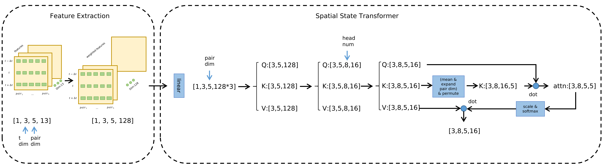

## Code structure of ST2

### Overview

### Code Structure

```
├── crowd_nav
│   ├── configs
│   │   ├── env.config
│   │   ├── policy.config
│   │   └── train.config
│   ├── data
│   │   └── text
│   │       ├── env.config
│   │       ├── il_model.pth
│   │       ├── output.log
│   │       ├── policy.config
│   │       └── train.config
│   ├── policy
│   │   ├── cadrl.py
│   │   ├── lstm_rl.py
│   │   ├── multi_human_rl.py
│   │   ├── policy_factory.py
│   │   ├── sarl.py
│   │   └── ST2.py
│   ├── test.py
│   ├── train.py
│   └── utils
│       ├── explorer.py
│       ├── memory.py
│       ├── plot.py
│       └── trainer.py
├── crowd_sim
│   ├── envs
│   │   ├── crowd_sim.py
│   │   ├── policy
│   │   │   ├── linear.py
│   │   │   ├── orca.py
│   │   │   ├── policy_factory.py
│   │   │   ├── policy.py
│   │   └── utils
│   │       ├── action.py
│   │       ├── agent.py
│   │       ├── human.py
│   │       ├── info.py
│   │       ├── robot.py
│   │       ├── state.py
│   │       └── utils.py
│   └── README.md
├── LICENSE
└── setup.py

```

### Environment Setup

#### Observation

self_state:        $s = [g_x, g_y, v_{pref}, \theta, v_x, v_y, r, p_x, p_y]$

human_state:   $w_i = [p_x, p_y, v_x, v_y, r_i, v_{pref}^i]$

**Code**

```python
#file location: CrowdNav/crowd_sim/envs/utils/robot.py
state = JointState(self.get_full_state(), ob)
```

#### Reward

```math
R_t(s_t^{jn}, a_t) = \begin{cases} -0.25 & \text{if\ $d_t$ < 0} \\ -0.1+d_t/2 & \text{else\ if\ $d_t$ < 0.2} \\ 1 & \text{else\ if\ $p_t$ = $p_g$} \\ 0 & \text{otherwise} \end{cases}
```

<!--

$$R_t(s_t^{jn}, a_t) = \begin{cases} -0.25 & \text{if\ $d_t$ < 0} \\ -0.1+d_t/2 & \text{else\ if\ $d_t$ < 0.2} \\ 1 & \text{else\ if\ $p_t$ = $p_g$} \\ 0 & \text{otherwise} \end{cases}$$

-->

<details>
  <summary>Code</summary>

```python
#file location: CrowdNav/crowd_sim/envs/utils/crowd_sim.py
if self.global_time >= self.time_limit - 1:
    reward = 0
    done = True
    info = Timeout()
elif collision:
    reward = self.collision_penalty
    done = True
    info = Collision()
elif reaching_goal:
    reward = self.success_reward
    done = True
    info = ReachGoal()
elif dmin < self.discomfort_dist:
    reward = (dmin - self.discomfort_dist) * self.discomfort_penalty_factor * self.time_step
    done = False
    info = Danger(dmin)
else:
    reward = 0
    done = False
    info = Nothing()
```

</details>

#### Action

- The action space consists of 80 discrete actions: 
  1. 5 speeds exponentially spaced between $(0, v_{pref}]$
  2. 16 headings evenly spaced between $[0, 2\pi)$

<details>
  <summary>Code</summary>

```python
#file location: CrowdNav/crowd_nav/policy/cadrl.py

speeds = [(np.exp((i + 1) / self.speed_samples) - 1) / (np.e - 1) * v_pref for i in range(self.speed_samples)]
if holonomic:
    rotations = np.linspace(0, 2 * np.pi, self.rotation_samples, endpoint=False)
else:
    rotations = np.linspace(-np.pi / 4, np.pi / 4, self.rotation_samples)

action_space = [ActionXY(0, 0) if holonomic else ActionRot(0, 0)]
```

</details>

#### Terminal condition

- Timeout
- Reaching goal
- Collision

**Code**

- The code's location is the same as reward

#### Dynamics

**env.step()**

```pseudocode
Input: global arguments, action: a
1 if robot is visible then
2   Get all humans’ state si and robot’ state
3 else
4   Get all humans’ state si
5 end
6 Calculate all humans’ action a i using orca
7 Detection collision between robot and humans
8 Detection collision between humans (just for warning)
9 Check if reaching the goal
10 Calculate reward
11 Check if terminal conditions were satisfied
12 Update robot’s state and humans’s state
13 Get observation ob
Output: ob reward done info
```

### Value Network


- Take 5 people as example, we can see the process of spatial does not affect temporal dimension



- Spatial data: each human and robot state pair

- Temporal data: humans and robot state at $t-\Delta t, t, t+\Delta t$

- How to adapt to a variable number of humans：

  The number of humans of is constant at beginning, it can't handle variable condition

  ```python
  x = x.reshape(-1, 3, 5, 13) #Only consider 5 people
  ```

- How to get state $t+\Delta t$

  Using constant velocity model

  Thus, simulation is updated by policy, robot(st2) and humans(orca).  however, states are got by prediction

  ```python
  if self.robot.sensor == 'coodinates':
      ob = [human.get_next_observable_state(action) for human, action in zip(self.humans, human_actions)]
  
  def compute_position(self, action, delta_t):
  self.check_validity(action)
  if self.kinematics == 'holonomic':
      px = self.px + action.vx * delta_t
      py = self.py + action.vy * delta_t 
  ```

- Data Process

```python
Spatial_Temporal_Transformer(
  (Embedding): Embedding(
    (embedding): Linear(in_features=13, out_features=128, bias=True)
    (dropout): Dropout(p=0.1, inplace=False)
  )
  
  (temporal_encoder): Encoder(
    (layers): ModuleList(
      (0): EncoderLayer(
        (attn_norm): LayerNorm((128,), eps=1e-05, elementwise_affine=True)
        (attn): Attention(
          (qkv): Linear(in_features=128, out_features=384, bias=True)
          (out): Linear(in_features=128, out_features=128, bias=True)
          (attn_dropout): Dropout(p=0.1, inplace=False)
          (proj_dropout): Dropout(p=0.1, inplace=False)
          (softmax): Softmax(dim=-1)
          (avgpool): AdaptiveAvgPool1d(output_size=1)
        )
        (mlp_norm): LayerNorm((128,), eps=1e-05, elementwise_affine=True)
        (mlp): Mlp(
          (fc1): Linear(in_features=128, out_features=512, bias=True)
          (fc2): Linear(in_features=512, out_features=128, bias=True)
          (act): GELU(approximate='none')
          (dropout1): Dropout(p=0.1, inplace=False)
          (dropout2): Dropout(p=0.1, inplace=False)
        )
        (drop_path): DropPath()
      )
    )
    (encoder_norm): LayerNorm((128,), eps=1e-05, elementwise_affine=True)
  )
  
  (Spatial_encoder): Encoder(
    (layers): ModuleList(
      (0): EncoderLayer(
        (attn_norm): LayerNorm((128,), eps=1e-05, elementwise_affine=True)
        (attn): Attention(
          (qkv): Linear(in_features=128, out_features=384, bias=True)
          (out): Linear(in_features=128, out_features=128, bias=True)
          (attn_dropout): Dropout(p=0.1, inplace=False)
          (proj_dropout): Dropout(p=0.1, inplace=False)
          (softmax): Softmax(dim=-1)
          (avgpool): AdaptiveAvgPool1d(output_size=1)
        )
        (mlp_norm): LayerNorm((128,), eps=1e-05, elementwise_affine=True)
        (mlp): Mlp(
          (fc1): Linear(in_features=128, out_features=512, bias=True)
          (fc2): Linear(in_features=512, out_features=128, bias=True)
          (act): GELU(approximate='none')
          (dropout1): Dropout(p=0.1, inplace=False)
          (dropout2): Dropout(p=0.1, inplace=False)
        )
        (drop_path): DropPath()
      )
    )
    (encoder_norm): LayerNorm((128,), eps=1e-05, elementwise_affine=True)
  )
  
  (avgpool): AdaptiveAvgPool1d(output_size=1)
  (value_Linear_1): Linear(in_features=134, out_features=256, bias=True)
  (act): GELU(approximate='none')
  (value_Linear_2): Linear(in_features=256, out_features=128, bias=True)
  (value_Linear_3): Linear(in_features=128, out_features=1, bias=True)
  (softmax): Softmax(dim=-1)
)
```

### Training Process

- **main**

```pseudocode
1 Load configuration
2 Implement memory model trainer explorer
3 Set policy as ST2
/* start imitation learning */
4 for episodes = 1, K IL do
5   while not done do
6     Generate action through orca
7     Push state, action, reward in memory
8   end
9 end
10 for epoch = 1, M IL do
11   Get one batch data from memory
12   Calculate loss between reward and value(return through model)
13   Using SGD execute gradient descent and update model’s parameters
14 end
/* start reinforcement learning */
15 Dynamically set epsilon while training
16 for episodes = 1, K RL do
17   while not done do
18     Generate action through sampling and scoring from action space
19     Collect data into memory
20   end
21   Using SGD execute gradient descent
22 end
23 Saving model’s parameters
```

**Details of action generated while RL**

- Random sample action from action space when probability less than epsilon
- Or $a_t = argmax_{a_t\in A}R(s_{t+\Delta t}^{jn},a_t)+{\gamma}^{{\Delta t}\cdot v_{pref}}V(s_{t+\Delta t}^{jn},a_t)$

### Testing Process

```pseudocode
1 Load configuration
2 Set policy as sarl
3 while not done do
4    for action in action_space do
5       Calculate self_state at next time step according to single integrator model
6       Calculate humans_state and next_state_reward at next time step using onestep_lookahead(policy is orca)
7       Concatenate self_state and humans_state as next_state
8       Input next_state into network and get next_state_value
9       Calculate value using next_state_value and next_state_reward
10      Get value and action pair
11    Choose action with highest value from pairs as execute action
11 Update env
12 end
```

- Method to calculate value: $R(s_{t+\Delta t}^{jn},a_t)+{\gamma}^{{\Delta t}\cdot v_{pref}}V(s_{t+\Delta t}^{jn},a_t)$
- Method to pursuance onestep_lookahead: Using action as input to execute step() function in sim env but don't update env state

<!--

**utils for html showing**

```markdown
<details>
  <summary>Code</summary>

</details>
```

-->
