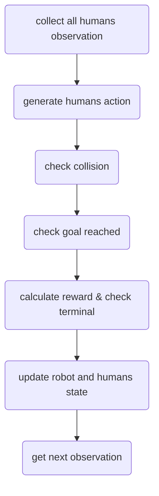
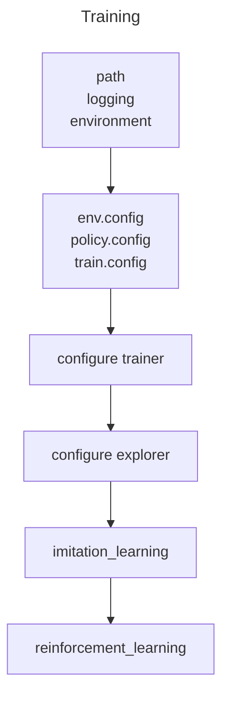

## Code structure of CrowdNav

### Overview

### Code Structure

```
├── crowd_nav
│   ├── configs
│   │   ├── env.config
│   │   ├── policy.config
│   │   └── train.config
│   ├── data
│   │   └── output
│   │       ├── env.config
│   │       ├── il_model.pth
│   │       ├── output.log
│   │       ├── policy.config
│   │       ├── rl_model.pth
│   │       └── train.config
│   ├── __init__.py
│   ├── policy
│   │   ├── cadrl.py
│   │   ├── __init__.py
│   │   ├── lstm_rl.py
│   │   ├── multi_human_rl.py
│   │   ├── policy_factory.py
│   │   └── sarl.py
│   ├── test.py
│   ├── train.py
│   └── utils
│       ├── explorer.py
│       ├── __init__.py
│       ├── memory.py
│       ├── plot.py
│       └── trainer.py
├── crowd_sim
│   ├── envs
│   │   ├── crowd_sim.py
│   │   ├── __init__.py
│   │   ├── policy
│   │   │   ├── __init__.py
│   │   │   ├── linear.py
│   │   │   ├── orca.py
│   │   │   ├── policy_factory.py
│   │   │   ├── policy.py
│   │   └── utils
│   │       ├── action.py
│   │       ├── agent.py
│   │       ├── human.py
│   │       ├── info.py
│   │       ├── __init__.py
│   │       ├── robot.py
│   │       ├── state.py
│   │       └── utils.py
│   ├── __init__.py
│   └── README.md
├── LICENSE
├── README.md
└── setup.py
```

### Environment Setup

#### Env



##### Step

```python
#file location: CrowdNav/crowd_sim/envs/utils/crowd_sim.py

def step(self, action, update=True):
    """
    Compute actions for all agents, detect collision, update environment and return (ob, reward, done, info)

    """
    human_actions = []
    for human in self.humans:
        # observation for humans is always coordinates
        ob = [other_human.get_observable_state() for other_human in self.humans if other_human != human]
        if self.robot.visible:
            ob += [self.robot.get_observable_state()]
        human_actions.append(human.act(ob))

    # collision detection
    dmin = float('inf')
    collision = False
    for i, human in enumerate(self.humans):
        px = human.px - self.robot.px
        py = human.py - self.robot.py
        if self.robot.kinematics == 'holonomic':
            vx = human.vx - action.vx
            vy = human.vy - action.vy
        else:
            vx = human.vx - action.v * np.cos(action.r + self.robot.theta)
            vy = human.vy - action.v * np.sin(action.r + self.robot.theta)
        ex = px + vx * self.time_step
        ey = py + vy * self.time_step
        # closest distance between boundaries of two agents
        closest_dist = point_to_segment_dist(px, py, ex, ey, 0, 0) - human.radius - self.robot.radius
        if closest_dist < 0:
            collision = True
            # logging.debug("Collision: distance between robot and p{} is {:.2E}".format(i, closest_dist))
            break
        elif closest_dist < dmin:
            dmin = closest_dist

    # collision detection between humans
    human_num = len(self.humans)
    for i in range(human_num):
        for j in range(i + 1, human_num):
            dx = self.humans[i].px - self.humans[j].px
            dy = self.humans[i].py - self.humans[j].py
            dist = (dx ** 2 + dy ** 2) ** (1 / 2) - self.humans[i].radius - self.humans[j].radius
            if dist < 0:
                # detect collision but don't take humans' collision into account
                logging.debug('Collision happens between humans in step()')

    # check if reaching the goal
    end_position = np.array(self.robot.compute_position(action, self.time_step))
    reaching_goal = norm(end_position - np.array(self.robot.get_goal_position())) < self.robot.radius

    if self.global_time >= self.time_limit - 1:
        reward = 0
        done = True
        info = Timeout()
    elif collision:
        reward = self.collision_penalty
        done = True
        info = Collision()
    elif reaching_goal:
        reward = self.success_reward
        done = True
        info = ReachGoal()
    elif dmin < self.discomfort_dist:
        # only penalize agent for getting too close if it's visible
        # adjust the reward based on FPS
        reward = (dmin - self.discomfort_dist) * self.discomfort_penalty_factor * self.time_step
        done = False
        info = Danger(dmin)
    else:
        reward = 0
        done = False
        info = Nothing()

    if update:
        # store state, action value and attention weights
        self.states.append([self.robot.get_full_state(), [human.get_full_state() for human in self.humans]])
        if hasattr(self.robot.policy, 'action_values'):
            self.action_values.append(self.robot.policy.action_values)
        if hasattr(self.robot.policy, 'get_attention_weights'):
            self.attention_weights.append(self.robot.policy.get_attention_weights())

        # update all agents
        self.robot.step(action)
        for i, human_action in enumerate(human_actions):
            self.humans[i].step(human_action)
        self.global_time += self.time_step
        for i, human in enumerate(self.humans):
            # only record the first time the human reaches the goal
            if self.human_times[i] == 0 and human.reached_destination():
                self.human_times[i] = self.global_time

        # compute the observation
        if self.robot.sensor == 'coordinates':
            ob = [human.get_observable_state() for human in self.humans]
        elif self.robot.sensor == 'RGB':
            raise NotImplementedError
    else:
        if self.robot.sensor == 'coordinates':
            ob = [human.get_next_observable_state(action) for human, action in zip(self.humans, human_actions)]
        elif self.robot.sensor == 'RGB':
            raise NotImplementedError

    return ob, reward, done, info
```

##### Reset

```python
#file location: CrowdNav/crowd_sim/envs/utils/crowd_sim.py

def reset(self, phase='test', test_case=None):
    """
    Set px, py, gx, gy, vx, vy, theta for robot and humans
    :return:
    """
    if self.robot is None:
        raise AttributeError('robot has to be set!')
    assert phase in ['train', 'val', 'test']
    if test_case is not None:
        self.case_counter[phase] = test_case
    self.global_time = 0
    if phase == 'test':
        self.human_times = [0] * self.human_num
    else:
        self.human_times = [0] * (self.human_num if self.robot.policy.multiagent_training else 1)
    if not self.robot.policy.multiagent_training:
        self.train_val_sim = 'circle_crossing'

    if self.config.get('humans', 'policy') == 'trajnet':
        raise NotImplementedError
    else:
        counter_offset = {'train': self.case_capacity['val'] + self.case_capacity['test'],
                          'val': 0, 'test': self.case_capacity['val']}
        self.robot.set(0, -self.circle_radius, 0, self.circle_radius, 0, 0, np.pi / 2)
        if self.case_counter[phase] >= 0:
            np.random.seed(counter_offset[phase] + self.case_counter[phase])
            if phase in ['train', 'val']:
                human_num = self.human_num if self.robot.policy.multiagent_training else 1
                self.generate_random_human_position(human_num=human_num, rule=self.train_val_sim)
            else:
                self.generate_random_human_position(human_num=self.human_num, rule=self.test_sim)
            # case_counter is always between 0 and case_size[phase]
            self.case_counter[phase] = (self.case_counter[phase] + 1) % self.case_size[phase]
        else:
            assert phase == 'test'
            if self.case_counter[phase] == -1:
                # for debugging purposes
                self.human_num = 3
                self.humans = [Human(self.config, 'humans') for _ in range(self.human_num)]
                self.humans[0].set(0, -6, 0, 5, 0, 0, np.pi / 2)
                self.humans[1].set(-5, -5, -5, 5, 0, 0, np.pi / 2)
                self.humans[2].set(5, -5, 5, 5, 0, 0, np.pi / 2)
            else:
                raise NotImplementedError

    for agent in [self.robot] + self.humans:
        agent.time_step = self.time_step
        agent.policy.time_step = self.time_step

    self.states = list()
    if hasattr(self.robot.policy, 'action_values'):
        self.action_values = list()
    if hasattr(self.robot.policy, 'get_attention_weights'):
        self.attention_weights = list()

    # get current observation
    if self.robot.sensor == 'coordinates':
        ob = [human.get_observable_state() for human in self.humans]
    elif self.robot.sensor == 'RGB':
        raise NotImplementedError

    return ob
```

#### Observation

$p_x,p_y,v_x,v_y,radius$

p<sub>x</sub> : human's position x
p<sub>y</sub> : human's position y
v<sub>x</sub> : human's velocity x
v<sub>y</sub> : human's velocity y
radius : human's radius

- Source of observation data: Ground truth in gym environment
- Collect each human's $p_x,p_y,v_x,v_y,radius$ and form the observation

```python
#file location: CrowdNav/crowd_sim/envs/utils/agents.py

def get_next_observable_state(self, action):
    self.check_validity(action)
    pos = self.compute_position(action, self.time_step)
    next_px, next_py = pos
    if self.kinematics == 'holonomic':
        next_vx = action.vx
        next_vy = action.vy
    else:
        next_theta = self.theta + action.r
        next_vx = action.v * np.cos(next_theta)
        next_vy = action.v * np.sin(next_theta)
return ObservableState(next_px, next_py, next_vx, next_vy, self.radius)
```

#### Reward

add formula

```python
#file location: CrowdNav/crowd_sim/envs/utils/crowd_sim.py

if self.global_time >= self.time_limit - 1:
    reward = 0
    done = True
    info = Timeout()
elif collision:
    reward = self.collision_penalty
    done = True
    info = Collision()
elif reaching_goal:
    reward = self.success_reward
    done = True
    info = ReachGoal()
elif dmin < self.discomfort_dist:
    # only penalize agent for getting too close if it's visible
    # adjust the reward based on FPS
    reward = (dmin - self.discomfort_dist) * self.discomfort_penalty_factor * self.time_step
    done = False
    info = Danger(dmin)
else:
    reward = 0
    done = False
    info = Nothing()
```

#### Action

#### Terminal

### Network Structure

### Training Process



```
#implement trainer class
trainer = Trainer(model, memory, device, batch_size)
#input:
#  model: sarl
#  memory: use for replay data which is generated by explorer
#  device: cpu or gpu
#  batch_size: 100
```

```
#implement explorer class
explorer = Explorer(env, robot, device, memory, policy.gamma, target_policy=policy)
#input:
#  env: 'CrowdSim-v0'
#  robot: robot class(inherit class agent)
#  memory: store simulation data
#  policy.gamma: 
#  target_policy=policy: 
```

process of **imitation learning**

1. set parameters

2. set robot policy ORCA

3. ```
   explorer.run_k_episodes(il_episodes, 'train', update_memory=True, imitation_learning=True)
   ```

3. ```
   #exec update memory for each one of episodes
   self.update_memory(states, actions, rewards, imitation_learning)
   ```

4. ```
   self.memory.push((state, value))
   #todo finger out how to process state and value
   ```

5. ```
   trainer.optimize_epoch(il_epochs)
   #elf.optimizer = optim.SGD(self.model.parameters(), lr=learning_rate, momentum=0.9)
   #using SGD to optimize network
   ```

6. saving model weight

process of **reinforcement learning**

1. set parameters (learning rate \ epsilon)

2. set policy SARL

3. ```
   explorer.run_k_episodes(sample_episodes, 'train', update_memory=True, episode=episode)
   ```

4. ```
   trainer.optimize_batch(train_batches)
   ```

5. saving model weight

### Testing Process

---

$\sum_{s=0}^{total-steps} (\gamma^{s\cdot 0.25\cdot 1}*reward_s )\\\\0.25: robot.time\_step\\1: robot.v\_pref$

```python
self.update_memory(states, actions, rewards, imitation_learning)

state = JointState(self.get_full_state(), ob)
#full state: px, py, vx, vy, radius, gx, gy, v_pref, theta (robot)
#ob: px, py, vx, vy, radius (humans)

state = self.target_policy.transform(state)
#Take the state passed from agent and transform it to the input of value network

```

```python
state_tensor = torch.cat([torch.Tensor([state.self_state + human_state]).to(self.device)
                      for human_state in state.human_states], dim=0)
```

```python
round is: 7
tensor([[ 8.0000,  1.0000,  0.0000,  0.3000,  0.0000, -0.0000, -0.1905, -0.8070,
          0.0000, -0.0000,  0.3000,  0.8292,  0.6000],
        [ 8.0000,  1.0000,  0.0000,  0.3000,  0.0000, -0.0000,  6.4962, -3.3679,
          0.0000, -0.0000,  0.3000,  7.3173,  0.6000],
        [ 8.0000,  1.0000,  0.0000,  0.3000,  0.0000, -0.0000,  6.2920,  2.6839,
          0.0000, -0.0000,  0.3000,  6.8405,  0.6000],
        [ 8.0000,  1.0000,  0.0000,  0.3000,  0.0000, -0.0000,  4.4402,  3.9008,
          0.0000, -0.0000,  0.3000,  5.9102,  0.6000],
        [ 8.0000,  1.0000,  0.0000,  0.3000,  0.0000, -0.0000,  2.1060, -3.4071,
          0.0000, -0.0000,  0.3000,  4.0054,  0.6000]])
# 
[dg, v_pref, theta, radius, vx, vy, px1, py1, vx1, vy1, radius1, da, radius_sum]
```

```python
def input_dim(self):
        return self.joint_state_dim + (self.cell_num ** 2 * self.om_channel_size if self.with_om else 0)
#joint_state_dim = self.self_state_dim + self.human_state_dim
#self.self_state_dim = 6
#self.human_state_dim = 7
```

```latex
\documentclass{article}
\usepackage{graphicx} % Required for inserting images
\usepackage[linesnumbered,ruled]{algorithm2e}

\title{crowd_nav}
\author{LC UP}
\date{August 2023}

\begin{document}

\section{ Dynamic }
\begin{algorithm}

\KwIn{global\_arguments,\ action: $a_{robot}$}
\eIf{robot is visible}{
Get all humans' state $s_i\ i \in 1,2 ... 5 $ and robot' state $s_{robot}$\\}{
Get all humans' state $s_i\ i \in 1,2 ... 5 $
}
Calculate all humans' action $a_{human\_i}$ using orca \\
Detection collision between robot and humans \\
Detection collision between humans (just for warning) \\
Check if reaching the goal \\
Calculate reward \\
Check if terminal conditions were satisfied \\
Update robot's state and humans's state \\
Get observation ob \\

\KwOut{ob\ reward\ done\ info}
\caption{Env\_Step}
\end{algorithm}

\section{Train}
\begin{algorithm}

Loading configuration of env, policy and train \\
Initialize file path and logging \\
Implement \textbf{memory} using for experience replay \\
Implement value network: \textbf{model} \\
Implement \textbf{trainer} with \\
\KwIn{model, memory, device, batch\_size}
Implement \textbf{explorer} with \\
\KwIn{env, robot, device, memory, policy.gamma, target\_policy=policy}
\BlankLine
\textbf{Start imitation learning} \\
\uIf{args.resume}{
Load rl model weight file
}\uElseIf{il weight file exist}{
Load il model weight file
}\Else{
Set training configuration \\
Set robot policy as orca \\
Call explorer.run\_k\_episodes with \\
\KwIn{il\_episodes, train, update\_memory=True, imitation\_learning=True}
}

Call trainer.optimize\_epoch with \\
\KwIn{il\_epochs}

Save weight of model
\BlankLine
\textbf{Start reinforcement learning} \\
Set robot policy as sarl \\
Set training configuration \\
\lIf{args.resume}{
Set epsilon as epsilon\_end \\
Fill the memory pool with calling explorer.run\_k\_episodes
}
\While{episode < train\_episodes}{
Update epsilon \\
Call explorer.run\_k\_episodes with \\
\KwIn{sample\_episodes, train, update\_memory=True, episode=episode}
Call trainer.optimize\_batch with \\
\KwIn{train\_batches}
Save weight of model
}

\caption{Train}
\end{algorithm}


\section{Forward}
\begin{algorithm}

\KwIn{state}
\BlankLine
Pass data through mlp1 layer with \\
\KwIn{data\ size:\ [5, 13]}
\KwOut{data\ size:\ [5, 100]}
Pass data through mlp2 layer with \\
\KwIn{data\ size:\ [5, 100]}
\KwOut{data\ size:\ [5, 50]}
\uIf{with\_global\_state}{
Add Mean of mlp1's output with mlp2's output and form attention\_input
}\Else{
Let mlp1's output as attention\_input
}
Calculate attention scores data\ size:\ [1, 5] \\
Calculate attention weights using softmax \\
Multiple weights and mlp2's output and form weighted\_feature \\
add weighted\_feature and self\_state as joint\_state \\
pass joint\_state to mlp3 and output value

\BlankLine
\KwOut{value}

\caption{Network\_Forward}
\end{algorithm}

\end{document}


```

