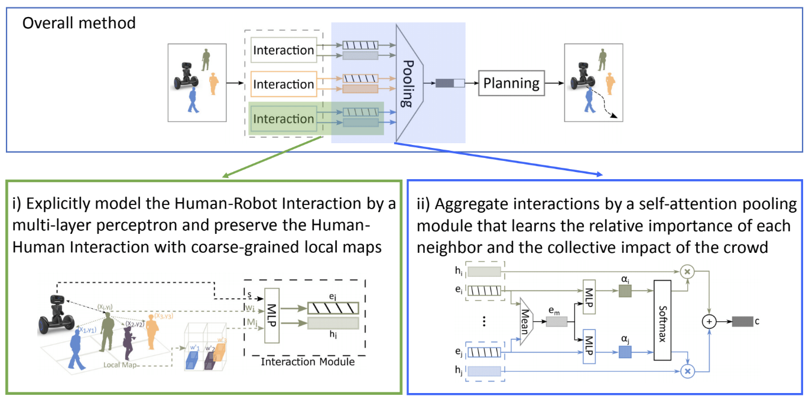
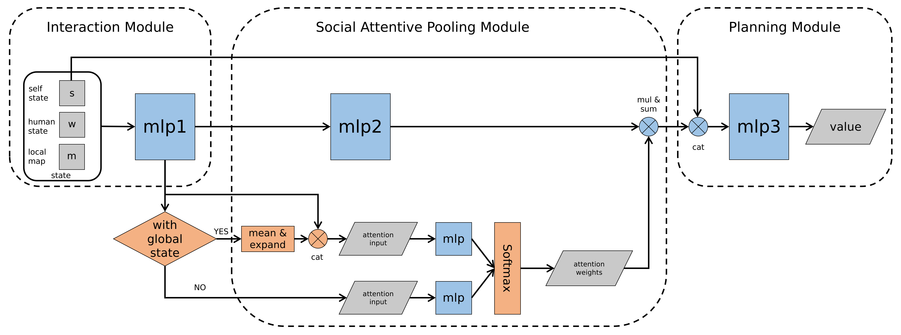
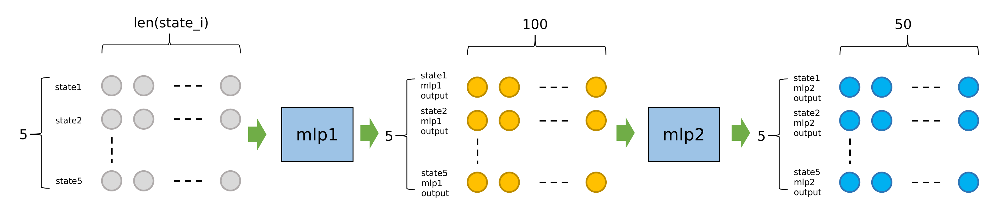
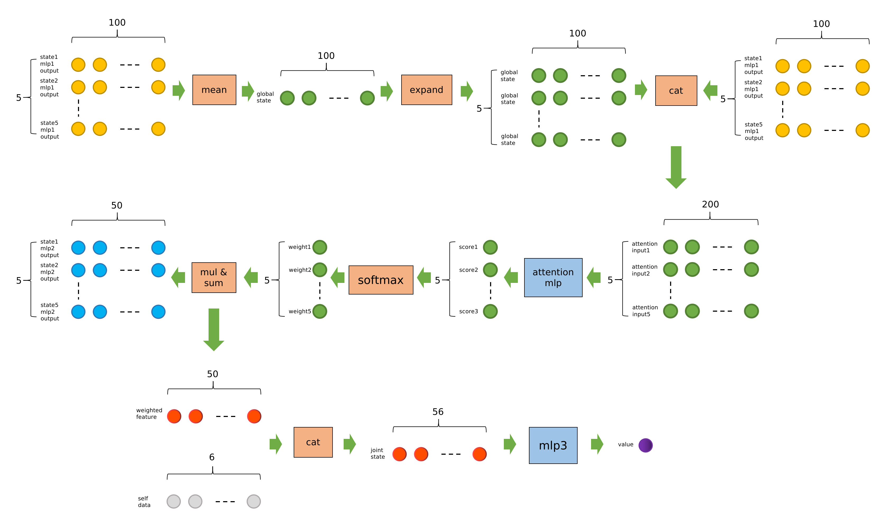

## Code structure of CrowdNav

### Overview



### Code Structure

```
├── crowd_nav
│   ├── configs
│   │   ├── env.config
│   │   ├── policy.config
│   │   └── train.config
│   ├── data
│   │   └── output
│   │       ├── env.config
│   │       ├── il_model.pth
│   │       ├── output.log
│   │       ├── policy.config
│   │       ├── rl_model.pth
│   │       └── train.config
│   ├── __init__.py
│   ├── policy
│   │   ├── cadrl.py
│   │   ├── lstm_rl.py
│   │   ├── multi_human_rl.py
│   │   ├── policy_factory.py
│   │   └── sarl.py
│   ├── test.py
│   ├── train.py
│   └── utils
│       ├── explorer.py
│       ├── memory.py
│       ├── plot.py
│       └── trainer.py
├── crowd_sim
│   ├── envs
│   │   ├── crowd_sim.py
│   │   ├── policy
│   │   │   ├── linear.py
│   │   │   ├── orca.py
│   │   │   ├── policy_factory.py
│   │   │   ├── policy.py
│   │   └── utils
│   │       ├── action.py
│   │       ├── agent.py
│   │       ├── human.py
│   │       ├── info.py
│   │       ├── robot.py
│   │       ├── state.py
│   │       └── utils.py
│   └── README.md
├── LICENSE
├── README.md
└── setup.py
```

### Environment Setup

#### Observation

self_state:        $s = [d_g, v_{pref}, v_x, v_y, r]$

human_state:   $w_i = [p_x, p_y, v_x, v_y, r_i, d_i, r_i + r]$

- $d_g$ : robot's distance to the goal
- $d_i$ : robot's distance to the human i 
- Source of observation data: Ground truth in gym environment

**Code**

```python
#file location: CrowdNav/crowd_sim/envs/utils/robot.py
state = JointState(self.get_full_state(), ob)
```

#### Reward

$$R_t(s_t^{jn}, a_t)=\left\{\begin{align} &-0.25 & \text{$if\ d_t < 0$} \\ &-0.1+d_t/2 & \text{$else\ if\ d_t < 0.2$} \\ &1 & \text{$else\ if\ p_t = p_g$} \\ &0 & \text{$otherwise$} \end{align}\right.$$

```math
R_t(s_t^{jn}, a_t) = \begin{cases} -0.25 & \text{if\ $d_t$ < 0} \\ -0.1+d_t/2 & \text{else\ if\ $d_t$ < 0.2} \\ 1 & \text{else\ if\ $p_t$ = $p_g$} \\ 0 & \text{otherwise} \end{cases}
```

$$R_t(s_t^{jn}, a_t) = \begin{cases} -0.25 & \text{if\ $d_t$ < 0} \\ -0.1+d_t/2 & \text{else\ if\ $d_t$ < 0.2} \\ 1 & \text{else\ if\ $p_t$ = $p_g$} \\ 0 & \text{otherwise} \end{cases}$$

**Code**

```python
#file location: CrowdNav/crowd_sim/envs/utils/crowd_sim.py

if self.global_time >= self.time_limit - 1:
    reward = 0
    done = True
    info = Timeout()
elif collision:
    reward = self.collision_penalty
    done = True
    info = Collision()
elif reaching_goal:
    reward = self.success_reward
    done = True
    info = ReachGoal()
elif dmin < self.discomfort_dist:
    reward = (dmin - self.discomfort_dist) * self.discomfort_penalty_factor * self.time_step
    done = False
    info = Danger(dmin)
else:
    reward = 0
    done = False
    info = Nothing()
```

#### Action

- The action space consists of 80 discrete actions: 
  1. 5 speeds exponentially spaced between $(0, v_{pref}]$
  2. 16 headings evenly spaced between $[0, 2\pi)$

**Code**

```python
#file location: CrowdNav/crowd_nav/policy/cadrl.py

speeds = [(np.exp((i + 1) / self.speed_samples) - 1) / (np.e - 1) * v_pref for i in range(self.speed_samples)]
if holonomic:
    rotations = np.linspace(0, 2 * np.pi, self.rotation_samples, endpoint=False)
else:
    rotations = np.linspace(-np.pi / 4, np.pi / 4, self.rotation_samples)

action_space = [ActionXY(0, 0) if holonomic else ActionRot(0, 0)]
```

#### Terminal condition

- Timeout
- Reaching goal
- Collision

**Code**

- The code's location is the same as reward

#### Dynamics

**env.step()**

```pseudocode
Input: global arguments, action: arobot
1 if robot is visible then
2   Get all humans’ state si i ∈ 1, 2...5 and robot’ state srobot
3 else
4   Get all humans’ state si i ∈ 1, 2...5
5 end
6 Calculate all humans’ action ahuman i using orca
7 Detection collision between robot and humans
8 Detection collision between humans (just for warning)
9 Check if reaching the goal
10 Calculate reward
11 Check if terminal conditions were satisfied
12 Update robot’s state and humans’s state
13 Get observation ob
Output: ob reward done info
```

**Code**

```python
#file location: CrowdNav/crowd_sim/envs/utils/crowd_sim.py

def step(self, action, update=True):
    """
    Compute actions for all agents, detect collision, update environment and return (ob, reward, done, info)

    """
    human_actions = []
    for human in self.humans:
        # observation for humans is always coordinates
        ob = [other_human.get_observable_state() for other_human in self.humans if other_human != human]
        if self.robot.visible:
            ob += [self.robot.get_observable_state()]
        human_actions.append(human.act(ob))

    # collision detection
    dmin = float('inf')
    collision = False
    for i, human in enumerate(self.humans):
        px = human.px - self.robot.px
        py = human.py - self.robot.py
        if self.robot.kinematics == 'holonomic':
            vx = human.vx - action.vx
            vy = human.vy - action.vy
        else:
            vx = human.vx - action.v * np.cos(action.r + self.robot.theta)
            vy = human.vy - action.v * np.sin(action.r + self.robot.theta)
        ex = px + vx * self.time_step
        ey = py + vy * self.time_step
        # closest distance between boundaries of two agents
        closest_dist = point_to_segment_dist(px, py, ex, ey, 0, 0) - human.radius - self.robot.radius
        if closest_dist < 0:
            collision = True
            # logging.debug("Collision: distance between robot and p{} is {:.2E}".format(i, closest_dist))
            break
        elif closest_dist < dmin:
            dmin = closest_dist

    # collision detection between humans
    human_num = len(self.humans)
    for i in range(human_num):
        for j in range(i + 1, human_num):
            dx = self.humans[i].px - self.humans[j].px
            dy = self.humans[i].py - self.humans[j].py
            dist = (dx ** 2 + dy ** 2) ** (1 / 2) - self.humans[i].radius - self.humans[j].radius
            if dist < 0:
                # detect collision but don't take humans' collision into account
                logging.debug('Collision happens between humans in step()')

    # check if reaching the goal
    end_position = np.array(self.robot.compute_position(action, self.time_step))
    reaching_goal = norm(end_position - np.array(self.robot.get_goal_position())) < self.robot.radius

    if self.global_time >= self.time_limit - 1:
        reward = 0
        done = True
        info = Timeout()
    elif collision:
        reward = self.collision_penalty
        done = True
        info = Collision()
    elif reaching_goal:
        reward = self.success_reward
        done = True
        info = ReachGoal()
    elif dmin < self.discomfort_dist:
        # only penalize agent for getting too close if it's visible
        # adjust the reward based on FPS
        reward = (dmin - self.discomfort_dist) * self.discomfort_penalty_factor * self.time_step
        done = False
        info = Danger(dmin)
    else:
        reward = 0
        done = False
        info = Nothing()

    if update:
        # store state, action value and attention weights
        self.states.append([self.robot.get_full_state(), [human.get_full_state() for human in self.humans]])
        if hasattr(self.robot.policy, 'action_values'):
            self.action_values.append(self.robot.policy.action_values)
        if hasattr(self.robot.policy, 'get_attention_weights'):
            self.attention_weights.append(self.robot.policy.get_attention_weights())

        # update all agents
        self.robot.step(action)
        for i, human_action in enumerate(human_actions):
            self.humans[i].step(human_action)
        self.global_time += self.time_step
        for i, human in enumerate(self.humans):
            # only record the first time the human reaches the goal
            if self.human_times[i] == 0 and human.reached_destination():
                self.human_times[i] = self.global_time

        # compute the observation
        if self.robot.sensor == 'coordinates':
            ob = [human.get_observable_state() for human in self.humans]
        elif self.robot.sensor == 'RGB':
            raise NotImplementedError
    else:
        if self.robot.sensor == 'coordinates':
            ob = [human.get_next_observable_state(action) for human, action in zip(self.humans, human_actions)]
        elif self.robot.sensor == 'RGB':
            raise NotImplementedError

    return ob, reward, done, info
```

```python
#file location: CrowdNav/crowd_sim/envs/utils/crowd_sim.py

def reset(self, phase='test', test_case=None):
    """
    Set px, py, gx, gy, vx, vy, theta for robot and humans
    :return:
    """
    if self.robot is None:
        raise AttributeError('robot has to be set!')
    assert phase in ['train', 'val', 'test']
    if test_case is not None:
        self.case_counter[phase] = test_case
    self.global_time = 0
    if phase == 'test':
        self.human_times = [0] * self.human_num
    else:
        self.human_times = [0] * (self.human_num if self.robot.policy.multiagent_training else 1)
    if not self.robot.policy.multiagent_training:
        self.train_val_sim = 'circle_crossing'

    if self.config.get('humans', 'policy') == 'trajnet':
        raise NotImplementedError
    else:
        counter_offset = {'train': self.case_capacity['val'] + self.case_capacity['test'],
                          'val': 0, 'test': self.case_capacity['val']}
        self.robot.set(0, -self.circle_radius, 0, self.circle_radius, 0, 0, np.pi / 2)
        if self.case_counter[phase] >= 0:
            np.random.seed(counter_offset[phase] + self.case_counter[phase])
            if phase in ['train', 'val']:
                human_num = self.human_num if self.robot.policy.multiagent_training else 1
                self.generate_random_human_position(human_num=human_num, rule=self.train_val_sim)
            else:
                self.generate_random_human_position(human_num=self.human_num, rule=self.test_sim)
            # case_counter is always between 0 and case_size[phase]
            self.case_counter[phase] = (self.case_counter[phase] + 1) % self.case_size[phase]
        else:
            assert phase == 'test'
            if self.case_counter[phase] == -1:
                # for debugging purposes
                self.human_num = 3
                self.humans = [Human(self.config, 'humans') for _ in range(self.human_num)]
                self.humans[0].set(0, -6, 0, 5, 0, 0, np.pi / 2)
                self.humans[1].set(-5, -5, -5, 5, 0, 0, np.pi / 2)
                self.humans[2].set(5, -5, 5, 5, 0, 0, np.pi / 2)
            else:
                raise NotImplementedError

    for agent in [self.robot] + self.humans:
        agent.time_step = self.time_step
        agent.policy.time_step = self.time_step

    self.states = list()
    if hasattr(self.robot.policy, 'action_values'):
        self.action_values = list()
    if hasattr(self.robot.policy, 'get_attention_weights'):
        self.attention_weights = list()

    # get current observation
    if self.robot.sensor == 'coordinates':
        ob = [human.get_observable_state() for human in self.humans]
    elif self.robot.sensor == 'RGB':
        raise NotImplementedError

    return ob
```

### Value Network

#### Structure



```python
ValueNetwork(
  (mlp1): Sequential(
    (0): Linear(in_features=13, out_features=150, bias=True)
    (1): ReLU()
    (2): Linear(in_features=150, out_features=100, bias=True)
    (3): ReLU()
  )
  (mlp2): Sequential(
    (0): Linear(in_features=100, out_features=100, bias=True)
    (1): ReLU()
    (2): Linear(in_features=100, out_features=50, bias=True)
  )
  (attention): Sequential(
    (0): Linear(in_features=200, out_features=100, bias=True)
    (1): ReLU()
    (2): Linear(in_features=100, out_features=100, bias=True)
    (3): ReLU()
    (4): Linear(in_features=100, out_features=1, bias=True)
  )
  (mlp3): Sequential(
    (0): Linear(in_features=56, out_features=150, bias=True)
    (1): ReLU()
    (2): Linear(in_features=150, out_features=100, bias=True)
    (3): ReLU()
    (4): Linear(in_features=100, out_features=100, bias=True)
    (5): ReLU()
    (6): Linear(in_features=100, out_features=1, bias=True)
  )
)
```

- Assume there are 5 humans and with_global_state is set to true, we can get state:

$$\begin{cases}state = [state1, state2, ..., state5] \\ state1 = [self\_data, human1\_data, local\_map1] \\ self\_data = [dg, v\_pref, theta, radius, vx, vy] \\ human1\_data = [px1, py1, vx1, vy1, radius1, da, radius\_sum] \\ local\_map1 = [4 * 4 * 3]\end{cases}$$





```pseudocode
Input: state
1 Pass data through mlp1 layer with
Input: data size: [5, 13]
Output: data size: [5, 100]
2 Pass data through mlp2 layer with
Input: data size: [5, 100]
Output: data size: [5, 50]
3 if with global state then
4   Add Mean of mlp1’s output with mlp1’s output and form attention input
5 else
6   Let mlp1’s output as attention input
7 end
8 Calculate attention scores data size: [1, 5]
9 Calculate attention weights using softmax
10 Multiple weights with mlp2’s output then form weighted feature
11 add weighted feature with self state as joint state
12 pass joint state to mlp3 then output value
Output: value
```

### Training Process

- **main**

```pseudocode
1 Loading configuration of env, policy and train
2 Initialize file path and logging
3 Implement memory using for experience replay
4 Implement value network: model
5 Implement trainer with
Input: model, memory, device, batch size
6 Implement explorer with
Input: env, robot, device, memory, policy.gamma, target policy=policy
7 Start imitation learning
8 if args.resume then
9    Load rl model weight file
10 else if il weight file exist then
11   Load il model weight file
12 else
13   Set training configuration
14   Set robot policy as orca
15   Call explorer.run k episodes with
     Input: il episodes, train, update memory=True,
     imitation learning=True
16 end
17 Call trainer.optimize epoch with
   Input: il epochs
18 Save weight of model
19 Start reinforcement learning
20 Set robot policy as sarl
21 Set training configuration
22 if args.resume then Set epsilon as epsilon end
23   Fill the memory pool with calling explorer.run k episodes ;
24 while episode < train episodes do
25   Update epsilon
26   Call explorer.run k episodes with
     Input: sample episodes, train, update memory=True, episode=episode
27   Call trainer.optimize batch with
     Input: train batches
28 Save weights of model
29 end
```

- **explorer.run_k_episodes**

```pseudocode
Input: k, phase, update memory, imitation learning
1 for episode < k do
2   Reset env
3 while not done do
4   if policy == orca then
5     Generate action according orca
6   else
      /* write more detailed */
7     Generate action according sarl
8   end
9   Collect states, actions, rewards
    /* update memory always true when training */
10  if update memory then
11    Update memory when success or collision
12  end
13 end
14 epidode+ = 1
15 end
```

- **update_memory**

```pseudocode
Input: states, actions, rewards, imitation learning
1 for i < len(states) do
2   if imitation learning then
3     Calculate value
4   else
5     Calculate value
6   end
7   Push state and value in memory
9 i+ = 1
8 end
```

- **trainer.optimize_epoch**

```pseudocode
Input: num epochs
/* Using SGD as optimizer */
1 for epoch < numepochs do
2   for datainmemory do
3     Calculate loss
4     Loss backward
5     Update model
6   end
7 epoch += 1
8 end
```

- **trainer.optimize_batch**

```pseudocode
Input: num epochs
/* Using SGD as optimizer */
1 for epoch < numepochs do
2   for datainmemory do
3   Calculate loss
4   Loss backward
5   Update model
6   end
7 epoch += 1
8 end
```

### Testing Process

```pseudocode
1 Loading configuration of env, policy and train
2 Initialize file path and logging
3 Implement memory using for experience replay
4 Implement value network: model
5 Implement explorer with
Input: env, robot, device, gamma
6 while not done do
    /* write more detailed */
7   Generate action according sarl
8   Update env
9 end
```

**Code**


