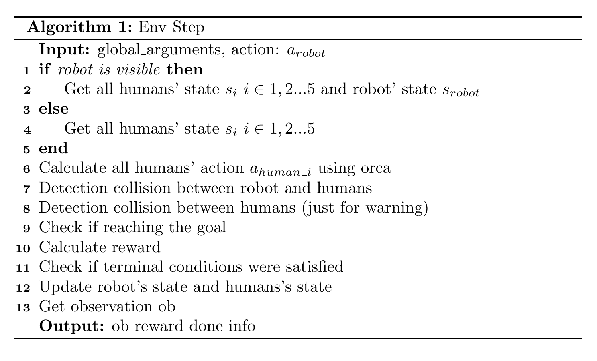
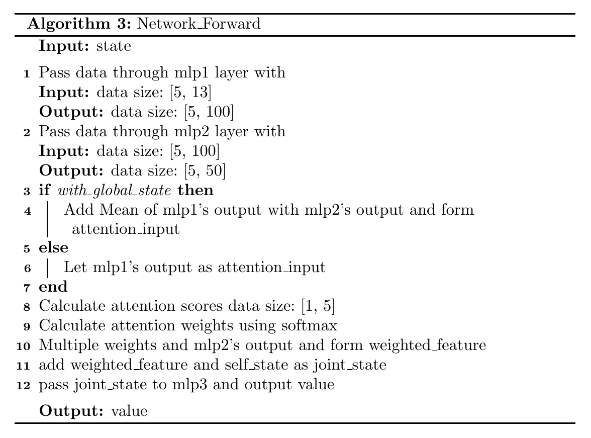

## Code structure of CrowdNav

### Overview

### Code Structure

```
├── crowd_nav
│   ├── configs
│   │   ├── env.config
│   │   ├── policy.config
│   │   └── train.config
│   ├── data
│   │   └── output
│   │       ├── env.config
│   │       ├── il_model.pth
│   │       ├── output.log
│   │       ├── policy.config
│   │       ├── rl_model.pth
│   │       └── train.config
│   ├── __init__.py
│   ├── policy
│   │   ├── cadrl.py
│   │   ├── lstm_rl.py
│   │   ├── multi_human_rl.py
│   │   ├── policy_factory.py
│   │   └── sarl.py
│   ├── test.py
│   ├── train.py
│   └── utils
│       ├── explorer.py
│       ├── memory.py
│       ├── plot.py
│       └── trainer.py
├── crowd_sim
│   ├── envs
│   │   ├── crowd_sim.py
│   │   ├── policy
│   │   │   ├── linear.py
│   │   │   ├── orca.py
│   │   │   ├── policy_factory.py
│   │   │   ├── policy.py
│   │   └── utils
│   │       ├── action.py
│   │       ├── agent.py
│   │       ├── human.py
│   │       ├── info.py
│   │       ├── robot.py
│   │       ├── state.py
│   │       └── utils.py
│   └── README.md
├── LICENSE
├── README.md
└── setup.py
```

### Environment Setup

#### Observation

self_state:        $s = [d_g, v_{pref}, v_x, v_y, r]$

human_state:   $w_i = [p_x, p_y, v_x, v_y, r_i, d_i, r_i + r]$

- $d_g$ : robot's distance to the goal
- $d_i$ : robot's distance to the human i 
- Source of observation data: Ground truth in gym environment

#### Reward

$R_t(s_t^{jn}, a_t)=\begin{cases}
-0.25 & \text{$if\ d_t < 0$} \\
-0.1+d_t/2 & \text{$else\ if\ d_t < 0.2$} \\
1 & \text{$else\ if\ p_t = p_=g$} \\
0 & \text{$otherwise$}  
\end{cases}$

#### Action

- The action space consists of 80 discrete actions: 
  1. 5 speeds exponentially spaced between $(0, v_{pref}]$
  2. 16 headings evenly spaced between $[0, 2\pi)$

#### Terminal condition

- Timeout
- Reaching goal
- Collision

#### Dynamics



### Network

#### Structure

draw a graph

```python
ValueNetwork(
  (mlp1): Sequential(
    (0): Linear(in_features=13, out_features=150, bias=True)
    (1): ReLU()
    (2): Linear(in_features=150, out_features=100, bias=True)
    (3): ReLU()
  )
  (mlp2): Sequential(
    (0): Linear(in_features=100, out_features=100, bias=True)
    (1): ReLU()
    (2): Linear(in_features=100, out_features=50, bias=True)
  )
  (attention): Sequential(
    (0): Linear(in_features=200, out_features=100, bias=True)
    (1): ReLU()
    (2): Linear(in_features=100, out_features=100, bias=True)
    (3): ReLU()
    (4): Linear(in_features=100, out_features=1, bias=True)
  )
  (mlp3): Sequential(
    (0): Linear(in_features=56, out_features=150, bias=True)
    (1): ReLU()
    (2): Linear(in_features=150, out_features=100, bias=True)
    (3): ReLU()
    (4): Linear(in_features=100, out_features=100, bias=True)
    (5): ReLU()
    (6): Linear(in_features=100, out_features=1, bias=True)
  )
)
```

#### Forward



### Training Process


### Testing Process


**Code**

