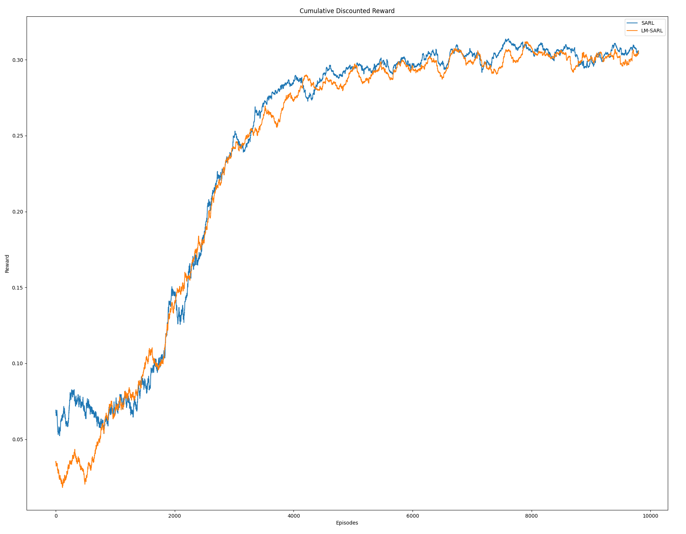

### SARL test result

#### Test Process of SARL

- Attention scores

```pseudocode
1 Reset env
2 while not done do
3   env.step
4   env.render(’video’)
5   Get the weights from policy sarl and update
6   Show the attention scores
7 end
```

```python
#file location: CrowdNav/crowd_sim/envs/utils/crowd_sim.py
def render():
# compute attention scores
if self.attention_weights is not None:
    attention_scores = [plt.text(-5.5, 5 - 0.5 * i, 'Human {}: {:.2f}'.format(i + 1, self.attention_weights[0][i]),
                 fontsize=16) for i in range(len(self.humans))]

if hasattr(self.robot.policy, 'get_attention_weights'):
    self.attention_weights.append(self.robot.policy.get_attention_weights())

#file location: CrowdNav/crowd_nav/policy/sarl.py
# masked softmax
scores_exp = torch.exp(scores) * (scores != 0).float()
weights = (scores_exp / torch.sum(scores_exp, dim=1, keepdim=True)).unsqueeze(2)
self.attention_weights = weights[0, :, 0].data.cpu().numpy()
```


#### Average reward of SARL



#### Time to goal


- 怎么得到ped 1, 2, attention scores
- interaction pooling
- sarl + gazebo

