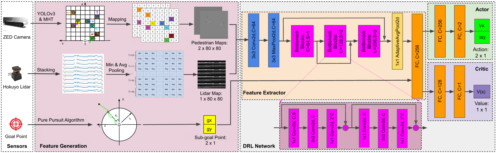
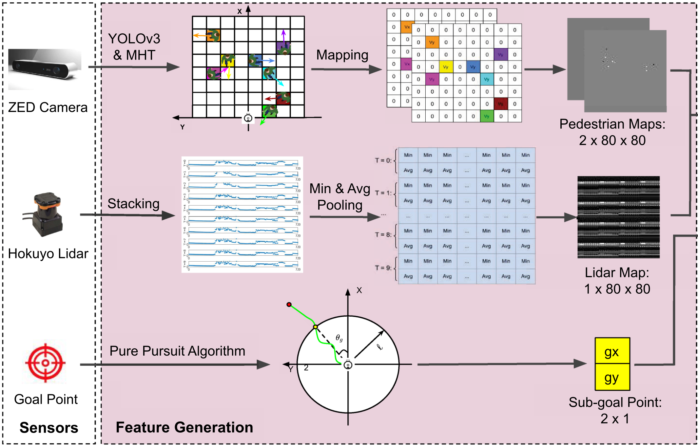

## DRL_VO algorithm analysis

---

### Overview



**observation**
$$
o^t = [l^t, p^t, g^t)]
$$
**l<sup>t</sup> :** lidar history

**p<sup>t</sup>** : pedestrian kinematics

**g<sup>t</sup>** : subgoal position

**reward**
$$
r^t = r_g^t + r_c^t + r_w^t + r_d^t
$$
**r<sub>g</sub><sup>t</sup>** : encourage robot move towards goal,  awarded when reaching the goal, penilized when timeout

**r<sub>c</sub><sup>t</sup>** : give punishment when collision

**r<sub>w</sub><sup>t</sup>** : give punishment when output large angular velocity

**r<sub>d</sub><sup>t</sup>** : reward actively steering to avoid obstacles and point toward the subgoal

---

### Environment Setup

#### observation



- annotation about down size process did not add yet
- get observation

```python
#file location: drl_vo_nav/drl_vo/src/turtlebot_gym/turtlebot_gym/envs/drl_nav_env.py

class DRLNavEnv(gym.Env):#inherit gym.Env

#observation
def _get_observation(self):
    #form obaservation process and 
    #1. ped pose process
    #2. scan proscess
    #declare how to get observation and obsercations data type
    self.ped_pos = self.cnn_data.ped_pos_map  #variable type float32[], contain 1280 elements in general
    self.scan = self.cnn_data.scan            #variable type float32[], contain 720*10 elements in general
    self.goal = self.cnn_data.goal_cart       #variable type float32[], contain 2 elements in general
    
    self.vel = self.cnn_data.vel

    # ped map:
    # MaxAbsScaler:
    v_min = -2
    v_max = 2
    self.ped_pos = np.array(self.ped_pos, dtype=np.float32)
    self.ped_pos = 2 * (self.ped_pos - v_min) / (v_max - v_min) + (-1)

    # scan map:
    # MaxAbsScaler:
    temp = np.array(self.scan, dtype=np.float32)
    scan_avg = np.zeros((20,80))
    for n in range(10):
        scan_tmp = temp[n*720:(n+1)*720]
        for i in range(80):
            scan_avg[2*n, i] = np.min(scan_tmp[i*9:(i+1)*9])
            scan_avg[2*n+1, i] = np.mean(scan_tmp[i*9:(i+1)*9])

    scan_avg = scan_avg.reshape(1600)
    scan_avg_map = np.matlib.repmat(scan_avg,1,4)
    self.scan = scan_avg_map.reshape(6400)
    s_min = 0
    s_max = 30
    self.scan = 2 * (self.scan - s_min) / (s_max - s_min) + (-1)

    # goal:
    # MaxAbsScaler:
    g_min = -2
    g_max = 2
    self.goal = np.array(self.goal, dtype=np.float32)
    self.goal = 2 * (self.goal - g_min) / (g_max - g_min) + (-1)
    #self.goal = self.goal.tolist()

    # observation:
    self.observation = np.concatenate((self.ped_pos, self.scan, self.goal), axis=None) 
    return self.observation

```

- observation process

```python
#file location: drl_vo_nav/drl_vo/src/cnn_data_pub.py

def timer_callback(self, event):  
    # generate the trajectory of pedstrians:
    self.ped_pos_map = self.ped_pos_map_tmp
    self.scan.append(self.scan_tmp.tolist())
    self.scan_all = self.scan_all_tmp

    self.ts_cnt = self.ts_cnt + 1
    if(self.ts_cnt == NUM_TP): # default NUM_TP = 10, ped_pos up-to-data, scan contain 10 frames
        # publish cnn data:
        cnn_data = CNN_data()
        #process ped_pos from 3D array (2, 80, 80) to 1D array (1280)
        cnn_data.ped_pos_map = [float(val) for sublist in self.ped_pos_map for subb in sublist for val in subb]
        #process scan lists to 1D array (720 * 10) new coming scan at the end
        cnn_data.scan = [float(val) for sublist in self.scan for val in sublist]
        
        cnn_data.scan_all = self.scan_all 
        cnn_data.depth = [] #[float(val) for sublist in self.depth for val in sublist]
        cnn_data.image_gray = [] #[float(val) for sublist in self.image_gray for val in sublist]
        cnn_data.goal_cart = self.goal_cart
        cnn_data.goal_final_polar = []
        cnn_data.vel = self.vel
        self.cnn_data_pub.publish(cnn_data)

        # reset the position data list:
        self.ts_cnt = NUM_TP-1
        self.scan = self.scan[1:NUM_TP]
```

- pedestrian message process

```python
#file location: drl_vo_nav/drl_vo/src/cnn_data_pub.py

# Callback function for the pedestrian subscriber
def ped_callback(self, trackPed_msg):
    # get the pedstrain's position:
    self.ped_pos_map_tmp = np.zeros((2,80,80))  # cartesian velocity map
    if(len(trackPed_msg.tracks) != 0):  # tracker results
        for ped in trackPed_msg.tracks:
            #ped_id = ped.track_id 
            # create pedestrian's postion costmap: 10*10 m
            x = ped.pose.pose.position.x
            y = ped.pose.pose.position.y
            vx = ped.twist.twist.linear.x
            vy = ped.twist.twist.linear.y
            # 20m * 20m occupancy map:
            if(x >= 0 and x <= 20 and np.abs(y) <= 10):
                # bin size: 0.25 m
                c = int(np.floor(-(y-10)/0.25))
                r = int(np.floor(x/0.25))

                if(r == 80):
                    r = r - 1
                if(c == 80):
                    c = c - 1
                # cartesian velocity map
                self.ped_pos_map_tmp[0,r,c] = vx
                self.ped_pos_map_tmp[1,r,c] = vy
#two [80, 80] matrix resolution to real is 0.25
#position of column and row represent positon of pedestrian pos
#frist matrix contain linear velocity of pedestrian
#second matrix contain angular velocity of pedestrian
```

- scan message process

```python
#file location: drl_vo_nav/drl_vo/src/cnn_data_pub.py

# Callback function for the scan measurement subscriber
def scan_callback(self, laserScan_msg):
    # get the laser scan data:
    # we only need data inside of 180 degree in the middle of all scan which contain 270 degree of data
    self.scan_tmp = np.zeros(720)
    self.scan_all_tmp = np.zeros(1080)
    scan_data = np.array(laserScan_msg.ranges, dtype=np.float32)
    scan_data[np.isnan(scan_data)] = 0.
    scan_data[np.isinf(scan_data)] = 0.
    self.scan_tmp = scan_data[180:900]
    self.scan_all_tmp = scan_data
```

- goal message process

```python
#file location: drl_vo_nav/drl_vo/src/cnn_data_pub.py

# Callback function for the current goal subscriber
def goal_callback(self, goal_msg):
    # Cartesian coordinate:
    self.goal_cart = np.zeros(2)
    self.goal_cart[0] = goal_msg.x
    self.goal_cart[1] = goal_msg.y
```

#### reward

```python
#file location: drl_vo_nav/drl_vo/src/turtlebot_gym/turtlebot_gym/envs/drl_nav_env.py

#totoal rewards
def _compute_reward(self):
    """Calculates the reward to give based on the observations given.
    """
    # reward parameters:
    r_arrival = 20 #15
    r_waypoint = 3.2 #2.5 #1.6 #2 #3 #1.6 #6 #2.5 #2.5
    r_collision = -20 #-15
    r_scan = -0.2 #-0.15 #-0.3
    r_angle = 0.6 #0.5 #1 #0.8 #1 #0.5
    r_rotation = -0.1 #-0.15 #-0.4 #-0.5 #-0.2 # 0.1

    angle_thresh = np.pi/6
    w_thresh = 1 # 0.7

    # reward parts:
    r_g = self._goal_reached_reward(r_arrival, r_waypoint)
    r_c = self._obstacle_collision_punish(self.cnn_data.scan[-720:], r_scan, r_collision)
    r_w = self._angular_velocity_punish(self.curr_vel.angular.z,  r_rotation, w_thresh)
    r_t = self._theta_reward(self.goal, self.mht_peds, self.curr_vel.linear.x, r_angle, angle_thresh)
    reward = r_g + r_c + r_t + r_w #+ r_v # + r_p
    #rospy.logwarn("Current Velocity: \ncurr_vel = {}".format(self.curr_vel.linear.x))
    rospy.logwarn("Compute reward done. \nreward = {}".format(reward))
    return reward

def _goal_reached_reward(self, r_arrival, r_waypoint):
    """
    Returns positive reward if the robot reaches the goal.
    :param transformed_goal goal position in robot frame
    :param k reward constant
    :return: returns reward colliding with obstacles
    """
    # distance to goal:
    dist_to_goal = np.linalg.norm(
        np.array([
        self.curr_pose.position.x - self.goal_position.x,
        self.curr_pose.position.y - self.goal_position.y,
        self.curr_pose.position.z - self.goal_position.z
        ])
    )
    # t-1 id:
    t_1 = self.num_iterations % self.DIST_NUM
    # initialize the dist_to_goal_reg:
    if(self.num_iterations == 0):
        self.dist_to_goal_reg = np.ones(self.DIST_NUM)*dist_to_goal

    rospy.logwarn("distance_to_goal_reg = {}".format(self.dist_to_goal_reg[t_1]))
    rospy.logwarn("distance_to_goal = {}".format(dist_to_goal))
    max_iteration = 512 #800 
    # reward calculation:
    if(dist_to_goal <= self.GOAL_RADIUS):  # goal reached: t = T
        reward = r_arrival
    elif(self.num_iterations >= max_iteration):  # failed to the goal
        reward = -r_arrival
    else:   # on the way
        reward = r_waypoint*(self.dist_to_goal_reg[t_1] - dist_to_goal)

    # storage the robot pose at t-1:
    #if(self.num_iterations % 40 == 0):
    self.dist_to_goal_reg[t_1] = dist_to_goal #self.curr_pose

    rospy.logwarn("Goal reached reward: {}".format(reward))
    return reward

def _obstacle_collision_punish(self, scan, r_scan, r_collision):
    """
    Returns negative reward if the robot collides with obstacles.
    :param scan containing obstacles that should be considered
    :param k reward constant
    :return: returns reward colliding with obstacles
    """
    min_scan_dist = np.amin(scan[scan!=0])
    #if(self.bump_flag == True): #or self.pos_valid_flag == False):
    if(min_scan_dist <= self.ROBOT_RADIUS and min_scan_dist >= 0.02):
        reward = r_collision
    elif(min_scan_dist < 3*self.ROBOT_RADIUS):
        reward = r_scan * (3*self.ROBOT_RADIUS - min_scan_dist)
    else:
        reward = 0.0

    rospy.logwarn("Obstacle collision reward: {}".format(reward))
    return reward

def _angular_velocity_punish(self, w_z,  r_rotation, w_thresh):
    """
    Returns negative reward if the robot turns.
    :param w roatational speed of the robot
    :param fac weight of reward punish for turning
    :param thresh rotational speed > thresh will be punished
    :return: returns reward for turning
    """
    if(abs(w_z) > w_thresh):
        reward = abs(w_z) * r_rotation
    else:
        reward = 0.0

    rospy.logwarn("Angular velocity punish reward: {}".format(reward))
    return reward

def _theta_reward(self, goal, mht_peds, v_x, r_angle, angle_thresh):
    """
    Returns negative reward if the robot turns.
    :param w roatational speed of the robot
    :param fac weight of reward punish for turning
    :param thresh rotational speed > thresh will be punished
    :return: returns reward for turning
    """
    # prefer goal theta:
    theta_pre = np.arctan2(goal[1], goal[0])
    d_theta = theta_pre

    # get the pedstrain's position:
    if(len(mht_peds.tracks) != 0):  # tracker results
        d_theta = np.pi/2 #theta_pre
        N = 60
        theta_min = 1000
        for i in range(N):
            theta = random.uniform(-np.pi, np.pi)
            free = True
            for ped in mht_peds.tracks:
                #ped_id = ped.track_id 
                # create pedestrian's postion costmap: 10*10 m
                p_x = ped.pose.pose.position.x
                p_y = ped.pose.pose.position.y
                p_vx = ped.twist.twist.linear.x
                p_vy = ped.twist.twist.linear.y

                ped_dis = np.linalg.norm([p_x, p_y])
                if(ped_dis <= 7):
                    ped_theta = np.arctan2(p_y, p_x)
                    vo_theta = np.arctan2(3*self.ROBOT_RADIUS, np.sqrt(ped_dis**2 - (3*self.ROBOT_RADIUS)**2))
                    # collision cone:
                    theta_rp = np.arctan2(v_x*np.sin(theta)-p_vy, v_x*np.cos(theta) - p_vx)
                    if(theta_rp >= (ped_theta - vo_theta) and theta_rp <= (ped_theta + vo_theta)):
                        free = False
                        break

            # reachable available theta:
            if(free):
                theta_diff = (theta - theta_pre)**2
                if(theta_diff < theta_min):
                    theta_min = theta_diff
                    d_theta = theta

    else: # no obstacles:
        d_theta = theta_pre

    reward = r_angle*(angle_thresh - abs(d_theta))

    rospy.logwarn("Theta reward: {}".format(reward))
    return reward
```

#### step

- Updates an environment with actions returning the next agent observation, the reward for taking that actions, if the environment has terminated or truncated due to the latest action and information from the environment about the step, i.e. metrics, debug info

```python
#file location: drl_vo_nav/drl_vo/src/turtlebot_gym/turtlebot_gym/envs/drl_nav_env.py

#step
def step(self, action):
    """
    Gives env an action to enter the next state,
    obs, reward, done, info = env.step(action)
    """
    # Convert the action num to movement action
    self.gazebo.unpauseSim()
    self._take_action(action)
    self.gazebo.pauseSim()
    obs = self._get_observation()
    reward = self._compute_reward()
    done = self._is_done(reward)
    # self._done_pub.publish(done)
    info = self._post_information()
    #print('info=', info, 'reward=', reward, 'done=', done)
    return obs, reward, done, info
```

---

#### network structure


```python
#file location: drl_vo_nav/drl_vo/src/custom_cnn_full.py

#initialize network structure
def __init__(self, observation_space: gym.spaces.Box, features_dim:int = 256):
    # network parameters:
    block = Bottleneck  #ResNet block
    layers = [2, 1, 1]
    zero_init_residual=True
    groups=1
    width_per_group=64
    replace_stride_with_dilation=None
    norm_layer=None

    # inherit the superclass properties/methods
    #
    super(CustomCNN, self).__init__(observation_space, features_dim)
    # define the model
    #
    ################## ped_pos net model: ###################
    if norm_layer is None:
        norm_layer = nn.BatchNorm2d
    self._norm_layer = norm_layer

    self.inplanes = 64
    self.dilation = 1
    if replace_stride_with_dilation is None:
        # each element in the tuple indicates if we should replace
        # the 2x2 stride with a dilated convolution instead
        replace_stride_with_dilation = [False, False, False]
    if len(replace_stride_with_dilation) != 3:
        raise ValueError("replace_stride_with_dilation should be None "
                         "or a 3-element tuple, got {}".format(replace_stride_with_dilation))
    self.groups = groups
    self.base_width = width_per_group
    self.conv1 = nn.Conv2d(3, self.inplanes, kernel_size=3, stride=1, padding=1,
                           bias=False)
    self.bn1 = norm_layer(self.inplanes)
    self.relu = nn.ReLU(inplace=True)
    self.maxpool = nn.MaxPool2d(kernel_size=3, stride=1, padding=1)
    self.layer1 = self._make_layer(block, 64, layers[0])
    self.layer2 = self._make_layer(block, 128, layers[1], stride=2,
                                   dilate=replace_stride_with_dilation[0])
    self.layer3 = self._make_layer(block, 256, layers[2], stride=2,
                                   dilate=replace_stride_with_dilation[1])

    self.conv2_2 = nn.Sequential(
        nn.Conv2d(in_channels=256, out_channels=128, kernel_size=(1, 1), stride=(1,1), padding=(0, 0)),
        nn.BatchNorm2d(128),
        nn.ReLU(inplace=True),

        nn.Conv2d(in_channels=128, out_channels=128, kernel_size=(3, 3), stride=(1,1), padding=(1, 1)),
        nn.BatchNorm2d(128),
        nn.ReLU(inplace=True),

        nn.Conv2d(in_channels=128, out_channels=256, kernel_size=(1, 1), stride=(1,1), padding=(0, 0)),
        nn.BatchNorm2d(256)
    )
    self.downsample2 = nn.Sequential(
        nn.Conv2d(in_channels=128, out_channels=256, kernel_size=(1, 1), stride=(2,2), padding=(0, 0)),
        nn.BatchNorm2d(256)
    )
    self.relu2 = nn.ReLU(inplace=True)

    self.conv3_2 = nn.Sequential(
        nn.Conv2d(in_channels=512, out_channels=256, kernel_size=(1, 1), stride=(1,1), padding=(0, 0)),
        nn.BatchNorm2d(256),
        nn.ReLU(inplace=True),

        nn.Conv2d(in_channels=256, out_channels=256, kernel_size=(3, 3), stride=(1,1), padding=(1, 1)),
        nn.BatchNorm2d(256),
        nn.ReLU(inplace=True),

        nn.Conv2d(in_channels=256, out_channels=512, kernel_size=(1, 1), stride=(1,1), padding=(0, 0)),
        nn.BatchNorm2d(512)
    )
    self.downsample3 = nn.Sequential(
        nn.Conv2d(in_channels=64, out_channels=512, kernel_size=(1, 1), stride=(4,4), padding=(0, 0)),
        nn.BatchNorm2d(512)
    )
    self.relu3 = nn.ReLU(inplace=True)

    # self.layer4 = self._make_layer(block, 512, layers[3], stride=2,
    #                               dilate=replace_stride_with_dilation[2])
    self.avgpool = nn.AdaptiveAvgPool2d((1, 1))
    self.linear_fc = nn.Sequential(
        nn.Linear(256 * block.expansion + 2, features_dim),
        #nn.BatchNorm1d(features_dim),
        nn.ReLU()
    )

    for m in self.modules():
        if isinstance(m, nn.Conv2d):
            nn.init.kaiming_normal_(m.weight, mode='fan_out', nonlinearity='relu')
        elif isinstance(m, (nn.BatchNorm2d, nn.GroupNorm)):
            nn.init.constant_(m.weight, 1)
            nn.init.constant_(m.bias, 0)
        elif isinstance(m, nn.BatchNorm1d): # add by xzt
            nn.init.constant_(m.weight, 1)
            nn.init.constant_(m.bias, 0) 
        elif isinstance(m, nn.Linear):
            nn.init.xavier_normal_(m.weight)

    # Zero-initialize the last BN in each residual branch,
    # so that the residual branch starts with zeros, and each residual block behaves like an identity.
    # This improves the model by 0.2~0.3% according to https://arxiv.org/abs/1706.02677
    if zero_init_residual:
        for m in self.modules():
            if isinstance(m, Bottleneck):
                nn.init.constant_(m.bn3.weight, 0)
```

- ResNet block

```python
#file location: drl_vo_nav/drl_vo/src/custom_cnn_full.py

class Bottleneck(nn.Module):
    # Bottleneck in torchvision places the stride for downsampling at 3x3 convolution(self.conv2)
    # while original implementation places the stride at the first 1x1 convolution(self.conv1)
    # according to "Deep residual learning for image recognition"https://arxiv.org/abs/1512.03385.
    # This variant is also known as ResNet V1.5 and improves accuracy according to
    # https://ngc.nvidia.com/catalog/model-scripts/nvidia:resnet_50_v1_5_for_pytorch.

    expansion = 2 #4

    def __init__(self, inplanes, planes, stride=1, downsample=None, groups=1,
                 base_width=64, dilation=1, norm_layer=None):
        super(Bottleneck, self).__init__()
        if norm_layer is None:
            norm_layer = nn.BatchNorm2d
        width = int(planes * (base_width / 64.)) * groups
        # Both self.conv2 and self.downsample layers downsample the input when stride != 1
        self.conv1 = conv1x1(inplanes, width)
        self.bn1 = norm_layer(width)
        self.conv2 = conv3x3(width, width, stride, groups, dilation)
        self.bn2 = norm_layer(width)
        self.conv3 = conv1x1(width, planes * self.expansion)
        self.bn3 = norm_layer(planes * self.expansion)
        self.relu = nn.ReLU(inplace=True)
        self.downsample = downsample
        self.stride = stride

    def forward(self, x):
        identity = x

        out = self.conv1(x)
        out = self.bn1(out)
        out = self.relu(out)

        out = self.conv2(out)
        out = self.bn2(out)
        out = self.relu(out)

        out = self.conv3(out)
        out = self.bn3(out)

        if self.downsample is not None:
            identity = self.downsample(x)

        out += identity
        out = self.relu(out)

        return out
#
# end of ResNet blocks
```

#### network forward

```python
#file location: drl_vo_nav/drl_vo/src/custom_cnn_full.py

def _forward_impl(self, ped_pos, scan, goal):
    ###### Start of fusion net ######
    ped_in = ped_pos.reshape(-1,2,80,80)
    scan_in = scan.reshape(-1,1,80,80)
    fusion_in = torch.cat((scan_in, ped_in), dim=1)

    # See note [TorchScript super()]
    x = self.conv1(fusion_in)
    x = self.bn1(x)
    x = self.relu(x)
    x = self.maxpool(x)

    identity3 = self.downsample3(x)

    x = self.layer1(x)

    identity2 = self.downsample2(x)

    x = self.layer2(x)

    x = self.conv2_2(x)
    x += identity2
    x = self.relu2(x)


    x = self.layer3(x)
    # x = self.layer4(x)

    x = self.conv3_2(x)
    x += identity3
    x = self.relu3(x)

    x = self.avgpool(x)
    fusion_out = torch.flatten(x, 1)
    ###### End of fusion net ######

    ###### Start of goal net #######
    goal_in = goal.reshape(-1,2)
    goal_out = torch.flatten(goal_in, 1)
    ###### End of goal net #######
    # Combine
    fc_in = torch.cat((fusion_out, goal_out), dim=1)
    x = self.linear_fc(fc_in)  

    return x

def forward(self, observations: torch.Tensor) -> torch.Tensor:
    # preprocessing:
    ped_pos = observations[:, :12800]
    scan = observations[:, 12800:19200]
    goal = observations[:, 19200:]
    return self._forward_impl(ped_pos, scan, goal)
#
# end of method
```

---

### Training process

```python
# create ros node:
rospy.init_node('env_test', anonymous=True, log_level=rospy.WARN) #log_level=rospy.ERROR)   

# Create log dir
log_dir = rospy.get_param('~log_dir', "./runs/")
os.makedirs(log_dir, exist_ok=True)

# Create and wrap the environment
env = gym.make('drl-nav-v0')
env = Monitor(env, log_dir) #, allow_early_resets=True)  # in order to get rollout log data
# env = DummyVecEnv([lambda: env])
obs = env.reset()

# policy parameters:
policy_kwargs = dict(
    features_extractor_class=CustomCNN,
    features_extractor_kwargs=dict(features_dim=256),
    net_arch=[dict(pi=[256], vf=[128])]
)

# raw training:
#model = PPO("CnnPolicy", env, policy_kwargs=policy_kwargs, learning_rate=1e-3, verbose=2, tensorboard_log=log_dir, n_steps=512, n_epochs=10, batch_size=128) #, gamma=0.96, ent_coef=0.1, vf_coef=0.4) 

# continue training:
kwargs = {'tensorboard_log':log_dir, 'verbose':2, 'n_epochs':10, 'n_steps':512, 'batch_size':128,'learning_rate':5e-5}
model_file = rospy.get_param('~model_file', "./model/drl_pre_train.zip")
model = PPO.load(model_file, env=env, **kwargs)

# Create the callback: check every 1000 steps
callback = SaveOnBestTrainingRewardCallback(check_freq=5000, log_dir=log_dir)
model.learn(total_timesteps=2000000, log_interval=5, tb_log_name='drl_vo_policy', callback=callback, reset_num_timesteps=True)

# Saving final model
model.save("drl_vo_model")
print("Training finished.")
env.close()
```

---

### Testing process
