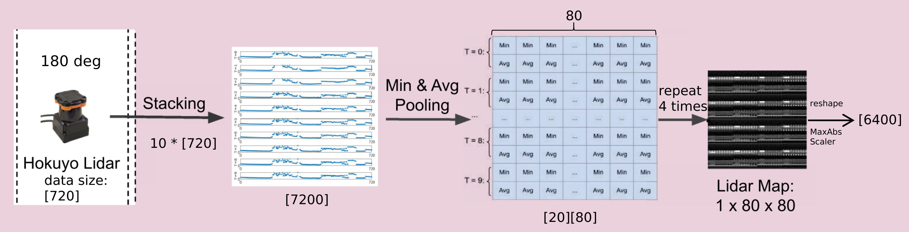
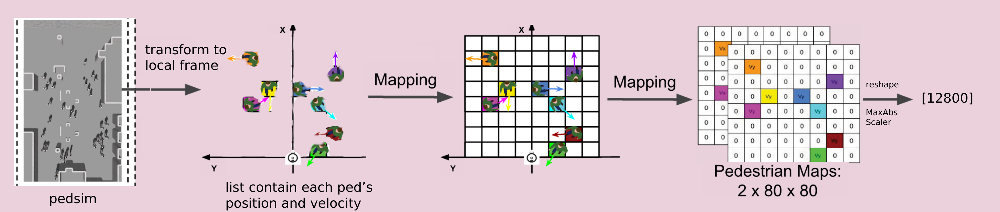
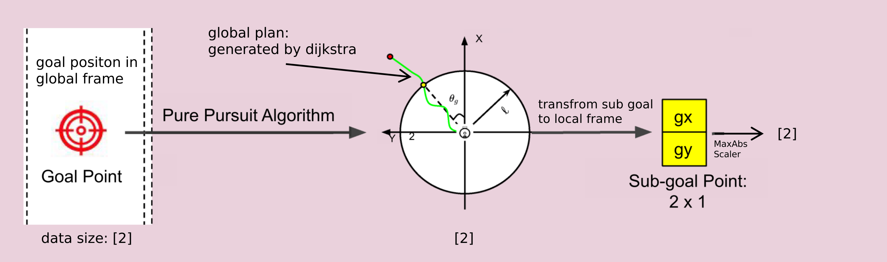

## DRL_VO algorithm analysis

---

### Overview


**observation**
$$
o^t = [l^t, p^t, g^t)]
$$
**l<sup>t</sup> :** lidar history

**p<sup>t</sup>** : pedestrian kinematics

**g<sup>t</sup>** : subgoal position

**reward**
$$
r^t = r_g^t + r_c^t + r_w^t + r_d^t
$$
**r<sub>g</sub><sup>t</sup>** : encourage robot move towards goal,  awarded when reaching the goal, penilized when timeout

**r<sub>c</sub><sup>t</sup>** : give punishment when collision

**r<sub>w</sub><sup>t</sup>** : give punishment when output large angular velocity

**r<sub>d</sub><sup>t</sup>** : reward actively steering to avoid obstacles and point toward the subgoal

---

### Environment Setup

#### observation overview


**get observation**

- return observation to Gym

$$
o^t = [l^t, p^t, g^t)]
$$
 **l<sup>t</sup> :** lidar history

**p<sup>t</sup>** : pedestrian kinematics

**g<sup>t</sup>** : subgoal position

- MaxAbsScaler

$$
\mathbf{o}^t=2 \frac{\mathbf{o}^t-\mathbf{o}_{\min }^t}{\mathbf{o}_{\max }^t-\mathbf{o}_{\min }^t}-1
$$

#### observation function relationships

```
├── _get_observation
    ├── timer_callback
        ├── ped_callback
        ├── scan_callback
        ├── goal_callback
```

---

#### lidar_scan_data



1. [scan_callback](#scan_callback)(self, laserScan_msg) 
   - **Intput**(ranges) **date_size**: array[1080] : distance measurement with 1080 elements
   - **Output**(ranges) **data_size**: array[720] : distance measurement with 720 elements
   - **Func** prune scan data from 270 deg to 180 deg (keep the middle part of one scan)

2. [timer_callback](#timer_callback)(self, event)
   - **Input**(global arg: scan_tmp) **date_size**: array[720] * 10
   - **Output**(global arg: scan) **date_size**: array[7200]
   - **Func** collecting history scan message(0.5 sec\10 frames default)

3. [_get_observation](#_get_observation)(self)
   - **Input**(global arg: scan) **date_size**: array[7200]
   - **Output**(return self.observation) **date_size**: array[6400] in self.observation array[19202]
   - **Func** [Min&Avg](#Min&Avg) pooling scan data and MaxAbsScaler

- Min&Avg polling
- <a name="Min&Avg"></a>
  1. using 9 numbers as a group to slice one scan array[720] to an array[80]
  2. extract min value of each group and form an array[80]
  3. extract average value of each group and  form an array[80]
  4. through above process one can form an array\[2][80]
  5. all the 10 scan data form an array\[20][80]
  6. repeat array 4 times then form an array\[80][80]

#### ped_data



1. track_ped_pub.py(file location: drl_vo_nav/drl_vo/src/track_ped_pub.py)
   - **Input** **data_tpye**: list of ped data(**global frame**), which element contains position and velocity of one ped
   - **Ouput** **data_tpye**: list of ped data(**local frame**), which element contains position and velocity of one ped
   - **Func** change ped data's coordinate frame from global(map_frame) to local(robot_frame)

2. [ped_callback](#ped_callback)(self, trackPed_msg)
   - **Ouput** **data_tpye**: list of ped data(**local frame**),
   - **Ouput** **data_szie**: two matrix 2 * \[80][80]
   - **Func** [mapping](#mapping) ped data to matrix

3. [_get_observation](#_get_observation)(self)
   - **Input**(global arg: ped_pos_map) **date_size**: 2 * \[80][80]
   - **Output**(return self.observation) **date_size**: array[12800] in self.observation array[19202]
   - **Func** reshape and MaxAbsScaler

- mapping ped data to matrix 2 * \[80][80]

  <a name="mapping"></a>

  1. extract ped data which position_x belong to [0, 20]\(meter) and position_y belong to [-10, 10]\(meter)
  2. make two [80, 80] matrix, resolution to real is 0.25(meter)
  3. cell numbers of column and row represent position of pedestrian
  4. then mapping pedestrians linear velocity x to first matrix
  5. mapping pedestrians linear velocity y to second matrix

#### goal_data



1. pure_pursuit.py(file location: drl_vo_nav/drl_vo/src/pure_pursuit.py)

   - **Input**(global plan) **data_tpye**: list of points(**global frame**), global plan was generated by **dijkstra**
   - **Output**(goal point) **data_tpye**: sub goal point(**local frame**)
   - **Func** got a goal from global plan path which distance(w.r.t. robot) is equal or less than 2 meter

2. [_get_observation](#_get_observation)(self)
   - **Input**(global arg: goal_cart) **date_size**: array[2]
   - **Output**(return self.observation) **date_size**: array[2] in self.observation array[19202]
   - **Func** MaxAbsScaler

---

#### observation code

- _get_observation

<a name="_get_observation"></a>

```python
#file location: drl_vo_nav/drl_vo/src/turtlebot_gym/turtlebot_gym/envs/drl_nav_env.py

#get observation
#calling by step() and reset() in drl_nav_env.py

def _get_observation(self):
    #form obaservation process and 
    #1. ped pose process
    #2. scan proscess
    #declare how to get observation and obsercations data type
    self.ped_pos = self.cnn_data.ped_pos_map  #variable type float32[], contains 12800 elements
    self.scan = self.cnn_data.scan            #variable type float32[], contains 720*10 elements
    self.goal = self.cnn_data.goal_cart       #variable type float32[], contains 2 elements
    
    self.vel = self.cnn_data.vel

    # ped map:
    # MaxAbsScaler:
    # normalize vx of ped to [-1, 1]
    # normalize vy of ped to [-1, 1]
    v_min = -2
    v_max = 2
    self.ped_pos = np.array(self.ped_pos, dtype=np.float32)
    self.ped_pos = 2 * (self.ped_pos - v_min) / (v_max - v_min) + (-1)
    # got 1-D array with 12800 elements

    # scan map:
    # MaxAbsScaler:
    temp = np.array(self.scan, dtype=np.float32)
    scan_avg = np.zeros((20,80))
    for n in range(10):
        scan_tmp = temp[n*720:(n+1)*720]
        for i in range(80):
            scan_avg[2*n, i] = np.min(scan_tmp[i*9:(i+1)*9])
            scan_avg[2*n+1, i] = np.mean(scan_tmp[i*9:(i+1)*9])

    scan_avg = scan_avg.reshape(1600)
    scan_avg_map = np.matlib.repmat(scan_avg,1,4)
    self.scan = scan_avg_map.reshape(6400)
    s_min = 0
    s_max = 30
    self.scan = 2 * (self.scan - s_min) / (s_max - s_min) + (-1)
    # normalize each num to [-1, 1]
    # got 1-D array with 6400 elements

    # goal:
    # MaxAbsScaler:
    g_min = -2
    g_max = 2
    self.goal = np.array(self.goal, dtype=np.float32)
    self.goal = 2 * (self.goal - g_min) / (g_max - g_min) + (-1)
    # got 1-D array with 2 elements

    # observation:
    self.observation = np.concatenate((self.ped_pos, self.scan, self.goal), axis=None)
    # 1-D array with (12800 + 6400 + 2) elements as observation
    return self.observation
```

- sub topics
- merge and process topics (ped/scan/goal) into cnn_data

```python
#file location: drl_vo_nav/drl_vo/src/cnn_data_pub.py

# topic track_ped contains ped's position and velocity w.r.t. robot

# ped's data provide by pedsim in simulation
# ped's positon and velocity was translated from map frame to robot frame
# translation process in file drl_vo_nav/drl_vo/src/track_ped_pub.py
self.ped_sub = rospy.Subscriber("/track_ped", TrackedPersons, self.ped_callback)

# prune scan data from 270 deg to 180 deg (keep the middle of one scan)
self.scan_sub = rospy.Subscriber("/scan", LaserScan, self.scan_callback)

# publish by file drl_vo_nav/drl_vo/src/pure_pursuit.py
# got a goal from path which distance(w.r.t. robot) is less than 2m
self.goal_sub = rospy.Subscriber("/cnn_goal", Point, self.goal_callback)
```

- timer_callback

<a name="timer_callback"></a>

```python
#file location: drl_vo_nav/drl_vo/src/cnn_data_pub.py

#pub state of environment at rate of 20Hz
def timer_callback(self, event):  
    # generate the trajectory of pedestrians:
    self.ped_pos_map = self.ped_pos_map_tmp
    self.scan.append(self.scan_tmp.tolist())
    self.scan_all = self.scan_all_tmp

    self.ts_cnt = self.ts_cnt + 1
    if(self.ts_cnt == NUM_TP): # default NUM_TP = 10, ped_pos up-to-data, scan contains 10 frames
        # publish cnn data:
        cnn_data = CNN_data()
        #process ped_pos from 3D array (2, 80, 80) to 1D array (12800)
        cnn_data.ped_pos_map = [float(val) for sublist in self.ped_pos_map for subb in sublist for val in subb]
        #process scan lists to 1D array (720 * 10) new coming scan at the end
        cnn_data.scan = [float(val) for sublist in self.scan for val in sublist]
        
        cnn_data.scan_all = self.scan_all 
        cnn_data.depth = [] #[float(val) for sublist in self.depth for val in sublist]
        cnn_data.image_gray = [] #[float(val) for sublist in self.image_gray for val in sublist]
        cnn_data.goal_cart = self.goal_cart
        cnn_data.goal_final_polar = []
        cnn_data.vel = self.vel
        self.cnn_data_pub.publish(cnn_data)

        # reset the position data list:
        self.ts_cnt = NUM_TP-1
        self.scan = self.scan[1:NUM_TP]
```

- ped_callback

<a name="ped_callback"></a>

```python
#file location: drl_vo_nav/drl_vo/src/cnn_data_pub.py

# Callback function for the pedestrian subscriber
def ped_callback(self, trackPed_msg):
    # get the pedstrain's position:
    self.ped_pos_map_tmp = np.zeros((2,80,80))  # cartesian velocity map
    if(len(trackPed_msg.tracks) != 0):  # tracker results
        for ped in trackPed_msg.tracks:
            #ped_id = ped.track_id 
            # create pedestrian's postion costmap: 10*10 m
            x = ped.pose.pose.position.x
            y = ped.pose.pose.position.y
            vx = ped.twist.twist.linear.x
            vy = ped.twist.twist.linear.y
            # 20m * 20m occupancy map:
            if(x >= 0 and x <= 20 and np.abs(y) <= 10):
                # bin size: 0.25 m
                c = int(np.floor(-(y-10)/0.25))
                r = int(np.floor(x/0.25))

                if(r == 80):
                    r = r - 1
                if(c == 80):
                    c = c - 1
                # cartesian velocity map
                self.ped_pos_map_tmp[0,r,c] = vx
                self.ped_pos_map_tmp[1,r,c] = vy
```

- scan_callback
- we only need data inside of 180 degree in the middle of all scan which contains 270 degree of data

<a name="scan_callback"></a>

```python
#file location: drl_vo_nav/drl_vo/src/cnn_data_pub.py

# Callback function for the scan measurement subscriber
def scan_callback(self, laserScan_msg):
    self.scan_tmp = np.zeros(720)
    self.scan_all_tmp = np.zeros(1080)
    scan_data = np.array(laserScan_msg.ranges, dtype=np.float32)
    scan_data[np.isnan(scan_data)] = 0.
    scan_data[np.isinf(scan_data)] = 0.
    self.scan_tmp = scan_data[180:900]
    self.scan_all_tmp = scan_data
```

---

#### reward

$$
r^t = r_g^t + r_c^t + r_w^t + r_d^t
$$
**r<sub>g</sub><sup>t</sup>** : encourage robot move towards goal,  awarded when reaching the goal, penilized when timeout

**r<sub>c</sub><sup>t</sup>** : give punishment when collision

**r<sub>w</sub><sup>t</sup>** : give punishment when output large angular velocity

**r<sub>d</sub><sup>t</sup>** : reward actively steering to avoid obstacles and point toward the subgoal

---

#### reward function relationships

```
├── _compute_reward
    ├── _goal_reached_reward
    ├── _obstacle_collision_punish
    ├── _angular_velocity_punish
    ├── _theta_reward
```

---

- [_computer_reward](#_compute_reward)(self)

  - **Input** environment states
  - **Output** reward 

  the reward includes 4 parts (r_g + r_c + r_t + r_w)

1. [_goal_reached_reward](#_goal_reached_reward)(self, r_arrival, r_waypoint)
   - **Input** environment states

---

#### reward code

- _compute_reward

<a name="_compute_reward"></a>

```python
#file location: drl_vo_nav/drl_vo/src/turtlebot_gym/turtlebot_gym/envs/drl_nav_env.py

#robot paramters value
self.ROBOT_RADIUS = 0.3
self.GOAL_RADIUS = 0.3 #0.3
self.DIST_NUM = 10

# vo algorithm:
#this is a rostopic msg type
self.mht_peds = TrackedPersons()

#totoal rewards
def _compute_reward(self):
    """Calculates the reward to give based on the observations given.
    """
    # reward parameters:
    r_arrival = 20 #15
    r_waypoint = 3.2 #2.5 #1.6 #2 #3 #1.6 #6 #2.5 #2.5
    r_collision = -20 #-15
    r_scan = -0.2 #-0.15 #-0.3
    r_angle = 0.6 #0.5 #1 #0.8 #1 #0.5
    r_rotation = -0.1 #-0.15 #-0.4 #-0.5 #-0.2 # 0.1

    angle_thresh = np.pi/6
    w_thresh = 1 # 0.7

    # reward parts:
    r_g = self._goal_reached_reward(r_arrival, r_waypoint)
    r_c = self._obstacle_collision_punish(self.cnn_data.scan[-720:], r_scan, r_collision)
    r_w = self._angular_velocity_punish(self.curr_vel.angular.z,  r_rotation, w_thresh)
    r_t = self._theta_reward(self.goal, self.mht_peds, self.curr_vel.linear.x, r_angle, angle_thresh)
    reward = r_g + r_c + r_t + r_w #+ r_v # + r_p

    return reward
```

**details about mht_peds (vo msg)**

- message type of TrackedPersons()

```python
# details about vo msg

#file location: drl_vo_nav/drl_vo/src/turtlebot_gym/turtlebot_gym/envs/drl_nav_env.py
self._ped_sub = rospy.Subscriber("/track_ped", TrackedPersons, self._ped_callback)
# Callback function for the pedestrian subscriber
def _ped_callback(self, trackPed_msg): 
    self.mht_peds = trackPed_msg

#file location: src/pedsim_ros_with_gazebo/pedsim_msgs/msg/TrackedPersons.msg

#data tpye of vo msg
Header              header      # Header containing timestamp etc. of this message
TrackedPerson[]     tracks      # All persons that are currently being tracked

#file location: src/pedsim_ros_with_gazebo/pedsim_msgs/msg/TrackedPersons.msg

# Message defining a tracked person
#
uint64      track_id        # unique identifier of the target, consistent over time
bool        is_occluded     # if the track is currently not observable in a physical way
bool        is_matched      # if the track is currently matched by a detection
uint64      detection_id    # id of the corresponding detection in the current cycle (undefined if occluded)
duration    age             # age of the track

# The following fields are extracted from the Kalman state x and its covariance C

geometry_msgs/PoseWithCovariance    pose
# pose of the track (z value and orientation might not be set, check if corresponding variance on diagonal is > 99999)

geometry_msgs/TwistWithCovariance   twist
# velocity of the track (z value and rotational velocities might not be set, check if corresponding variance on diagonal is > 99999)
```

- _goal_reached_reward

<a name="_goal_reached_reward"></a>
$$
r_g^t= \begin{cases}r_{\text {goal }} & \text { if }\left\|p_g^t\right\|<g_m \\ -r_{\text {goal }} & \text { else if } t \geq t_{\text {max }} \\ r_{\text {path }}\left(\left\|p_g^{t-1}\right\|-\left\|p_g^t\right\|\right) & \text { otherwise }\end{cases}
$$

```python
#file location: drl_vo_nav/drl_vo/src/turtlebot_gym/turtlebot_gym/envs/drl_nav_env.py

def _goal_reached_reward(self, r_arrival, r_waypoint):
    """
    Returns positive reward if the robot reaches the goal.
    :param transformed_goal goal position in robot frame
    :param k reward constant
    :return: returns reward colliding with obstacles
    """
    # distance to goal:
    dist_to_goal = np.linalg.norm(
        np.array([
        self.curr_pose.position.x - self.goal_position.x,
        self.curr_pose.position.y - self.goal_position.y,
        self.curr_pose.position.z - self.goal_position.z
        ])
    )
    # t-1 id:
    t_1 = self.num_iterations % self.DIST_NUM
    # initialize the dist_to_goal_reg:
    # num_iterations will be setted to 0, when a new goal coming or env reset
    if(self.num_iterations == 0):
        self.dist_to_goal_reg = np.ones(self.DIST_NUM)*dist_to_goal

    max_iteration = 512 #800 
    # reward calculation:
    if(dist_to_goal <= self.GOAL_RADIUS):  # goal reached: t = T
        reward = r_arrival
        #num_iterations plus 1 when one step func done
    elif(self.num_iterations >= max_iteration):  # failed to the goal
        reward = -r_arrival
    else:   # on the way
        #compare dist to goal between current and 0.5s before
        reward = r_waypoint*(self.dist_to_goal_reg[t_1] - dist_to_goal)

    # storage the robot pose at t-1:
    self.dist_to_goal_reg[t_1] = dist_to_goal #self.curr_pose

    return reward
```

- collision reward

$$
r_c^t= \begin{cases}r_{\text {collision }} & \text { if }\left\|p_o^t\right\| \leq d_r \\ r_{\text {obstacle }}\left(d_m-\left\|p_o^t\right\|\right) & \text { else if }\left\|p_o^t\right\| \leq d_m \\ 0 & \text { otherwise }\end{cases}
$$

```python
#file location: drl_vo_nav/drl_vo/src/turtlebot_gym/turtlebot_gym/envs/drl_nav_env.py

def _obstacle_collision_punish(self, scan, r_scan, r_collision):
    """
    Returns negative reward if the robot collides with obstacles.
    :param scan containing obstacles that should be considered
    :param k reward constant
    :return: returns reward colliding with obstacles
    """
    # get minimum data from currently one frame of scan
    min_scan_dist = np.amin(scan[scan!=0])

    if(min_scan_dist <= self.ROBOT_RADIUS and min_scan_dist >= 0.02):
        reward = r_collision
    elif(min_scan_dist < 3*self.ROBOT_RADIUS):
        reward = r_scan * (3*self.ROBOT_RADIUS - min_scan_dist)
    else:
        reward = 0.0

    return reward
```

- angular velocity reward

$$
r_w^t= \begin{cases}r_{\text {rotation }}\left|\omega_z^t\right| & \text { if }\left|\omega_z^t\right|>\omega_m \\ 0 & \text { otherwise }\end{cases}
$$

```python
#file location: drl_vo_nav/drl_vo/src/turtlebot_gym/turtlebot_gym/envs/drl_nav_env.py

def _angular_velocity_punish(self, w_z,  r_rotation, w_thresh):
    """
    Returns negative reward if the robot turns.
    :param w roatational speed of the robot
    :param fac weight of reward punish for turning
    :param thresh rotational speed > thresh will be punished
    :return: returns reward for turning
    """
    if(abs(w_z) > w_thresh):
        reward = abs(w_z) * r_rotation
    else:
        reward = 0.0

    rospy.logwarn("Angular velocity punish reward: {}".format(reward))
    return reward
```

- theta reward

$$
r_d^t=r_{\text {angle }}\left(\theta_m-\left|\theta_d^t\right|\right)
$$

```python
#file location: drl_vo_nav/drl_vo/src/turtlebot_gym/turtlebot_gym/envs/drl_nav_env.py

def _theta_reward(self, goal, mht_peds, v_x, r_angle, angle_thresh):
    """
    Returns negative reward if the robot turns.
    :param w roatational speed of the robot
    :param fac weight of reward punish for turning
    :param thresh rotational speed > thresh will be punished
    :return: returns reward for turning
    """
    # prefer goal theta:
    theta_pre = np.arctan2(goal[1], goal[0])
    d_theta = theta_pre

    # get the pedstrain's position:
    if(len(mht_peds.tracks) != 0):  # tracker results
        d_theta = np.pi/2 #theta_pre
        N = 60
        theta_min = 1000
        for i in range(N):
            theta = random.uniform(-np.pi, np.pi)
            free = True
            for ped in mht_peds.tracks:
                #ped_id = ped.track_id 
                # create pedestrian's postion costmap: 10*10 m
                p_x = ped.pose.pose.position.x
                p_y = ped.pose.pose.position.y
                p_vx = ped.twist.twist.linear.x
                p_vy = ped.twist.twist.linear.y

                ped_dis = np.linalg.norm([p_x, p_y])
                if(ped_dis <= 7):
                    ped_theta = np.arctan2(p_y, p_x)
                    vo_theta = np.arctan2(3*self.ROBOT_RADIUS, np.sqrt(ped_dis**2 - (3*self.ROBOT_RADIUS)**2))
                    # collision cone:
                    theta_rp = np.arctan2(v_x*np.sin(theta)-p_vy, v_x*np.cos(theta) - p_vx)
                    if(theta_rp >= (ped_theta - vo_theta) and theta_rp <= (ped_theta + vo_theta)):
                        free = False
                        break

            # reachable available theta:
            if(free):
                theta_diff = (theta - theta_pre)**2
                if(theta_diff < theta_min):
                    theta_min = theta_diff
                    d_theta = theta

    else: # no obstacles:
        d_theta = theta_pre

    reward = r_angle*(angle_thresh - abs(d_theta))

    rospy.logwarn("Theta reward: {}".format(reward))
    return reward
```

#### action

- output action to Gym
- **TODO**: find out where the action arg com from

```python
#file location: drl_vo_nav/drl_vo/src/turtlebot_gym/turtlebot_gym/envs/drl_nav_env.py

def _take_action(self, action):
    """
    action: 2-d numpy array.
    """
    rospy.logdebug("TurtleBot2 Base Twist Cmd>>\nlinear: {}\nangular: {}".format(action[0], action[1]))
    cmd_vel = Twist()

    # MaxAbsScaler:
    vx_min = 0
    vx_max = 0.5
    vz_min = -2 #-3
    vz_max = 2 #3
    cmd_vel.linear.x = (action[0] + 1) * (vx_max - vx_min) / 2 + vx_min
    cmd_vel.angular.z = (action[1] + 1) * (vz_max - vz_min) / 2 + vz_min
    #self._check_publishers_connection()

    rate = rospy.Rate(20)
    for _ in range(1):
        self._cmd_vel_pub.publish(cmd_vel)
        #rospy.logdebug("cmd_vel: \nlinear: {}\nangular: {}".format(cmd_vel.linear.x,
        #                                                    cmd_vel.angular.z))
        rate.sleep()

    # self._cmd_vel_pub.publish(cmd_vel)
    rospy.logwarn("cmd_vel: \nlinear: {}\nangular: {}".format(cmd_vel.linear.x, cmd_vel.angular.z))
    
```

#### terminal

- Gym reset by 3 conditions
  1. goal reached
  2. collision 3 times
  3. running more than 512 iterations

```python
#file location: drl_vo_nav/drl_vo/src/turtlebot_gym/turtlebot_gym/envs/drl_nav_env.py

def _is_done(self, reward):
    """
    Checks if end of episode is reached. It is reached,
    if the goal is reached,
    if the robot collided with obstacle
    if the reward function returns a high negative value.
    if maximum number of iterations is reached,
    :param current state
    :return: True if self._episode_done
    """
    # updata the number of iterations:
    self.num_iterations += 1

    # 1) Goal reached?
    # distance to goal:
    dist_to_goal = np.linalg.norm(
        np.array([
        self.curr_pose.position.x - self.goal_position.x,
        self.curr_pose.position.y - self.goal_position.y,
        self.curr_pose.position.z - self.goal_position.z
        ])
    )
    if(dist_to_goal <= self.GOAL_RADIUS):
        # reset the robot velocity to 0:
        self._cmd_vel_pub.publish(Twist())
        self._episode_done = True
        return True

    # 2) Obstacle collision?
    scan = self.cnn_data.scan[-720:]
    min_scan_dist = np.amin(scan[scan!=0])
    if(min_scan_dist <= self.ROBOT_RADIUS and min_scan_dist >= 0.02):
        self.bump_num += 1

    # stop and reset if more than 3 collisions: 
    if(self.bump_num >= 3):
        # reset the robot velocity to 0:
        self._cmd_vel_pub.publish(Twist())
        self.bump_num = 0
        self._episode_done = True
        self._reset = True # reset the simulation world
        return True

    # 3) maximum number of iterations?
    max_iteration = 512
    if(self.num_iterations > max_iteration):
        # reset the robot velocity to 0:
        self._cmd_vel_pub.publish(Twist())
        self._episode_done = True
        self._reset = True
        return True

    return False #self._episode_done
```

#### step

- Updates an environment with actions returning the next agent observation, the reward for taking that actions, if the environment has terminated or truncated due to the latest action and information from the environment about the step, i.e. metrics, debug info

```python
#file location: drl_vo_nav/drl_vo/src/turtlebot_gym/turtlebot_gym/envs/drl_nav_env.py

#some interface
# self.unpause = rospy.ServiceProxy('/gazebo/unpause_physics', Empty)
# self.pause = rospy.ServiceProxy('/gazebo/pause_physics', Empty)

#todo: did not find where the action come from yet.
#step
def step(self, action):
    """
    Gives env an action to enter the next state,
    obs, reward, done, info = env.step(action)
    """
    # Convert the action num to movement action
    
    # call service to keep gazebo simulation running
    self.gazebo.unpauseSim()
    # using Max-Abs scale linear v to (0, 0.5), angular v to (-2.0, 2.0)
    self._take_action(action)
    # call service to pause gazebo simulation 
    self.gazebo.pauseSim()
    
    # get obs for next step
    obs = self._get_observation()
    # get this turn's reward
    reward = self._compute_reward()
    # cheak if termination conditions were satisfied
    # if done is true env.reset() will be call
    # pedestrians pose will be reset to initial pose
    done = self._is_done(reward)
    # print robot current pose information and goal pose information
    info = self._post_information()

    return obs, reward, done, info
```

#### action space

```python
#file location: drl_vo_nav/drl_vo/src/turtlebot_gym/turtlebot_gym/envs/drl_nav_env.py

# action space
self.high_action = np.array([1, 1])
self.low_action = np.array([-1, -1])
self.action_space = spaces.Box(low=self.low_action, high=self.high_action, dtype=np.float32)
```

#### observation space - using to init network

```python
#file location: drl_vo_nav/drl_vo/src/turtlebot_gym/turtlebot_gym/envs/drl_nav_env.py

self.observation_space = spaces.Box(low=-1, high=1, shape=(19202,), dtype=np.float32)
```

---

#### network structure


```python
#file location: drl_vo_nav/drl_vo/src/custom_cnn_full.py

#initialize network structure
# function: init
#
# arguments: observation_space: (gym.Space)
#            features_dim: (int) Number of features extracted.
#            block: block type (Bottleneck)
#            layers: the number of block layers
#
# return: none
#
# This method is the main function.
#

# inherit BaseFeaturesExtractor from stable_baselines3
class CustomCNN(BaseFeaturesExtractor):

def __init__(self, observation_space: gym.spaces.Box, features_dim:int = 256):
    # network parameters:
    block = Bottleneck  #ResNet block
    layers = [2, 1, 1]
    zero_init_residual=True
    groups=1
    width_per_group=64
    replace_stride_with_dilation=None
    norm_layer=None

    # inherit the superclass properties/methods
    #
    super(CustomCNN, self).__init__(observation_space, features_dim)
    # define the model
    #
    ################## ped_pos net model: ###################
    if norm_layer is None:
        norm_layer = nn.BatchNorm2d
    self._norm_layer = norm_layer

    self.inplanes = 64
    self.dilation = 1
    if replace_stride_with_dilation is None:
        # each element in the tuple indicates if we should replace
        # the 2x2 stride with a dilated convolution instead
        replace_stride_with_dilation = [False, False, False]
    if len(replace_stride_with_dilation) != 3:
        raise ValueError("replace_stride_with_dilation should be None "
                         "or a 3-element tuple, got {}".format(replace_stride_with_dilation))
    self.groups = groups
    self.base_width = width_per_group
    self.conv1 = nn.Conv2d(3, self.inplanes, kernel_size=3, stride=1, padding=1,
                           bias=False)
    self.bn1 = norm_layer(self.inplanes)
    self.relu = nn.ReLU(inplace=True)
    self.maxpool = nn.MaxPool2d(kernel_size=3, stride=1, padding=1)
    self.layer1 = self._make_layer(block, 64, layers[0])
    self.layer2 = self._make_layer(block, 128, layers[1], stride=2,
                                   dilate=replace_stride_with_dilation[0])
    self.layer3 = self._make_layer(block, 256, layers[2], stride=2,
                                   dilate=replace_stride_with_dilation[1])

    self.conv2_2 = nn.Sequential(
        nn.Conv2d(in_channels=256, out_channels=128, kernel_size=(1, 1), stride=(1,1), padding=(0, 0)),
        nn.BatchNorm2d(128),
        nn.ReLU(inplace=True),

        nn.Conv2d(in_channels=128, out_channels=128, kernel_size=(3, 3), stride=(1,1), padding=(1, 1)),
        nn.BatchNorm2d(128),
        nn.ReLU(inplace=True),

        nn.Conv2d(in_channels=128, out_channels=256, kernel_size=(1, 1), stride=(1,1), padding=(0, 0)),
        nn.BatchNorm2d(256)
    )
    self.downsample2 = nn.Sequential(
        nn.Conv2d(in_channels=128, out_channels=256, kernel_size=(1, 1), stride=(2,2), padding=(0, 0)),
        nn.BatchNorm2d(256)
    )
    self.relu2 = nn.ReLU(inplace=True)

    self.conv3_2 = nn.Sequential(
        nn.Conv2d(in_channels=512, out_channels=256, kernel_size=(1, 1), stride=(1,1), padding=(0, 0)),
        nn.BatchNorm2d(256),
        nn.ReLU(inplace=True),

        nn.Conv2d(in_channels=256, out_channels=256, kernel_size=(3, 3), stride=(1,1), padding=(1, 1)),
        nn.BatchNorm2d(256),
        nn.ReLU(inplace=True),

        nn.Conv2d(in_channels=256, out_channels=512, kernel_size=(1, 1), stride=(1,1), padding=(0, 0)),
        nn.BatchNorm2d(512)
    )
    self.downsample3 = nn.Sequential(
        nn.Conv2d(in_channels=64, out_channels=512, kernel_size=(1, 1), stride=(4,4), padding=(0, 0)),
        nn.BatchNorm2d(512)
    )
    self.relu3 = nn.ReLU(inplace=True)

    # self.layer4 = self._make_layer(block, 512, layers[3], stride=2,
    #                               dilate=replace_stride_with_dilation[2])
    self.avgpool = nn.AdaptiveAvgPool2d((1, 1))
    self.linear_fc = nn.Sequential(
        nn.Linear(256 * block.expansion + 2, features_dim),
        #nn.BatchNorm1d(features_dim),
        nn.ReLU()
    )

    for m in self.modules():
        if isinstance(m, nn.Conv2d):
            nn.init.kaiming_normal_(m.weight, mode='fan_out', nonlinearity='relu')
        elif isinstance(m, (nn.BatchNorm2d, nn.GroupNorm)):
            nn.init.constant_(m.weight, 1)
            nn.init.constant_(m.bias, 0)
        elif isinstance(m, nn.BatchNorm1d): # add by xzt
            nn.init.constant_(m.weight, 1)
            nn.init.constant_(m.bias, 0) 
        elif isinstance(m, nn.Linear):
            nn.init.xavier_normal_(m.weight)

    # Zero-initialize the last BN in each residual branch,
    # so that the residual branch starts with zeros, and each residual block behaves like an identity.
    # This improves the model by 0.2~0.3% according to https://arxiv.org/abs/1706.02677
    if zero_init_residual:
        for m in self.modules():
            if isinstance(m, Bottleneck):
                nn.init.constant_(m.bn3.weight, 0)
```

- ResNet block

```python
#file location: drl_vo_nav/drl_vo/src/custom_cnn_full.py

class Bottleneck(nn.Module):
    # Bottleneck in torchvision places the stride for downsampling at 3x3 convolution(self.conv2)
    # while original implementation places the stride at the first 1x1 convolution(self.conv1)
    # according to "Deep residual learning for image recognition"https://arxiv.org/abs/1512.03385.
    # This variant is also known as ResNet V1.5 and improves accuracy according to
    # https://ngc.nvidia.com/catalog/model-scripts/nvidia:resnet_50_v1_5_for_pytorch.

    expansion = 2 #4

    def __init__(self, inplanes, planes, stride=1, downsample=None, groups=1,
                 base_width=64, dilation=1, norm_layer=None):
        super(Bottleneck, self).__init__()
        if norm_layer is None:
            norm_layer = nn.BatchNorm2d
        width = int(planes * (base_width / 64.)) * groups
        # Both self.conv2 and self.downsample layers downsample the input when stride != 1
        self.conv1 = conv1x1(inplanes, width)
        self.bn1 = norm_layer(width)
        self.conv2 = conv3x3(width, width, stride, groups, dilation)
        self.bn2 = norm_layer(width)
        self.conv3 = conv1x1(width, planes * self.expansion)
        self.bn3 = norm_layer(planes * self.expansion)
        self.relu = nn.ReLU(inplace=True)
        self.downsample = downsample
        self.stride = stride

    def forward(self, x):
        identity = x

        out = self.conv1(x)
        out = self.bn1(out)
        out = self.relu(out)

        out = self.conv2(out)
        out = self.bn2(out)
        out = self.relu(out)

        out = self.conv3(out)
        out = self.bn3(out)

        if self.downsample is not None:
            identity = self.downsample(x)

        out += identity
        out = self.relu(out)

        return out
#
# end of ResNet blocks
```

#### network forward

```python
#file location: drl_vo_nav/drl_vo/src/custom_cnn_full.py

def _forward_impl(self, ped_pos, scan, goal):
    ###### Start of fusion net ######
    ped_in = ped_pos.reshape(-1,2,80,80)
    scan_in = scan.reshape(-1,1,80,80)
    fusion_in = torch.cat((scan_in, ped_in), dim=1)

    # See note [TorchScript super()]
    x = self.conv1(fusion_in)
    x = self.bn1(x)
    x = self.relu(x)
    x = self.maxpool(x)

    identity3 = self.downsample3(x)

    x = self.layer1(x)

    identity2 = self.downsample2(x)

    x = self.layer2(x)

    x = self.conv2_2(x)
    x += identity2
    x = self.relu2(x)


    x = self.layer3(x)
    # x = self.layer4(x)

    x = self.conv3_2(x)
    x += identity3
    x = self.relu3(x)

    x = self.avgpool(x)
    fusion_out = torch.flatten(x, 1)
    ###### End of fusion net ######

    ###### Start of goal net #######
    goal_in = goal.reshape(-1,2)
    goal_out = torch.flatten(goal_in, 1)
    ###### End of goal net #######
    # Combine
    fc_in = torch.cat((fusion_out, goal_out), dim=1)
    x = self.linear_fc(fc_in)  

    return x

def forward(self, observations: torch.Tensor) -> torch.Tensor:
    # preprocessing:
    ped_pos = observations[:, :12800]
    scan = observations[:, 12800:19200]
    goal = observations[:, 19200:]
    return self._forward_impl(ped_pos, scan, goal)
#
# end of method
```

---

### Training process

```python
#file location: drl_vo_nav/drl_vo/src/drl_vo_train.py

# PPO is the implementation of SB3

# Create log dir
log_dir = rospy.get_param('~log_dir', "./runs/")
os.makedirs(log_dir, exist_ok=True)

# Create and wrap the environment
env = gym.make('drl-nav-v0')
env = Monitor(env, log_dir) #, allow_early_resets=True)  # in order to get rollout log data
# reset gym env and get frist observation
obs = env.reset()

# policy parameters:
# using for raw training
policy_kwargs = dict(
    features_extractor_class=CustomCNN,
    features_extractor_kwargs=dict(features_dim=256),
    net_arch=[dict(pi=[256], vf=[128])]
)

# raw training:
# generate model when frist execute traning process

#model = PPO("CnnPolicy", env, policy_kwargs=policy_kwargs, learning_rate=1e-3, verbose=2, tensorboard_log=log_dir, n_steps=512, n_epochs=10, batch_size=128) #, gamma=0.96, ent_coef=0.1, vf_coef=0.4) 

# load model if we already have a trained model
# continue training:
kwargs = {'tensorboard_log':log_dir, 'verbose':2, 'n_epochs':10, 'n_steps':512, 'batch_size':128,'learning_rate':5e-5}
model_file = rospy.get_param('~model_file', "./model/drl_pre_train.zip")
model = PPO.load(model_file, env=env, **kwargs)

# Create the callback: check every 1000 steps
callback = SaveOnBestTrainingRewardCallback(check_freq=5000, log_dir=log_dir)
model.learn(total_timesteps=2000000, log_interval=5, tb_log_name='drl_vo_policy', callback=callback, reset_num_timesteps=True)

# Saving final model
model.save("drl_vo_model")
print("Training finished.")
env.close()
```

#### PPO

todo: finish annotation of ppo in stable_baselines2 later

```python
#file location: lib/python3.x/site-packages/stable_baselines3/ppo/ppo.py

def __init__(
    self,
    policy: Union[str, Type[ActorCriticPolicy]],
    env: Union[GymEnv, str],
    learning_rate: Union[float, Schedule] = 3e-4,
    n_steps: int = 2048,
    batch_size: Optional[int] = 64,
    n_epochs: int = 10,
    gamma: float = 0.99,
    gae_lambda: float = 0.95,
    clip_range: Union[float, Schedule] = 0.2,
    clip_range_vf: Union[None, float, Schedule] = None,
    ent_coef: float = 0.0,
    vf_coef: float = 0.5,
    max_grad_norm: float = 0.5,
    use_sde: bool = False,
    sde_sample_freq: int = -1,
    target_kl: Optional[float] = None,
    tensorboard_log: Optional[str] = None,
    create_eval_env: bool = False,
    policy_kwargs: Optional[Dict[str, Any]] = None,
    verbose: int = 0,
    seed: Optional[int] = None,
    device: Union[th.device, str] = "auto",
    _init_setup_model: bool = True,
):

    super(PPO, self).__init__(
        policy,
        env,
        learning_rate=learning_rate,
        n_steps=n_steps,
        gamma=gamma,
        gae_lambda=gae_lambda,
        ent_coef=ent_coef,
        vf_coef=vf_coef,
        max_grad_norm=max_grad_norm,
        use_sde=use_sde,
        sde_sample_freq=sde_sample_freq,
        tensorboard_log=tensorboard_log,
        policy_kwargs=policy_kwargs,
        verbose=verbose,
        device=device,
        create_eval_env=create_eval_env,
        seed=seed,
        _init_setup_model=False,
        supported_action_spaces=(
            spaces.Box,
            spaces.Discrete,
            spaces.MultiDiscrete,
            spaces.MultiBinary,
        ),
    )

    # Sanity check, otherwise it will lead to noisy gradient and NaN
    # because of the advantage normalization
    assert (
        batch_size > 1
    ), "`batch_size` must be greater than 1. See https://github.com/DLR-RM/stable-baselines3/issues/440"

    if self.env is not None:
        # Check that `n_steps * n_envs > 1` to avoid NaN
        # when doing advantage normalization
        buffer_size = self.env.num_envs * self.n_steps
        assert (
            buffer_size > 1
        ), f"`n_steps * n_envs` must be greater than 1. Currently n_steps={self.n_steps} and n_envs={self.env.num_envs}"
        # Check that the rollout buffer size is a multiple of the mini-batch size
        untruncated_batches = buffer_size // batch_size
        if buffer_size % batch_size > 0:
            warnings.warn(
                f"You have specified a mini-batch size of {batch_size},"
                f" but because the `RolloutBuffer` is of size `n_steps * n_envs = {buffer_size}`,"
                f" after every {untruncated_batches} untruncated mini-batches,"
                f" there will be a truncated mini-batch of size {buffer_size % batch_size}\n"
                f"We recommend using a `batch_size` that is a factor of `n_steps * n_envs`.\n"
                f"Info: (n_steps={self.n_steps} and n_envs={self.env.num_envs})"
            )
    self.batch_size = batch_size
    self.n_epochs = n_epochs
    self.clip_range = clip_range
    self.clip_range_vf = clip_range_vf
    self.target_kl = target_kl

    if _init_setup_model:
        self._setup_model()
```

---

### Testing process

```python
#file location: drl_vo_nav/drl_vo/src/drl_vo_inference.py

class DrlInference:
    # Constructor
    def __init__(self):
        # initialize data:  
        self.ped_pos = [] #np.ones((3, 20))*20.
        self.scan = [] #np.zeros((3, 720))
        self.goal = [] #np.zeros((3, 2))
        self.vx = 0
        self.wz = 0
        self.model = None

        # load model:
        model_file = rospy.get_param('~model_file', "./model/drl_vo.zip")
        self.model = PPO.load(model_file)
        print("Finish loading model.")

        # initialize ROS objects
        self.cnn_data_sub = rospy.Subscriber("/cnn_data", CNN_data, self.cnn_data_callback)
        self.cmd_vel_pub = rospy.Publisher('/drl_cmd_vel', Twist, queue_size=10, latch=False)

    # Callback function for the cnn_data subscriber
    def cnn_data_callback(self, cnn_data_msg):
        self.ped_pos = cnn_data_msg.ped_pos_map
        self.scan = cnn_data_msg.scan
        self.goal = cnn_data_msg.goal_cart
        cmd_vel = Twist()

        # minimum distance:
        scan = np.array(self.scan[-540:-180])
        scan = scan[scan!=0]
        if(scan.size!=0):
            min_scan_dist = np.amin(scan)
        else:
            min_scan_dist = 10

        # if the goal is close to the robot:
        if(np.linalg.norm(self.goal) <= 0.9):  # goal margin
                cmd_vel.linear.x = 0
                cmd_vel.angular.z = 0
        elif(min_scan_dist <= 0.4): # obstacle margin
            cmd_vel.linear.x = 0
            cmd_vel.angular.z = 0.7
        else:
            # MaxAbsScaler:
            v_min = -2 
            v_max = 2 
            self.ped_pos = np.array(self.ped_pos, dtype=np.float32)
            self.ped_pos = 2 * (self.ped_pos - v_min) / (v_max - v_min) + (-1)

            # MaxAbsScaler:
            temp = np.array(self.scan, dtype=np.float32)
            scan_avg = np.zeros((20,80))
            for n in range(10):
                scan_tmp = temp[n*720:(n+1)*720]
                for i in range(80):
                    scan_avg[2*n, i] = np.min(scan_tmp[i*9:(i+1)*9])
                    scan_avg[2*n+1, i] = np.mean(scan_tmp[i*9:(i+1)*9])
            
            scan_avg = scan_avg.reshape(1600)
            scan_avg_map = np.matlib.repmat(scan_avg,1,4)
            self.scan = scan_avg_map.reshape(6400)
            s_min = 0
            s_max = 30
            self.scan = 2 * (self.scan - s_min) / (s_max - s_min) + (-1)
            
            # goal:
            # MaxAbsScaler:
            g_min = -2
            g_max = 2
            goal_orignal = np.array(self.goal, dtype=np.float32)
            self.goal = 2 * (goal_orignal - g_min) / (g_max - g_min) + (-1)
            #self.goal = self.goal.tolist()

            # observation:
            self.observation = np.concatenate((self.ped_pos, self.scan, self.goal), axis=None) 

            #self.inference()
            #link base_class.py of SB3 and return through function _predict() from policies.py of SB3 
            action, _states = self.model.predict(self.observation)
            # calculate the goal velocity of the robot and send the command
            # MaxAbsScaler:
            vx_min = 0
            vx_max = 0.5
            vz_min = -2 # -0.7
            vz_max = 2 # 0.7
            cmd_vel.linear.x = (action[0] + 1) * (vx_max - vx_min) / 2 + vx_min
            cmd_vel.angular.z = (action[1] + 1) * (vz_max - vz_min) / 2 + vz_min
        
        if not np.isnan(cmd_vel.linear.x) and not np.isnan(cmd_vel.angular.z): # ensure data is valid
            self.cmd_vel_pub.publish(cmd_vel)

    #
    # end of function
```

