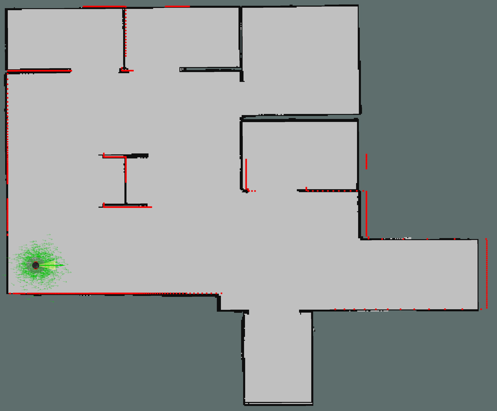
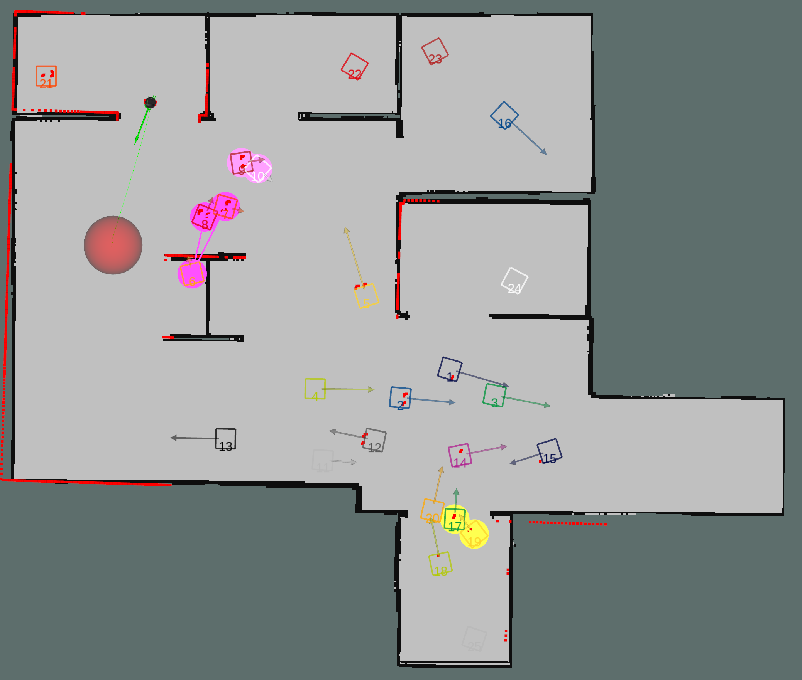

### DRL_VO VS DWA in simulation

#### experimental method

Separately using DRL_VO and DWA finish a sequence of navigation tasks. statistic and compare their total time spent, trajectory length, success ratel.

#### example of result on console

```
[INFO] [1692773895.010928, 392.831000]: Goal pose 25 reached
[INFO] [1692773895.011968, 392.833000]: Start Time: 36.497 secs
[INFO] [1692773895.012526, 392.833000]: End Time: 392.833 secs
[INFO] [1692773895.013119, 392.834000]: Success Number: 25 in total number 25
[INFO] [1692773895.013651, 392.834000]: Total Running Time: 356.336 secs
[INFO] [1692773895.014304, 392.835000]: Total Trajectory Length: 136.6251028026126 m
[INFO] [1692773895.014934, 392.836000]: Final goal pose reached!
```

---

#### autolab_without_pedestrians

- each env take 1 group test which contains 25 navigation points



| Environment | Method | Success rate | Average time (s) | Average length (m) | Average speed (m/s) |
| ----------- | ------ | ------------ | ---------------- | ------------------ | ------------------- |
| autolab     | DRL_VO | 1.0          | 12.49            | 5.88               | 0.47                |
| autolab     | DWA    | 1.0          | 14.25            | 5.47               | 0.38                |

#### autolab_with_pedestrians

- every couple of env and method takes 4 trials test and each trial contains 25 navigation points



- result of each trial

| Environment   | Method | Success rate            | Average time (s)          | Average length (m)     | Average speed (m/s)           |
| ------------- | ------ | ----------------------- | ------------------------- | ---------------------- | ----------------------------- |
| autolab_25ped | DRL_VO | (1.0+0.88+0.8+0.88)/4   | (12.6+13.28+12.9+13.13)/4 | (5.86+5.93+5.95+6.0)/4 | (0.47 +0.45 + 0.46 + 0.46)/4  |
| autolab_25ped | DWA    | (0.96+0.96+0.76+0.92)/4 | (18.07+15.6+15.6+16.2)/4  | (5.53+5.55+5.5+5.5)/4  | (0.31 + 0.36 + 0.35 + 0.34)/4 |

- average result

| Environment   | Method | Success rate | Average time (s) | Average length (m) | Average speed (m/s) |
| ------------- | ------ | ------------ | ---------------- | ------------------ | ------------------- |
| autolab_25ped | DRL_VO | 0.89         | 13.0             | 5.94               | 0.46                |
| autolab_25ped | DWA    | 0.9          | 16.37            | 5.52               | 0.34                |

#### lobby_with_pedestrians

- every couple of env and method takes 2 trials test and each trial contains 25 navigation points
- there is 4 trials test in the paper. I want to save some time, so I only did half of it


| Environment | Method | Success rate | Average time (s) | Average length (m) | Average speed (m/s) |
| ----------- | ------ | ------------ | ---------------- | ------------------ | ------------------- |
| lobby_5ped  | DRL_VO | 0.96         | 11.34            | 5.26               | 0.46                |
| lobby_5ped  | DWA    | 0.96         | 12.52            | 5.1                | 0.41                |
|             |        |              |                  |                    |                     |
| lobby_15ped | DRL_VO |              |                  |                    |                     |
| lobby_15ped | DWA    |              |                  |                    |                     |
|             |        |              |                  |                    |                     |
| lobby_25ped | DRL_VO |              |                  |                    |                     |
| lobby_25ped | DWA    |              |                  |                    |                     |
|             |        |              |                  |                    |                     |
| lobby_35ped | DRL_VO | 0.88         | 11.43            | 5.27               | 0.46                |
| lobby_35ped | DWA    | 0.8          | 16.66            | 5.22               | 0.32                |
|             |        |              |                  |                    |                     |
| lobby_45ped | DRL_VO |              |                  |                    |                     |
| lobby_45ped | DWA    |              |                  |                    |                     |
|             |        |              |                  |                    |                     |
| lobby_55ped | DRL_VO | 0.78         | 11.75            | 5.39               | 0.46                |
| lobby_55ped | DWA    | 0.7          | 15.78            | 5.17               | 0.33                |

- notes：
  1. collision may cause ped data deviation, this issue can reduce the success rate of drl_vo
  2. collision seems severe when using dwa. if these is 55 pedestrians in the environment its hard to finish all the navigation in a trail  with dwa