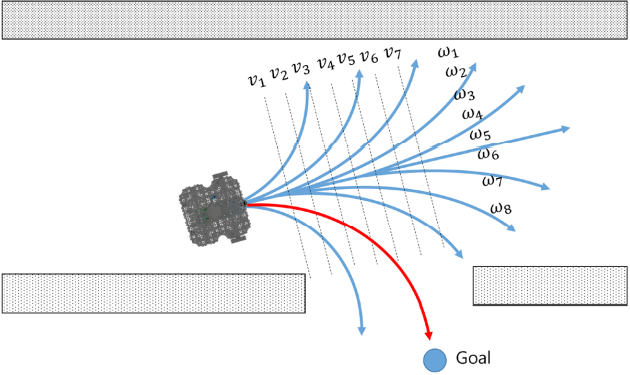

### Implementation of DWA

---

#### Basic idea of DWA



The basic idea of the Dynamic Window Approach (DWA) algorithm is as follows:

1. Discretely sample in the robot's control space (dx,dy,dtheta)
2. For each sampled velocity, perform forward simulation from the robot's current state to predict what would happen if the sampled velocity were applied for some (short) period of time.
3. Evaluate (score) each trajectory resulting from the forward simulation, using a metric that incorporates characteristics such as: proximity to obstacles, proximity to the goal, proximity to the global path, and speed. Discard illegal trajectories (those that collide with obstacles).
4. Pick the highest-scoring trajectory and send the associated velocity to the mobile base.
5. Rinse and repeat.

#### key parameters

根据DWA的原理可以总结出两类关键参数：

- 影响采样空间的参数
  1. 机器人线速度及角速度取值范围
  2. 线加速度及角加速度取值范围
  3. 局部路径的仿真时间
- 影响采样空间内速度选择的参数
  - 计算速度对应score时各个value的权重

#### Calculate score of sample

| 对象名称           | 数据类型                | 说明                                  |
| ------------------ | ----------------------- | ------------------------------------- |
| oscillation_costs_ | OscillationCostFunction | 尽量降低机器人在原地晃动的情况。      |
| obstacle_costs_    | ObstacleCostFunction    | 防止机器人撞到障碍物上。              |
| path_costs_        | MapGridCostFunction     | 使机器人尽可能的贴近全局轨迹。        |
| goal_costs_        | MapGridCostFunction     | 更倾向于选择接近目标点的轨迹。        |
| goal_front_costs_  | MapGridCostFunction     | 尽可能的让机器人朝向局部的nose goal。 |
| alignment_costs_   | MapGridCostFunction     | 尽可能的让机器人保持在nose path上。   |
| twirling_costs_    | TwirlingCostFunction    | 尽量不让机器人原地打转。              |

- 每一个速度采样都需要计算以上几类score，然后比较所有项score的和，选择score结果最大的速度给机器人执行

---

#### Code analysis of ROS DWA_local_planner

- setup

```c++
//定义用于发布dwa中全局与局部路径的话题
ros::NodeHandle private_nh("~/" + name);
g_plan_pub_ = private_nh.advertise<nav_msgs::Path>("global_plan", 1);
l_plan_pub_ = private_nh.advertise<nav_msgs::Path>("local_plan", 1);
```

```c++
//初始化tf用于获取坐标变换
//初始化costmap_ros_用于获得costmap信息，进行障碍物相关score的计算
//初始化odom_helper_用于获取机器人当前的速度
tf_ = tf;
costmap_ros_ = costmap_ros;
costmap_2d::Costmap2D* costmap = costmap_ros_->getCostmap();
odom_helper_.setOdomTopic( odom_topic_ );
```

- run dwa

```c++
//获取当前机器人距离终点的路径(通过截取当前点到终点的全局路径)
std::vector<geometry_msgs::PoseStamped> transformed_plan;
planner_util_.getLocalPlan(current_pose_, transformed_plan)) 
```

```c++
//关键函数： dwaComputeVelocityCommands()
//用于dwa计算速度给机器人执行
//这个函数调用了下面的一些函数
bool DWAPlannerROS::dwaComputeVelocityCommands(tf::Stamped<tf::Pose> &global_pose, 
                                                geometry_msgs::Twist& cmd_vel)
```

```c++
//在每一个timestep根据运动学约束采样速度
void SimpleTrajectoryGenerator::initialise()
      max_vel[0] = std::min(max_vel_x, vel[0] + acc_lim[0] * sim_period_);
      max_vel[1] = std::min(max_vel_y, vel[1] + acc_lim[1] * sim_period_);
      max_vel[2] = std::min(max_vel_th, vel[2] + acc_lim[2] * sim_period_);
//根据每个采样的速度生成仿真时间内的trajectory
bool SimpleTrajectoryGenerator::generateTrajectory()

//计算Score
//初始化每种用于计算score的实例对象，放入vector容器中
std::vector<base_local_planner::TrajectoryCostFunction*> critics;
critics.push_back(&obstacle_costs_); // discards trajectories that move into obstacles
critics.push_back(&oscillation_costs_); // discards oscillating motions (assisgns cost -1)
critics.push_back(&goal_front_costs_); // prefers trajectories that make the nose go towards (local) nose goal
critics.push_back(&alignment_costs_); // prefers trajectories that keep the robot nose on nose path
critics.push_back(&path_costs_); // prefers trajectories on global path
critics.push_back(&goal_costs_); // prefers trajectories that go towards (local) goal, based on wave propagation
critics.push_back(&twirling_costs_); // optionally prefer trajectories that don't spin

//在findBestPath中计算之前采样的速度对应的仿真trajectory的score,选出其中score最大的速度指令
base_local_planner::Trajectory DWAPlanner::findBestPath()

//得到最优的速度
```

